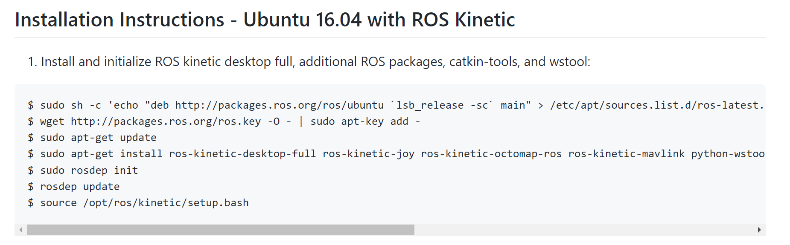
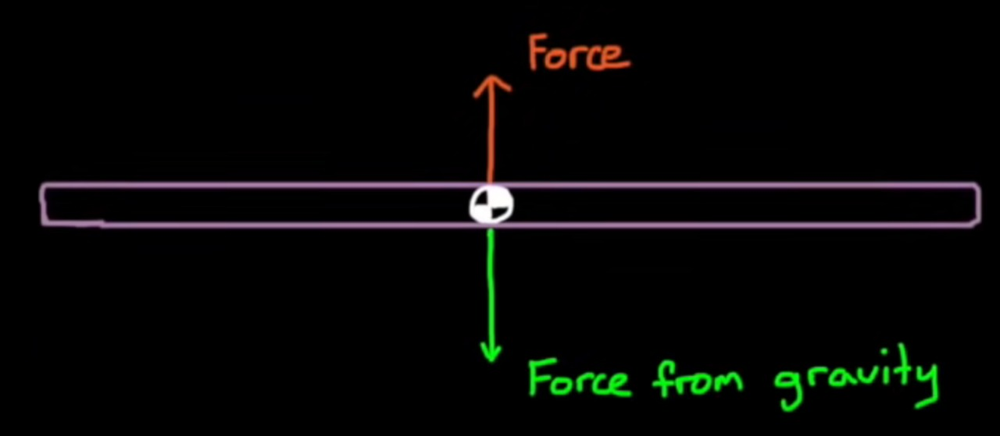
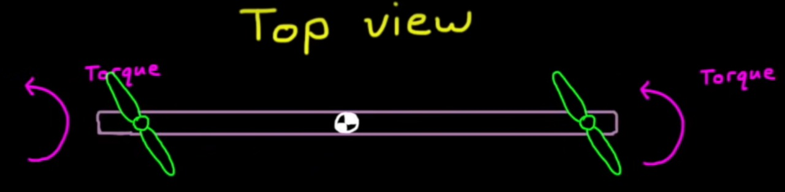
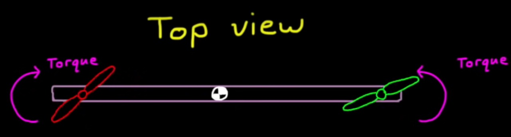
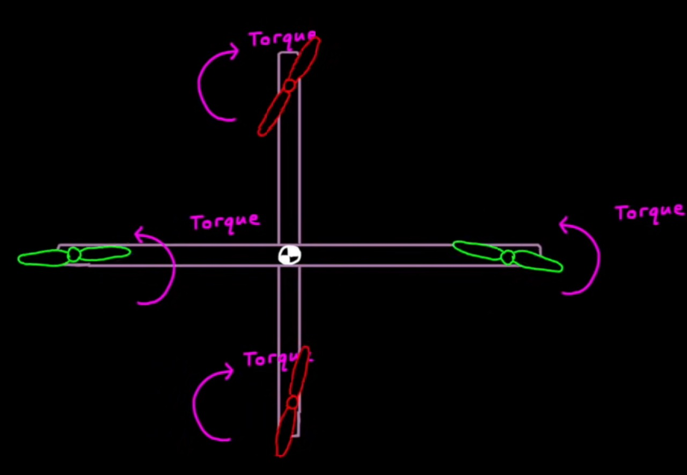
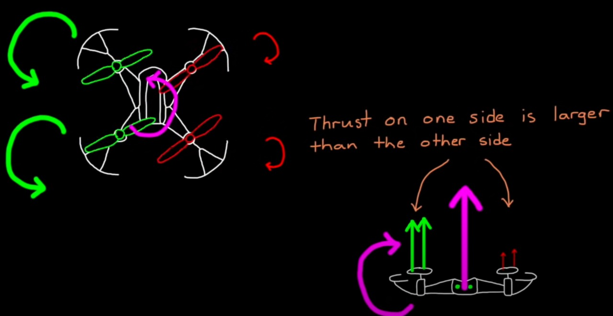
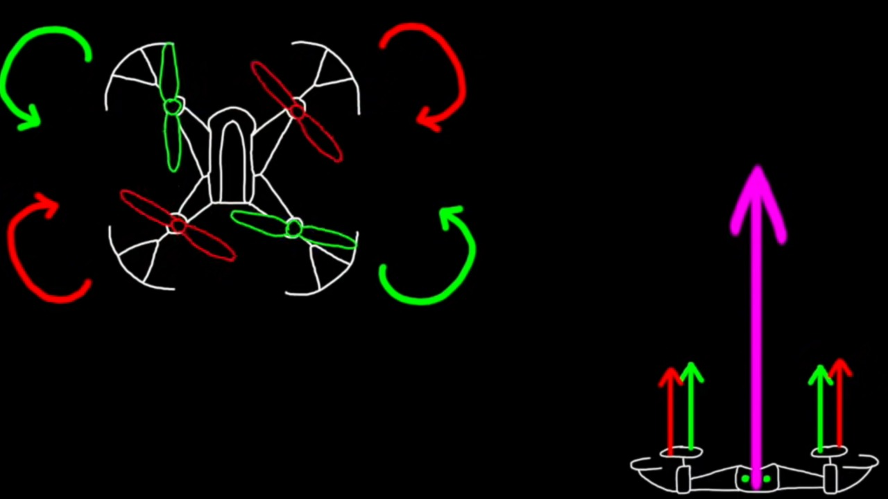
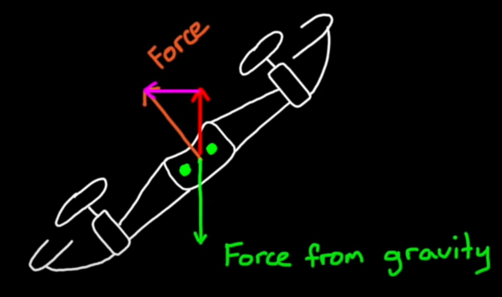
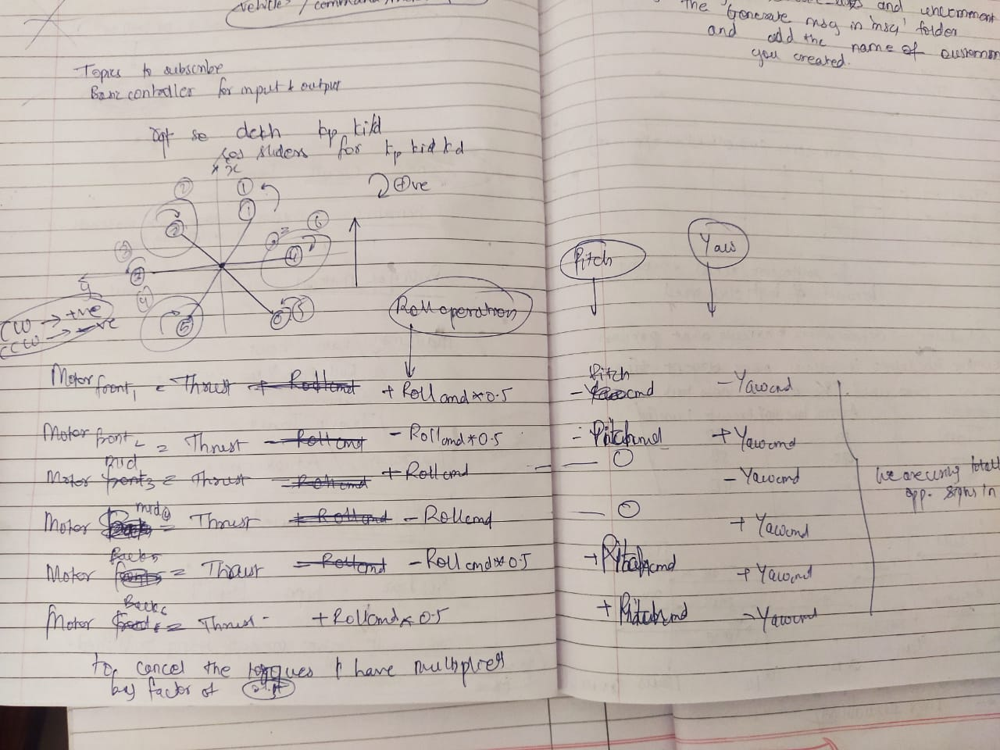

# Experiencing the Dream: Understanding Drones and Control systems

The Title describes our Project quite elgantly. It was like a dream for me and team-mate to work on this project. But this project isn't about building a simple drone it is much more than a beginner thinks-of while imagining drones. To give you a rough idea, the complexity of our system has made us scratch our heads and gave us many sleepless nights, the very description of which you find later in this blog.

Through this rough journey of learning to work with ROS, designing a controller for a hexacopter, While(1){Understanding **Math**} and understanding **Math**, and debugging, we were selflessly backed and helped by our mentors **Sagar Chotalia**, **Jash Shah**, and **Ayush Kaura**. Thanks to the most dynamic club of VJTI: [Society of Robotics and Automation (SRA)](https://sravjti.in/).

One of the Major questions was **How to make a control system for a drone ?**

>**Mentors**: Just do the Installations first!

### Struggles of the Installations

It now seems like it was too easy to install ROS, Gazebo, and other cloned repo. But it wasn't. I (Alqama) had no idea of how does these things even work, turns out no one really knows, they just install it by checking the versions🥲. 

First I tried to install as per the instructions given in the [README.md](https://github.com/ethz-asl/rotors_simulator/blob/master/README.md "Readme") of the ETH-Zürich (without reading the version it is really for). And then I realised I have downloaded it for 16... some version of ubuntu while we are using 20.04 LTS. 

Another shock for me was these tech freaks also name their version. Like kinetic, noetic, and all different sort of things which doesn't have any real world significance. After two days of struggle and adaptation to the idea that, there is no logic in installations here. After Identifying the mistakes they did in the cloning part and debugging their repo. I finally succeeded!

> Knowing that this wasn't even a fraction of work we needed to do to make the controller work😉

### Next up was implementing a controller based on a normal hexacopter

Before moving on to the actual model we needed to know how a controller works on a simpler model for which we needed to learn motor mixing before moving on to the matrix calculations.
#### Motor Mixing

> how spin direction allows us to decouple thrust, roll, pitch and yaw from one another

1. Thrust :
- A motor produces thrust by spinning a propeller which pushes air down causing a reaction force that is up

- If the motor is placed in a position that the force is applied through the center of gravity of an object then that object will move in pure translation with no rotation

- If the force of the thrust is exactly equal to and opposite the force of gravity then the object will hover in place

- A force at a distance from the center of gravity produces both a translational motion as well as a torque
- If our motor is attached to the bar as it rotates the torque will stay constant
- But the force is now no longer always in the opposite direction of gravity
- Hence our bar will begin to move off the side and fall out of the sky

- Now if there's a counter force on the opposite side of the center of gravity and each force is half of the force of gravity then the object will again stay stationary because the torques and forces will cancel each other out

- But our actuators don't generate purely force when it generates thrust since it accomplishes thrust by rotating and torquing a propeller which has mass our actuators are also generating a reaction torque that is in the opposite direction
- If both of our motors are spinning in the same direction then the torque is doubled and our bar would start to rotate

- To counter this torque we could spend the two motors in opposite directions
and that would work just fine for two dimensions
- but we can't roll this bar

- Hence we add a second bar with two more motors to create our quadcopter
- With this configuration we can hover by accelerating each motor until they each produce a force one fourth that of gravity

> **Configuration** - opposing motors spinning in the same direction

#### Reason for opposing motors spinning in the same direction - Configuration :

1. How yaw (flat spinning motion) interacts with thrust, roll and pitch -

- slowing two motors down that are running in the same direction and speed the other two up
- hence thrust remains same due to which we're still hovering and counteracting gravity
- but Sumation of motor Torque is non-zero
- causing yaw-motion
- forces about Centre of Mass is Zero, hence no roll or pitch

- If the rotating motor pairs are on the same side
- then slowing one pair down and increasing the other pair will cause an imbalance of forces about the center of gravity
- and the vehicle will either pitch or roll depending on which side the motor pairs are on
- However if we separate the two motors and place them on opposite sides of the drone then the forces will balance each other out

> Hence **motor configuration** and **spin directions** are so CRITICAL

2. Roll -

- decrease one of the left/right pairs and increase the other causing a rolling torque

3. Pitch - 

- decrease one of the front/back pairs and increase the other causing a pitching torque

> Both of these motions would have no effect on yaw since we're moving counter rotating motors in the same direction and their yaw torque would continue to cancel out each other

4. Thrust -

- tcontrolled by setting all 4 motors with the same speed.
- Increased/Decreased/Constant speed according to requirement

#### Motor Mixing Algorithm :

- Thrust - controlled by all 4 rotors at same speed
- Yaw - controlling opposite pairs spinning in same direction
- Pitch - Front/Back pairs controlled
- Roll - Left/Right pairs controlled

This is our simple motor mixing algorithm that can convert between the intuitive roll pitch yaw and thrust and the less intuitive motor and speeds.

## Forward/Backward/Left/Right Motion :

- Forward/Backward/Left/Right Motion our unactivated motions
- first tilt in direction of motion such that force (thrust) vector is partially in direction opposite to that of gravity and partially in direction of motion

- Now if we wanted to maintain altitude while we do this maneuver then we would increase the thrust so that the vertical component is still cancelling out the downward pull of gravity

By using this concept of motor mixing we tried to implement the controller for a hexacopter using the logic below:

Right, this was the point from which my (Alqama's) love for math came into picture ❤️.

### PID and it's code 

Now, The actual controller i.e. the PID controller needed to be designed for which we had no clue where to start.

So, we first learn 

### Implementing on actual tilt rotor model

### Making the thing Fly / Dance

### Our journey through the matrices

### Trapped in Allocation and frames

### The real hell 😈

### Conclusion

#### Links of Further reading
