# Drone Simulation and Control #2

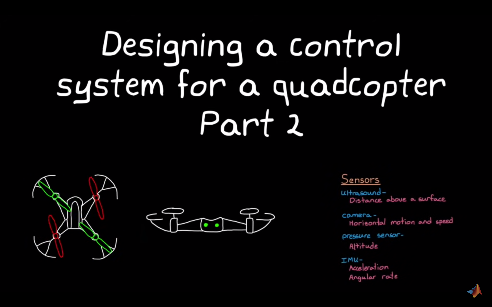

## To Design a Control System Architecture for Hovering a Quadcopter 

- we're gonna figure out which states we need to feedback
- how many controllers we need to build
- how those controllers interact with each other

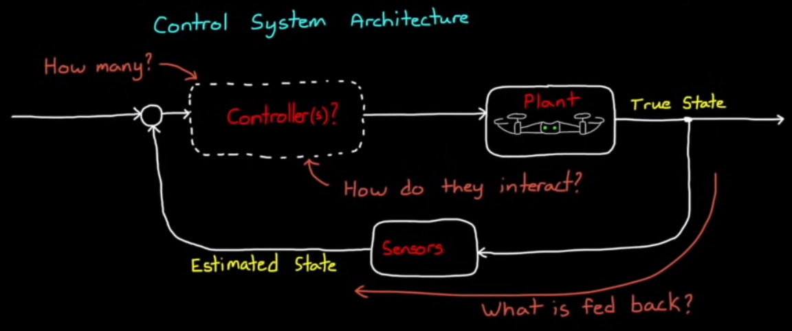

- the plant is the mini drone itself it takes four motor speeds as inputs which then spin the propellers generating forces and torques that affect the output state the output that we want is to have the mini drone hover at a fixed altitude
- **Problem Statement -** how do we command these four motors autonomously for drone to hover at a fixed altitude

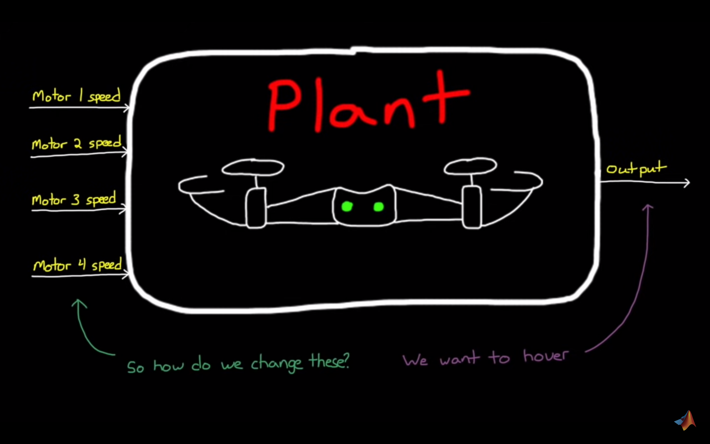

-  thinking in terms of roll pitch yaw and thrust is also beneficial when we're developing an autonomous control system rather than the less-intuitive rotor-speed
- hence we'll keep the motor mixing algorithm and build a feedback control system with it in the loop as well
- now let's do it's application by designing an autonomous control-system

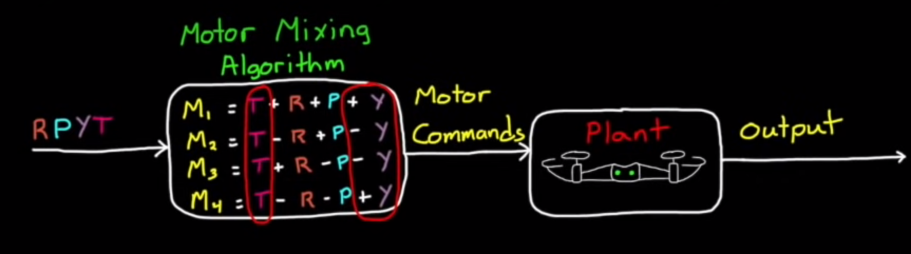

## Thrust Command -

- thrust is always in the same direction relative to the drone airframe it's along the z axis of the drone
- if the drone is flying level and the z axis is aligned with the gravity vector then increasing thrust causes the drone to increase its altitude rate which is how fast it's rising and decreasing thrust drops the altitude rate

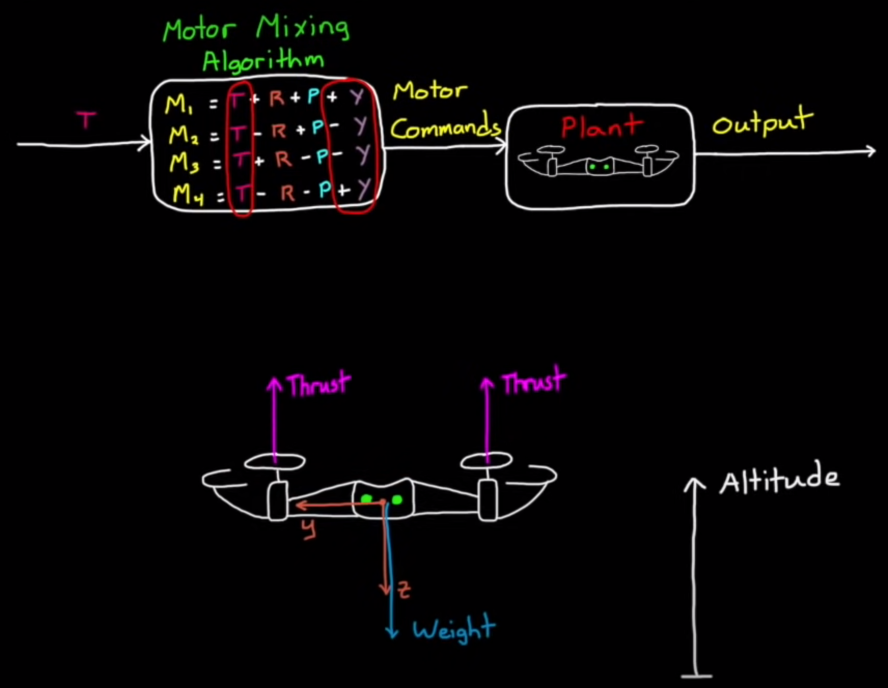

> - however if our drone is flying at a steep pitch or roll angle then increasing thrust is coupled to both altitude rate and horizontal speed
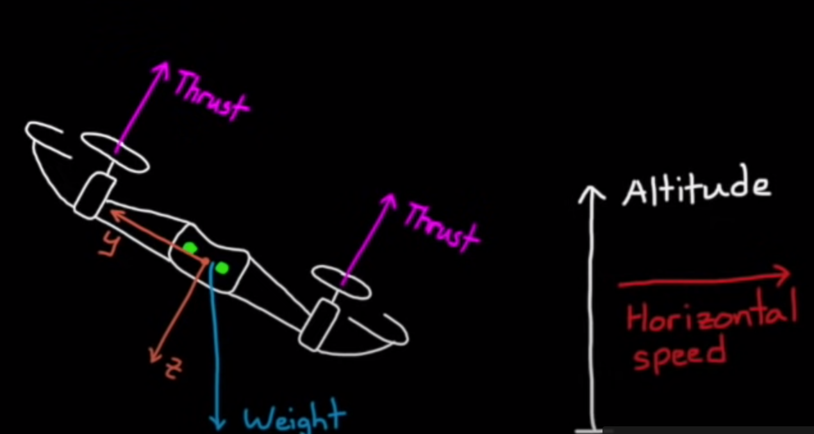
    - Hence if we're building a controller for a drone that's likely to fly at extreme roll and pitch angles then we need to take this coupling into account

> **Assumption -** that the roll in pitch angles are always really small in this way changing the thrust only meaningfully impacts altitude rate and nothing else

## Step 1 - Only Thrust Controller

- let's build a controller that uses thrust to adjust the altitude 
- if we're able to measure the drone altitude then we can feed it back to compare it to an altitude reference 
- the resulting error is then fed into an altitude controller that's using that information to determine how to increase or decrease thrust

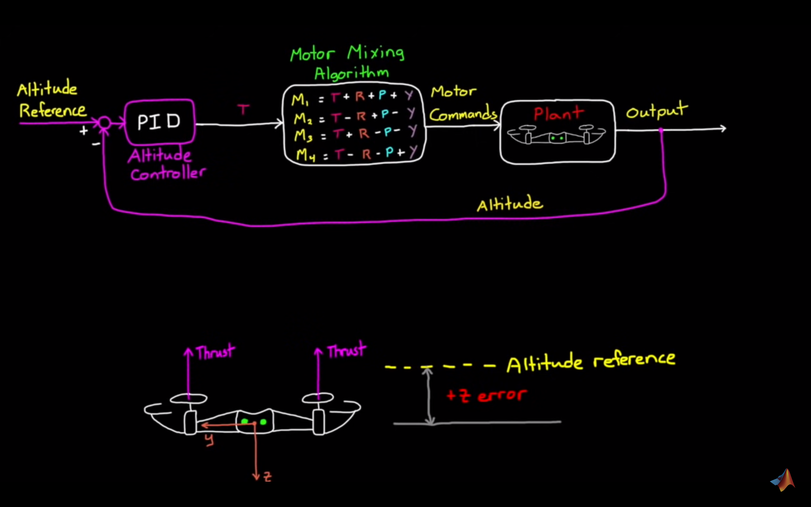

- if the drone is hovering too low the altitude error will be positive and the thrust command will increase causing all four motors to speed up at the same time and the drone will rise 
- if the drone is too high then all four motors will slow down so that the drone will descend

### Problems -

- when there are disturbances like wind gusts that will induce a little roll or pitch into the system and when that happens the thrust will not only adjust altitude but also create some horizontal motion and the drone will start to move away from desired position
- so a controller which maintains altitude but not position does not meet requirements as could lead to a crash
- Hence we clearly need a better control system architecture

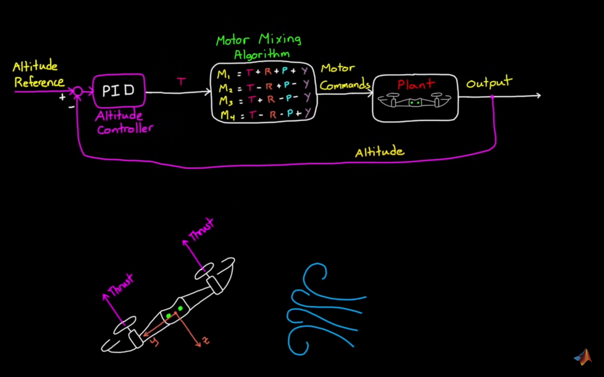

### Solution -

- we can start by trying to maintain level flight by controlling roll and pitch angles to 0 degrees if we can keep the mini drone level 
- then thrust once again will only impact altitude and the drone won't wander away

## Step 2 - Four Independent or Decoupled Controllers -

- since we're able to command thrust, roll, pitch and yaw independently
- we can create three more feedback controllers one for roll, pitch and yaw exactly the same way that we did for thrust 

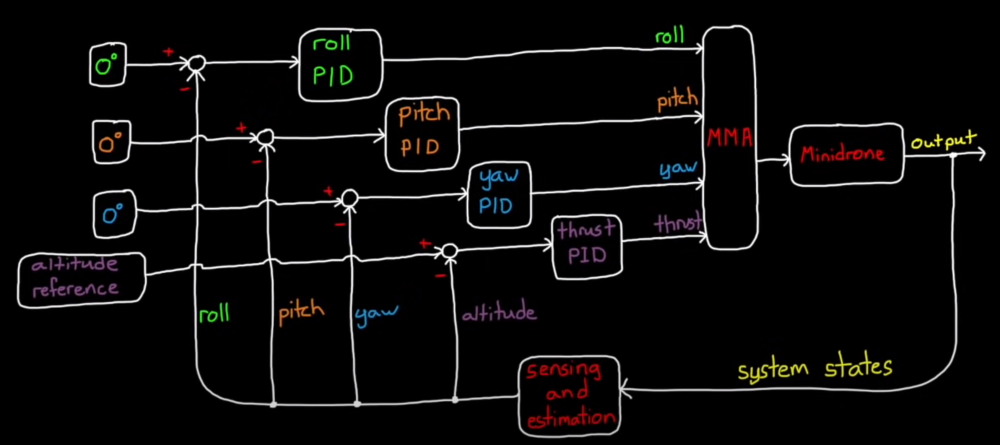

- motor mixing algorithm block : MMA
- we will be measuring and feeding all system states back, like feeding the estimated roll angle into the roll controller and so on
- Control System consists of 4 independent or decoupled controllers
- one for thrust which is really an altitude controller
- maintain level flight by controlling roll, pitch and yaw angles to 0 degrees
- roll, pitch and yaw controllers respectively should maintain altitude and it should keep the mini drone facing forward and level with the ground 
- better design but not perfect

### Problems -

- wind gust might initially introduce a little roll angle but our roll controller will remove that error and get the drone back to level flight
- however for a very brief time during the roll the thrust vector is not straight up and down and therefore the drone will have moved horizontally a little bit
- hence with roll or pitch errors the drone will not be at required position, but still doesn't meander uncontrollably
- here's nothing in our control system architecture that will bring the drone back to its starting position

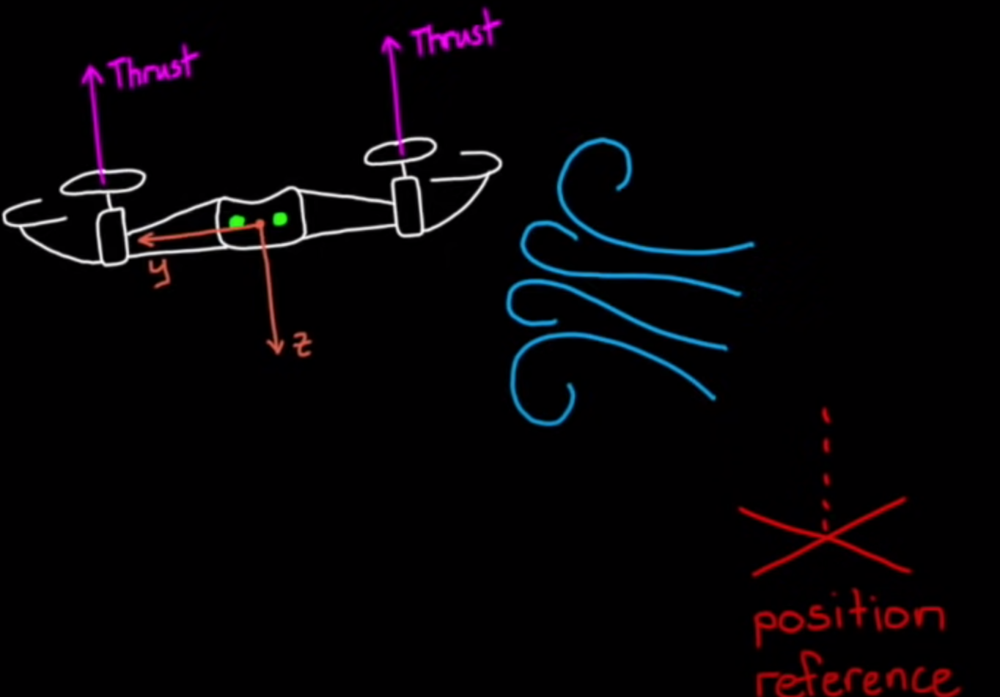

### Solution -

- in our current controller roll and pitch may need to be nonzero in order to hover, for example if we want to hover in a strong constant wind then the drone will have to lean into the wind at some angle to maintain its ground position
- we want level flight with a ground position controller that will recognize when the drone is wandering off and make the necessary Corrections to bring it back to the reference point x and y 

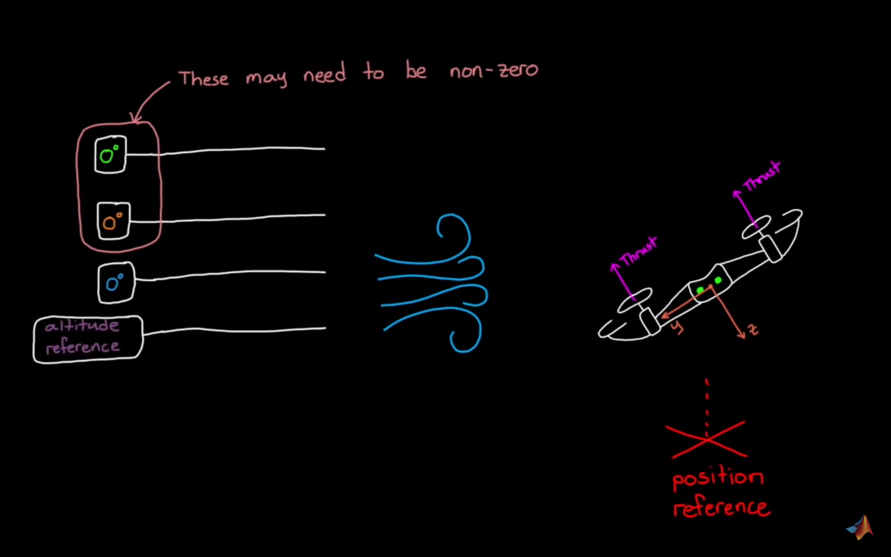

## Step 3 - Ground Position Controller -

- we want level flight with a ground position controller that will recognize when the drone is wandering off and make the necessary Corrections to bring it back to the reference point x and y 
- just because we don't want to pick specific roll and pitch angles that doesn't mean that we don't need the roll and pitch controllers because a quad-copter is incapable of moving left right forward or backward without first rolling or pitching into the desired direction of travel 
- so our control system needs to couple position errors with roll and pitch which is a complicated sounding set
of maneuvers
- but we can feedback the mini-drones measured XY position and compare it to the reference to get the position error

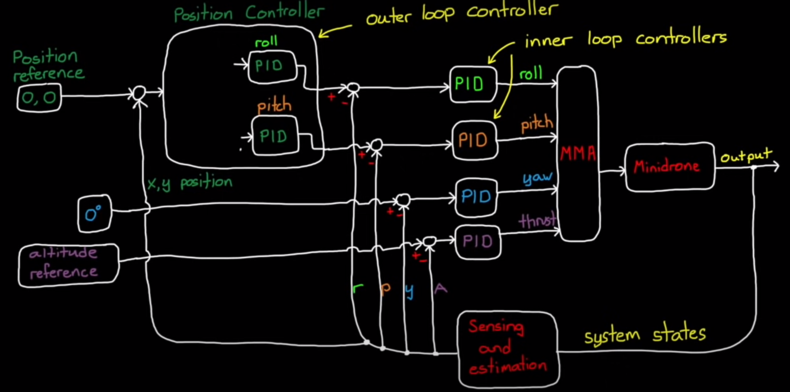

- the required reference position is set
- this way our controller will cause the drone to hover right above the desired point
- the position controller takes the position error as an input and then outputs roll and pitch angles which are the reference angles that the roll and pitch controllers are trying to follow
- so instead of us as the designer picking roll and pitch angles we're letting the position controller create them for us 
- hence the position controller is the outer loop and it's generating the reference commands for the inner loop roll and pitch controllers (these are cascaded loops)

## Step 4 - Yaw Angle also feeds into the position controller

- the reason is that the XY position error is relative to the ground or the world reference frame

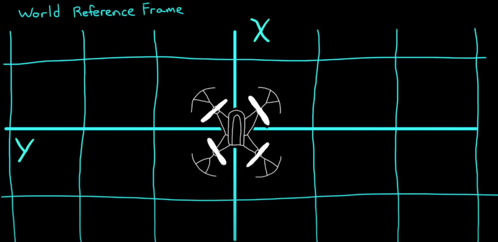

- whereas roll and pitch are relative to the body of the drone

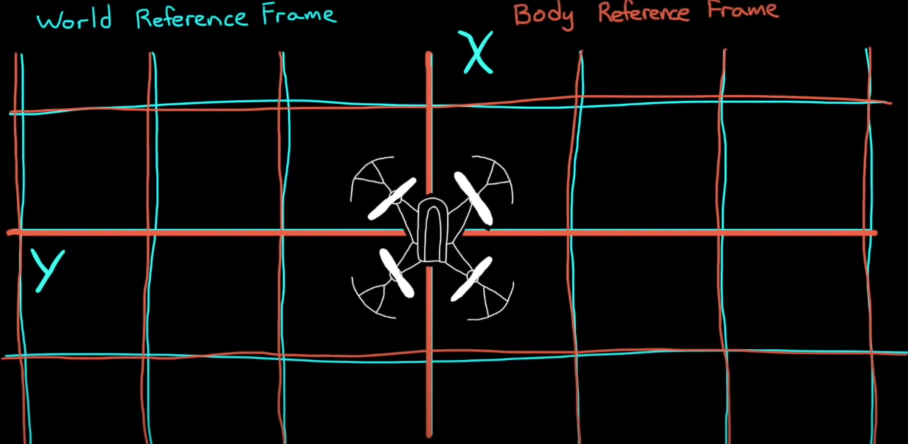

- therefore pitch doesn't always move the drone in the X-world direction

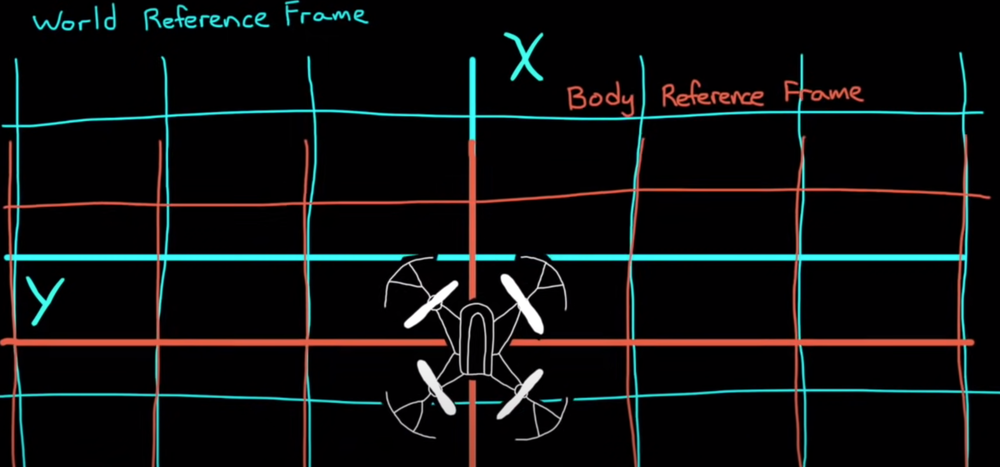

- and roll doesn't always move the drone in the Y-world direction

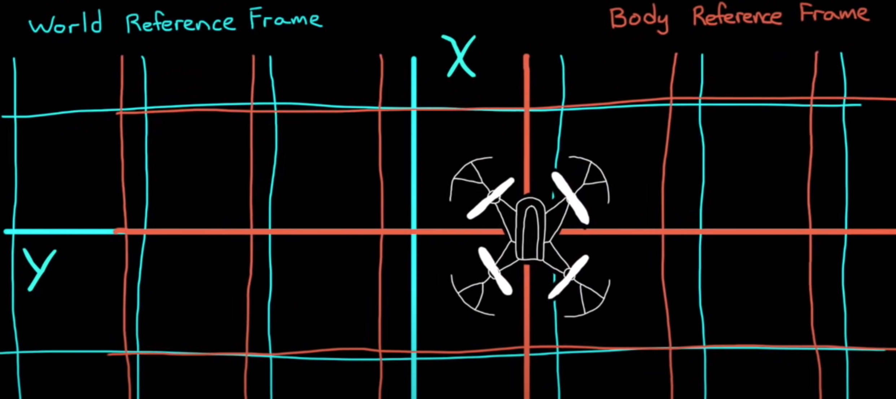

- it depends on how the drone is rotated or its yaw angle

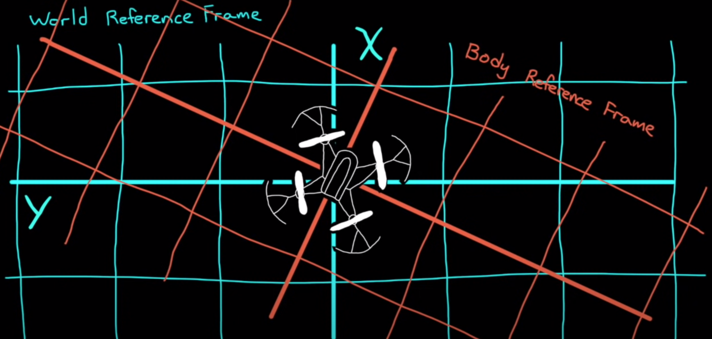

- so if we need to move the drone to a very specific spot in the room then it needs to know yaw in order to determine whether roll, pitch or some combination of the two is needed to achieve that

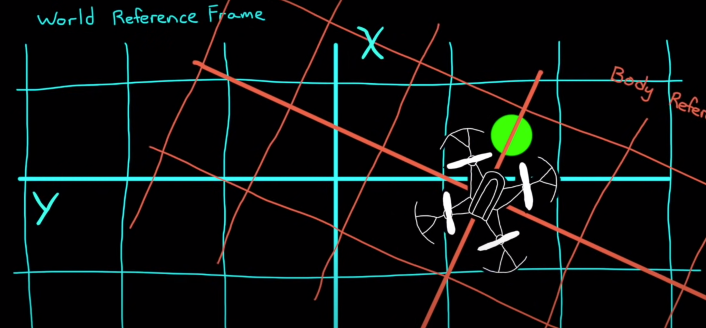

- so our position controller uses Yaw to convert between the world XY frame and the body XY frame

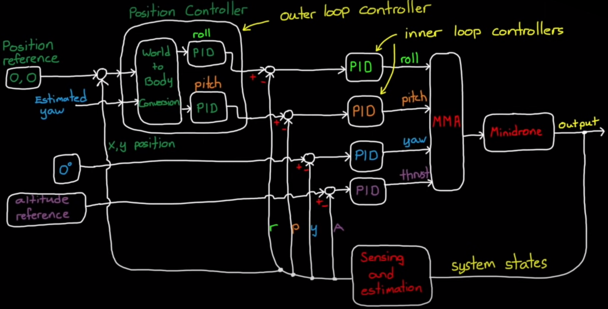

### Example -

- exercise to see how all of these controllers work together to maintain position and altitude
- let's say that the mini drone is flying level at the correct altitude but a little too far left of where it took off
- this will result in a position error that feeds into the position controller the proportional part of the controller will multiply that error by a constant which will request that the drone roll to the right
- the role controller will see that there is a roll error because the drone is still level and request a rolling torque
- this will play through the motor mixing algorithm and request that the motors on the left side of the drone speed up and the motors on the right side slowed down
- this will roll the drone to the commanded angle now the drone will begin to move to the right
- but since the vertical component of thrust is slightly smaller when rolled the drone will also start to lose altitude
- the altitude controller will sense this error and increase the thrust command accordingly
- now as the drone continues moving right the position error is dropping and therefore the requested roll angle through the proportional path is also dropping bringing the drone back level

### Problem - 

- this is now a good architecture for our hover control system but there are two glaring
obstacles to creating and tuning it

1. This requires us having a way to estimate the state's yaw, roll, pitch, altitude and XY position  and these are the signals that were feeding back into our controllers

2. We need to tune 6 PID controllers that all interact with each other and specifically 4 of them directly coupled in cascaded loops

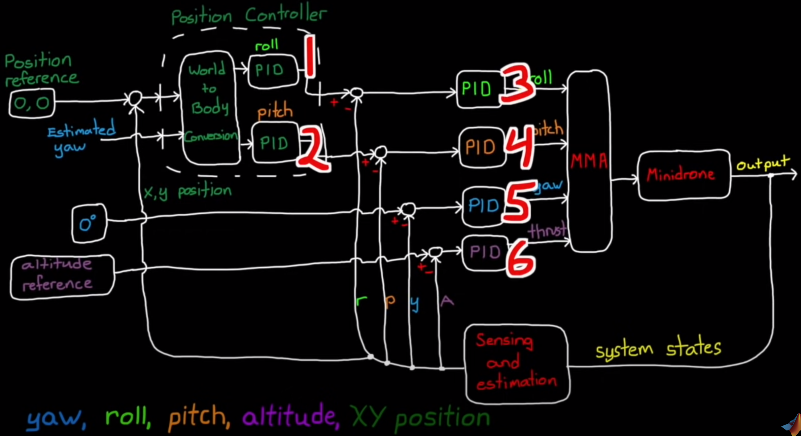

### Solution -

1. For 1st Problem
- we're going to handle it by combining the measurements from the four sensors we have and in some cases using a model and a common filter to estimate each of those feedback States

2. For 2nd Problem 
-  we need a good model of our system so that we can use model-based design and MATLAB and Simulink to tune our six PID
controllers in fact if we just look at the controller portion of this feedback system 

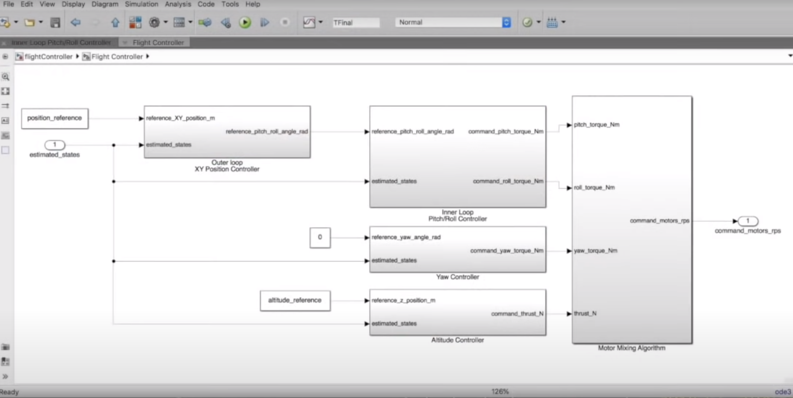

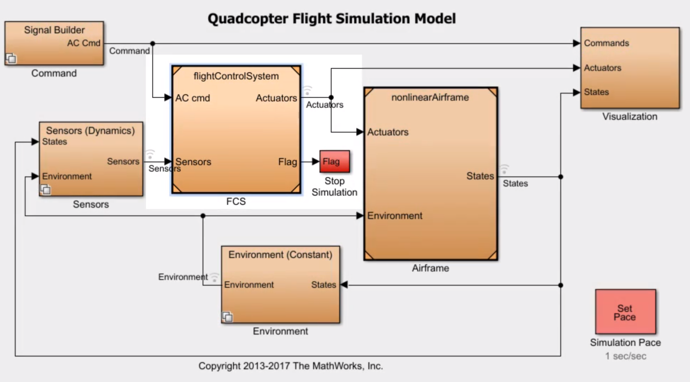

- The Simulink model has pretty much the exact same controller architecture that we've built
- the outer loop XY position controller is generating the reference pitch and roll angles for the inner loop controller
- there's also the yaw and altitude controllers in each of them feed into the motor mixing algorithm

### References -

- [Drone Simulation and Control, Part 2: How Do You Get a Drone to Hover?](https://www.youtube.com/watch?v=GK1t8YIvGM8&list=PLn8PRpmsu08oOLBVYYIwwN_nvuyUqEjrj&index=2)

- [Introduction to Simulink Hardware Support for PARROT Minidrones](https://in.mathworks.com/videos/introduction-to-simulink-hardware-support-for-parrot-minidrones-1503608358675.html?s_eid=PSM_15028)
