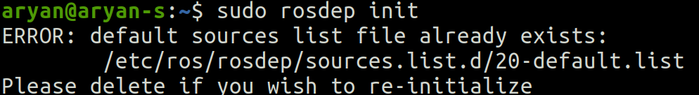

# Installation Instructions on Ubuntu 20.04 with ROS NOETIC NINJEMYS
> **ETH-Zürich** : ethz-asl/rotors_simulator Repository

## Prerequisites

- Ubuntu 20.04 OS
- ROS Noetic Ninjemys (Note: We will be using Ros 1 and python3)
- Gazebo and Gazebo Ros Installation

### If not installed any follow the following links :

- [Ubuntu 20.04 LTS Installation](https://ubuntu.com/download/desktop "Ubuntu Installation")
- [Ros Noetic Ninjemys Installation (Ros 1) ](http://wiki.ros.org/noetic/Installation/Ubuntu "Ros Noetic Installation")
- [Gazebo Installation](https://classic.gazebosim.org/tutorials?tut=ros_installing&cat=connect_ros "Gazebo Installation Tutorial")


> 1. Install and initialize ROS kinetic desktop full, additional ROS packages, catkin-tools, and wstool :
(Commands being run in Ubuntu Terminal in Home Directory)

```
    sudo sh -c 'echo "deb http://packages.ros.org/ros/ubuntu `lsb_release -sc` main" > /etc/apt/sources.list.d/ros-latest.list'
    wget http://packages.ros.org/ros.key -O - | sudo apt-key add -
    sudo apt-get update
    sudo apt-get install ros-noetic-desktop-full ros-noetic-joy ros-noetic-octomap-ros ros-noetic-mavlink python3-wstool python3-catkin-tools protobuf-compiler libgoogle-glog-dev ros-noetic-control-toolbox ros-noetic-mavros
    sudo rosdep init
    rosdep update
    source /opt/ros/noetic/setup.bash

```
**If you don’t have `source /opt/ros/noetic/setup.bash` line in your bash file then run following commands**

`gedit ~/.bashrc`
Add following command at the end of your bash file `source /opt/ros/noetic/setup.bash`

“SAVE” and then close the file

Then run following command in terminal `source ~/.bashrc`

**If you face a problem like:**

    Then just before using `line 3` of the above block just type in `sudo apt install -f` (This is auto remove feature of ros of unwanted commands) after this the problem should be solved.

**If you face a problem like:**

    It is necessary to solve this error (But in few cases it might be required)
    Run `sudo rm <path mentioned in error>`, for example `sudo rm /etc/ros/rosdep/sources.list.d/20-default.list`
    Then Run `sudo rosdep init`
    Then Run `rosdep update`


> 2. Since we don’t have a workspace for the given project, we will make one :
(Commands being run in Ubuntu Terminal in <workspace_name>/src directory once workspace created)

```
    mkdir -p ~/hexacopter_ws/src
    cd ~/hexacopter_ws/src
    catkin_init_workspace
    wstool init
    wget https://raw.githubusercontent.com/ethz-asl/rotors_simulator/master/rotors_hil.rosinstall
    wstool merge rotors_hil.rosinstall
    wstool update

```


### Get the simulator and additional dependencies
```
    git clone git@github.com:ethz-asl/rotors_simulator.git
```

3. Add source to your `.bashrc` file
```
    echo "source ~/workspace/devel/setup.bash" >> ~/.bashrc
    source ~/.bashrc
```
4. Build your workspace with `python3_catkin_tools` (therefore you need `python_catkin_tools`)

```
    1. cd ~/workspace
    2. catkin init
    3. catkin build
```


1. Install and initialize ROS kinetic desktop full, additional ROS packages, catkin-tools, and wstool:

```
    sudo sh -c 'echo "deb http://packages.ros.org/ros/ubuntu `lsb_release -sc` main" > /etc/apt/sources.list.d/ros-latest.list'
    wget http://packages.ros.org/ros.key -O - | sudo apt-key add -
    sudo apt-get update
    sudo apt-get install ros-kinetic-desktop-full ros-kinetic-joy ros-kinetic-octomap-ros ros-kinetic-mavlink python-wstool python-catkin-tools protobuf-compiler libgoogle-glog-dev ros-kinetic-control-toolbox ros-kinetic-mavros
    sudo rosdep init
    rosdep update
    source /opt/ros/kinetic/setup.bash
```
2. If you don't have ROS workspace yet you can do so by
```
    mkdir -p ~/catkin_ws/src
    cd ~/catkin_ws/src
    catkin_init_workspace  # initialize your catkin workspace
    wstool init
    wget https://raw.githubusercontent.com/ethz-asl/rotors_simulator/master/rotors_hil.rosinstall
    wstool merge rotors_hil.rosinstall
    wstool update

 ```
 3. Build your workspace
```
    cd ~/catkin_ws/
    catkin_make
```
Iff catkin_make doesn't work try using catkin_make_isolated instead.

4. Add source to your .bashrc file
```
    echo "source ~/catkin_ws/devel/setup.bash" >> ~/.bashrc
    source ~/.bashrc
```
## Get the simulator and additional dependencies
```
    cd ~/catkin_ws/src
    git clone git@github.com:ethz-asl/rotors_simulator.git
    git clone git@github.com:ethz-asl/mav_comm.git
```