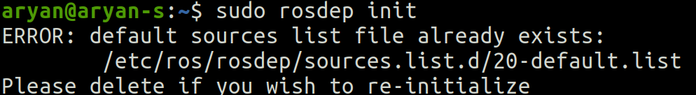

# Installation Instructions on Ubuntu 20.04 for ROS NOETIC
> **Eklavya-Copter-Control** : aPR0T0/Eklavya-Copter-Control Repository

## Prerequisites

- Ubuntu 20.04 OS
- ROS Noetic Ninjemys (Note: We will be using Ros1 and Python3)
- Gazebo and Gazebo Ros Installation

### If not installed follow the following links :

- [Ubuntu 20.04 LTS Installation](https://ubuntu.com/download/desktop "Ubuntu Installation")
- [Ros Noetic Ninjemys Installation (Ros 1) ](http://wiki.ros.org/noetic/Installation/Ubuntu "Ros Noetic Installation")
- [Gazebo Installation](https://classic.gazebosim.org/tutorials?tut=ros_installing&cat=connect_ros "Gazebo Installation Tutorial")


## 1. Install and initialize ROS Noetic Ninjemys, additional requried ROS packages, catkin-tools and wstool :

(Commands being run in Ubuntu Terminal in Home Directory)

```
sudo sh -c 'echo "deb http://packages.ros.org/ros/ubuntu `lsb_release -sc` main" > /etc/apt/sources.list.d/ros-latest.list'
wget http://packages.ros.org/ros.key -O - | sudo apt-key add -
sudo apt-get update
sudo apt-get install ros-noetic-desktop-full ros-noetic-joy ros-noetic-octomap-ros ros-noetic-mavlink python3-wstool python3-catkin-tools protobuf-compiler libgoogle-glog-dev ros-noetic-control-toolbox ros-noetic-mavros
sudo rosdep init
rosdep update
source /opt/ros/noetic/setup.bash
```

* **If you don’t have `source /opt/ros/noetic/setup.bash` line in your bash file then run following commands**

    `gedit ~/.bashrc`

    Add following command at the end of your bash file `source /opt/ros/noetic/setup.bash`

    “SAVE” and then close the file

    Then run following command in terminal `source ~/.bashrc`

* **If you face a problem like:**

    
    Then just before using `line 3` of the above block just type in `sudo apt install -f` (This is auto remove feature of ros of unwanted commands) after this the problem should be solved.


* **If you face a problem like:**

    
    It is not necessary to solve this error (But in few cases it might be required)

    Run `sudo rm <path mentioned in error>`, for example `sudo rm /etc/ros/rosdep/sources.list.d/20-default.list`

    Then Run `sudo rosdep init`

    Then Run `rosdep update`


## 2. Since we don’t have a workspace for the given project, we will make one :

(Commands being run in Ubuntu Terminal in <workspace_name>/src directory once workspace created)

```
mkdir -p ~/hexacopter_ws/src
cd ~/hexacopter_ws/src
catkin_init_workspace
wstool init
wget https://raw.githubusercontent.com/ethz-asl/rotors_simulator/master/rotors_hil.rosinstall
wstool merge rotors_hil.rosinstall
wstool update
```


## 3. Cloning Repository :

**Note the repository is to be cloned in the <workspace_name>/src directory**

(Note : Here we are using https to clone repository, other methods like ssh key,.. can also be used. Also, recursive cloning is used so any linked components if any are not missed (Recursive cloning is not essential, but is done to prevent any missing of essential linked components in certain cases))

```
cd ~/hexacopter_ws/src
git clone --recursive https://github.com/aPR0T0/Eklavya-Copter-Control.git
```


## 4. Building Workspace with `python3_catkin_tools` (therefore we require `python3_catkin_tools`) :

(Commands being run in Ubuntu Terminal in <workspace_name> directory)

Checking/Installing `python3_catkin_tools` :

```
sudo apt-get update
sudo apt-get install python3-catkin-tools
```

Building Workspace :

```
cd ~/hexacopter_ws
catkin init
catkin build
```

If any errors occur you could run `catkin init` and `catkin build` commands again

**Note : There should be total 10 packages (maybe more) installed successfully for installation to be successful**


## 5. Add Sourcing to your `~/.bashrc` file :

```
echo "source ~/hexacopter_ws/devel/setup.bash" >> ~/.bashrc
source ~/.bashrc
```
---
## Basic Usage
Launch the simulator with a hex-rotor helicopter model, in our case, the AscTec Firefly in a basic world.

```
$ roslaunch rotors_gazebo mav.launch mav_name:=omav world_name:=basic
```

There are some basic launch files where you can load the different multicopters with additional sensors. They can all be found in `~/catkin_ws/src/rotors_gazebo/launch`.

The `world_name` argument looks for a .world file with a corresponding name in `~/catkin_ws/src/rotors_gazebo/worlds`. By default, all launch files, with the exception of those that have the world name explicitly included in the file name, use the empty world described in `basic.world`.

### Getting the multicopter to fly

To let the multicopter fly you need to generate thrust with the rotors, this is achieved by sending commands to the multicopter, which make the rotors spin.
There are currently a few ways to send commands to the multicopter, we will show one of them here.
The rest is documented [here](../../wiki) in our Wiki.

#### Send direct motor commands

We will for now just send some constant motor velocities to the multicopter.

```
$ rostopic pub /firefly/command/motor_speed mav_msgs/Actuators '{angular_velocities: [700, 700, 700, 700, 700, 700, 700, 700, 700, 700, 700, 700, 0, 0, 0, 0, 0, 0]}'
```

> **Note** The size of the `motor_speed` array should be equal to the number of motors you have in your model of choice (e.g. 6 in the Firefly model). Also, the last 6 elements are preserved for the angles of the tilt rotors

> You can play with the numbers and will realize that the Firefly will take off with motor speeds of about 545 on each rotor. The multicopter is unstable though, since there is no controller running, if you just set the motor speeds.


#### Let the helicopter hover with ground truth odometry

You can let the helicopter hover with ground truth odometry (perfect state estimation), by launching:

```
$ roslaunch rotors_gazebo mav.launch mav_name:=omav world_name:=basic
```