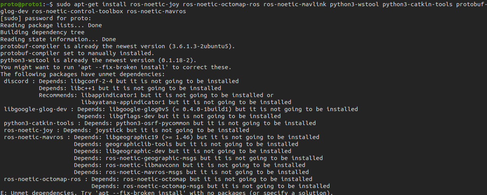

# Installation Instructions on Ubuntu
1. Install and initialize ROS noetic desktop full, additional ROS packages, catkin-tools, and wstool:
`Note: This installation process is for Ubuntu 20.04 LTS`
```
    1. sudo sh -c 'echo "deb http://packages.ros.org/ros/ubuntu `lsb_release -sc` main" > /etc/apt/sources.list.d/ros-latest.list'
    2. wget http://packages.ros.org/ros.key -O - | sudo apt-key add -
    3. sudo apt-get install ros-noetic-desktop-full ros-noetic-joy ros-noetic-octomap-ros python3-wstool python3-catkin-tools protobuf-compiler
    4. sudo rosdep init
    5. rosdep update
    6. source /opt/ros/noetic/setup.bash
    7. gedit ~/.bashrc
```
###  After gedit you should add `source /opt/ros/noetic/setup.bash` at the end of the file and then save it
* If you face a problem like:

    Then just before using `line 3` of the above block just type in `sudo apt install -f` (This is auto remove feature of ros of unwanted commands) after this the problem should be solved.

2. If you don't have ROS workspace yet you can do so by
```
    1. mkdir -p workspace/src
    2. cd workspace/src
    3. catkin_init_workspace
    4. wstool init
    5. wget https://raw.githubusercontent.com/ethz-asl/rotors_simulator/master/rotors_hil.rosinstall
    6. wstool merge rotors_hil.rosinstall
    7. wstool update
```
### Get the simulator and additional dependencies
```
    git clone git@github.com:ethz-asl/rotors_simulator.git
```

3. Add source to your `.bashrc` file
```
    echo "source ~/workspace/devel/setup.bash" >> ~/.bashrc
    source ~/.bashrc
```
4. Build your workspace with `python3_catkin_tools` (therefore you need `python_catkin_tools`)

```
    1. cd ~/workspace
    2. catkin init
    3. catkin build
```
