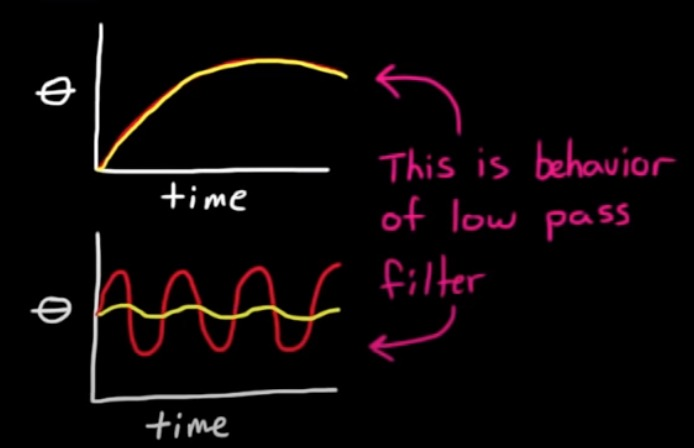
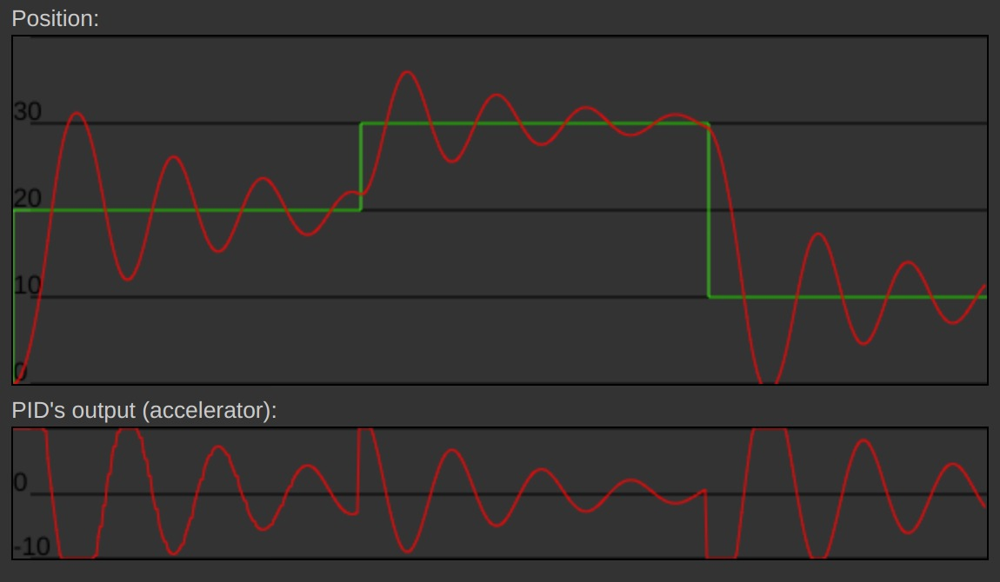
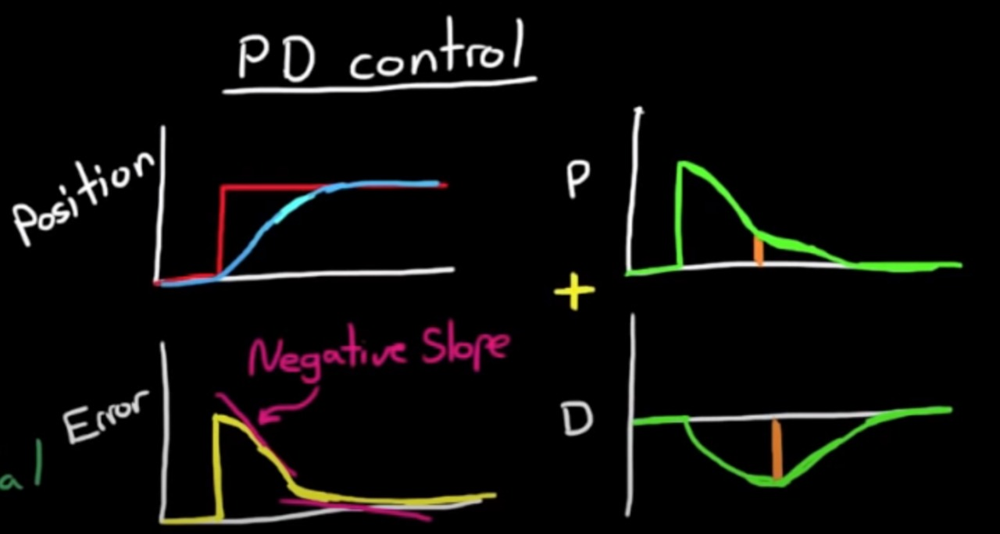
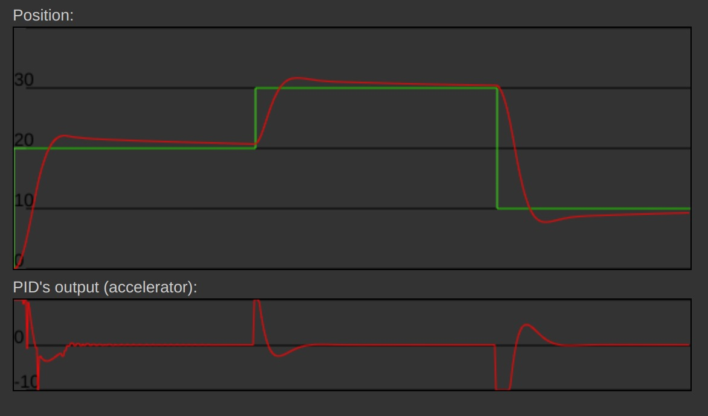
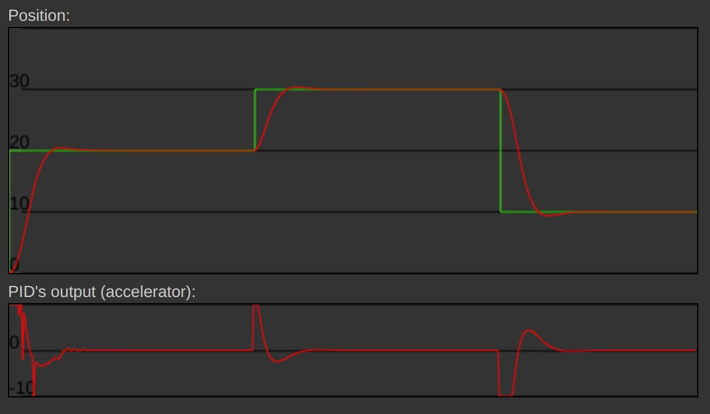
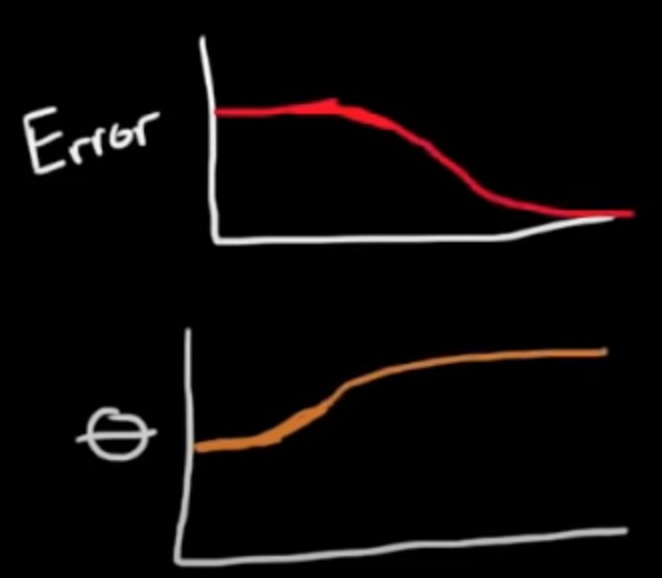
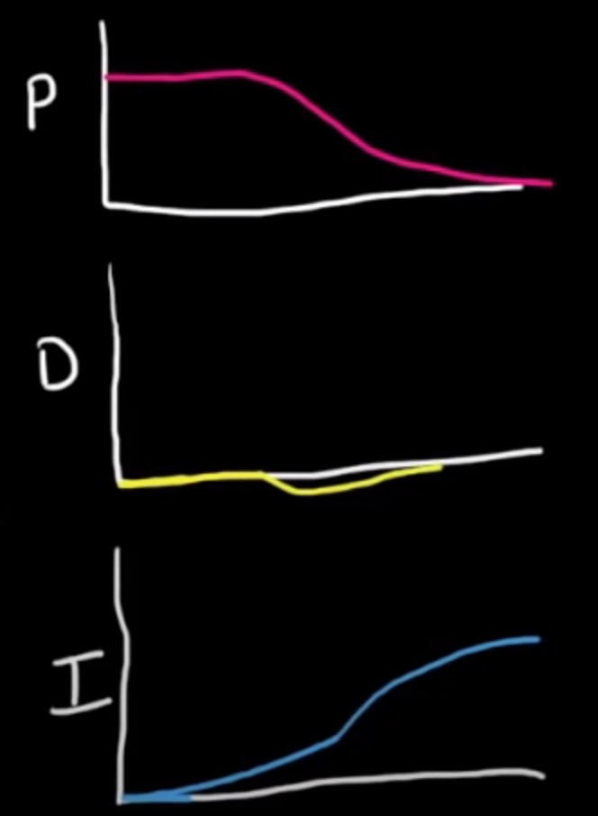

# PID CONTROL #2

This example uses reason and logic rather than math to see how PID controllers and their variations are used to generate the desired system
- [Simple Examples of PID Control](https://www.youtube.com/watch?v=XfAt6hNV8XM&list=PLUMWjy5jgHK20UW0yM22HYEUTMJfla7Mb&index=2)

- in reality control is a complicated nonlinear transfer function
- But we simplify this into Linear System by making some assumptions, which decreases accuracy but makes controlling these systems much easier

## Low-Pass Filter

- low-frequency inputs are passed to the output
- whereas higher frequency inputs produce an output that is much smaller
- this is the signature of a low-pass filter

## Understanding -

- the error is the difference between our reference command and the measured signal and the errors fed into our proportional controller
-  by increasing the gain of proportional term you run the risk of making your control system unstable

## PD Controller - 

- when you add the derivative term to the controller making a PD controller 
- you're adjusting the change in angle of the pedal based on the rate of change of the error as well as the magnitude
- interaction between proportional derivative is that the proportional path tries to get you to the destination as fast as possible while the derivative part is trying to restrain you and it takes the balance of the two.
- steady state error occurs

## PID Controller -

- integral path will slowly build up error for it to be significant enough to correct

> Representation of error being solved by PID Controller

## Tuning -

- Next step is to tune the controller according to requirements such that optimal path is followed or required result is obtained efficiently.

## References

- [Simple Examples of PID Control](https://www.youtube.com/watch?v=XfAt6hNV8XM&list=PLUMWjy5jgHK20UW0yM22HYEUTMJfla7Mb&index=2)