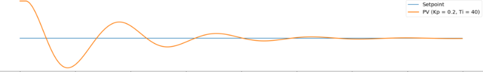

# P.I.D
What is a P.I.D?
P.I.D stands for ==Proportional, Integral and derivative== of a certain parameters of the system. Each of these parameters performs a different task and has a different effect on the functioning of a system.
In a typical PID controller these parameters are driven by a combination of the system command and the feedback signal from the thing that is being controlled (usually referred to as the "Plant"). Their outputs are added together to form the system output.
Please go through the following video for better understanding:
[P.I.D Controller](https://youtu.be/UR0hOmjaHp0 "Video")

## Scenario
Consider a hexacopter that we are using here, suppose we have set the cartesian co-ordinates w.r.t the body frame of refernce.
Now, if we want to fly the hexacopter to (x,y,z) cordinates (here, we ar not bothering the control system, we are just understanding whats happeining) it may offshoot from the point by (dx,dy,dz) term in order to get back at the desired position we should add or subtract the error.
> **Block diagram of PID**

## Types of error terms
* **Proportional**: Take the error and multiply it by a constant Kp.

* **Integral**: Take the cumulative total error and multiply it by a constant Ki.

* **Derivative**: Take the rate of change in error and multiply it by a constant Kd.

