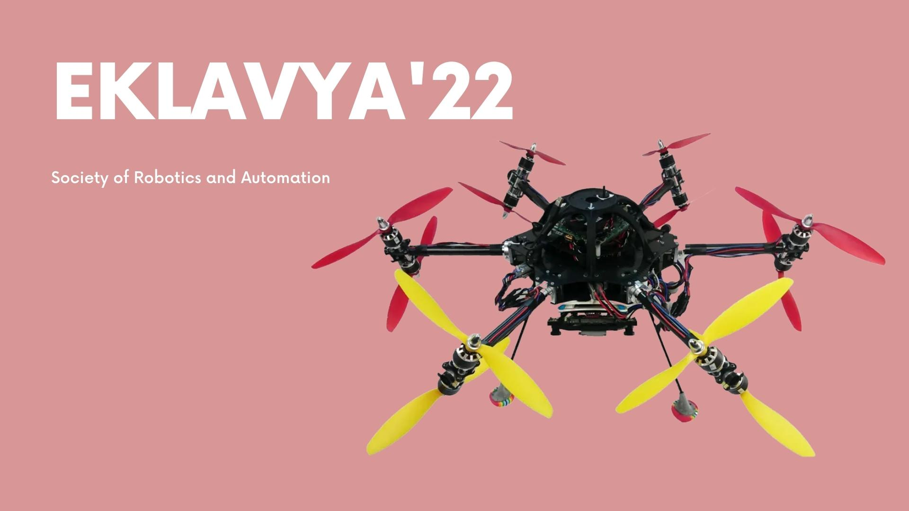
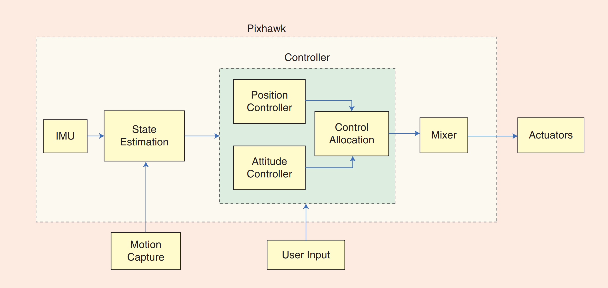
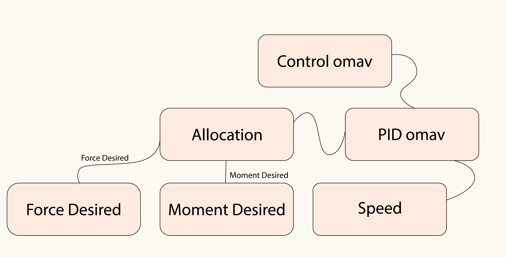
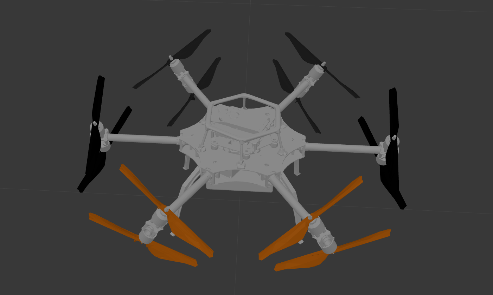

# Eklavya'22 Copter Control 



Designing & Implementing an Optimal Control System of an Overactuated Hexacopter with Co-axial Tilt-Rotors for Efficient Omnidirectional Flight in Simulation(Gazebo) using ROS & Python. Learning about dynamics of a basic UAV and further implementing that knowledge in understanding the various dynamics of our system.

## Demo


<!-- TABLE OF CONTENTS -->
## Table of Contents

- [Project](#Eklavya-Copter-Control)
  - [Demo](#demo)
  - [Table of Contents](#table-of-contents)
  - [About The Project](#about-the-project)
    - [Tech Stack](#tech-stack)
    - [File Structure](#file-structure)
  - [Getting Started](#getting-started)
    - [Prerequisites and installlation](#prerequisites-and-installlation)
    - [Installation](#installation)
    - [Execution](#execution)
  - [Algorithm Flowchart](#algorithm-flowchart)
  - [Results and Demo](#results-and-demo)
  - [Future Work](#future-work)
  - [Contributors](#contributors)
  - [Acknowledgements and Resources](#acknowledgements-and-resources)
  - [License](#license)
  - [Citation](#citation)
<!--ABOUT THE PROJECT -->
## About The Project
Drone aviation is an emerging industry with possible applications in agriculture, healthcare, e-commerce as well as traffic control. We were interesting in getting first hand experience in Dynamics of a UAV to get a firm grasp on the principles needed to work with drones in the future.
Extending the maneuverability of unmanned areal vehicles promises to yield a considerable increase in the areas in which these systems can be used. Some such applications are the performance of more complicated inspection tasks and the generation of complex uninterrupted movements of an attached camera. In our project, we our designing and implementing a control system for a novel aerial platform that combines the advantages of existing multi-rotor systems with the agility of omnidirectionally controllable platforms. We are using a hexacopter with co-axial tiltable rotors(omav) allowing the system to decouple the control of position and orientation.

This project involves understanding key concepts of Dynamics of UAVs, Modern Robotics, Control Systems, ROS, Gazebo which is essential knowledge to understand and work in the field of Robotics

Our full project report can be found [here](./report/Project_Report_Copter_Control.pdf)

[Brief Presentation](./report/Copter-Control.pptx) can be found here
[Detailed Presentation](https://www.canva.com/design/DAFO6QGqbzk/BZ5_9Rk-LoEGTwhVJiBExA/view?utm_content=DAFO6QGqbzk&utm_campaign=designshare&utm_medium=link2&utm_source=sharebutton) can be found here

## Project workflow
- To learn about different control systems
- Understanding Dynamics of a UAV and of our system(omav)
- Design a Control System for our model(omav)which is a model of hexacopter modelled by ETH-Zürich
- Implementing the Control System in Simulation(Gazebo)

### Tech Stack

- [ROS Noetic](http://wiki.ros.org/noetic)
- [Gazebo](http://gazebosim.org/)
- [Python 3](https://www.python.org/downloads/)
- Modern Robotics
- Control Systems


### File Structure
```
👨‍💻Eklavya-Copter-Control
 ┣ 📂assets                                 #contains gifs, videos and images of the results
 ┣ 📂report
 ┣ 📂rotors_comm                          # Contains msg files for windspeed
 ┣ 📂rotos_description                    # All urdfs and meshes are found in here
 ┃ ┣ 📂meshes
 ┃ ┣ 📂urdf
 ┃ ┃ ┗ 🗃️omav.xacro
 ┃ ┣ 🗃️CMakeLists.txt
 ┃ ┗ 🗃️package.xml
 ┣ 📂rotors_gazebo
 ┃ ┣ 📂launch                             # launch files
 ┃ ┃ ┗ 🗃️mav.launch                       # There are other launch files too but this is basic
 ┃ ┣ 📂models                             # files and meshes used to render the model
 ┃ ┣ 📂resource                             # files and meshes used to render the model
 ┃ ┣ 📂worlds                             # world files
 ┃ ┃ ┗ 🗃️basic.world
 ┃ ┣ 🗃️CMakeLists.txt
 ┃ ┗ 🗃️package.xml
 ┣ 📂rotors_gazebo_plugins 
 ┣ 📂scripts                            # python programs used to run the drone 
 ┃ ┣🗃️control_omav.py                   # controller which initializes the controller node
 ┃ ┣🗃️pid_omav.py                       # contains the pid term calculations
 ┃ ┣🗃️force_desired.py                  # gets force the copter needs from inertial frame and then trasforms it to body frame
 ┃ ┣🗃️moment_desired.py                 # gets moment desired in body frame using some cool quaternions
 ┃ ┣🗃️moment_force_allocation.py        # recieves both force and moments and blend them together smoothly
 ┃ ┣🗃️speed.py                          # Co-axial rotors need this for speed distribution 
 ┃ ┗🗃️takeoff.py                        # Simple test file for rookies
 ┣ 🗃️README.md
 ┣ 🗃️dependencies.rosinstall
 ┣ 🗃️rotors_demos.rosinstall
 ┣ 🗃️rotors_hil.rosinstall
 ┗ 🗃️rotors_minimal.rosinstall
 ```

<!-- GETTING STARTED -->
## Getting Started

### Prerequisites and installlation
* [Ubuntu 20.04](https://ubuntu.com/download/desktop)
* [ROS Noetic](http://wiki.ros.org/noetic/Installation)
* [Gazebo Sim](http://gazebosim.org/)
* It is recommended to install Gazebo along with ROS and not seperately

### Installation

[Installation Guide](./asset/Installations.md "Installation")

### Execution
Open two terminal windows and run the following commands
- Terminal 1

```sh
source ~/catkin_ws/devel/setup.bash
roslaunch rotors_gazebo mav.launch mav_name:=omav
```
- Terminal 2
```sh
source ~/catkin_ws/devel/setup.bash
cd ~/Eklavya-Copter-Control/scripts
chmod +x .                      
python3 control_omav.py
```

<!--Flowchart -->

## Algorithm Flowchart 
Control System

Controller and Sensor Readings, Reference Data Flowchart

Simplified code structure 


<!-- RESULTS AND DEMO -->
## Results and Demo


### Model  



Copter when target co-ordinates are given in control_omav.py:  


<!-- FUTURE WORK -->
## Future Work
Designing & Implementing an Optimal Control System of an Overactuated Hexa-copter with Co-axial Tilt-Rotors for Efficient Omnidirectional Flight in Simulation(Gazebo) using ROS & Python. Learning about the dynamics of a basic UAV and further implementing that knowledge in understanding the various dynamics of our system.

- [x] Designing Optimal Control System for Position Control using PID Algorithm
- [x] Designing Optimal Control System for Attitude Control
- [x] Implementing Control System with PID Tuning in Simulation(Gazebo) for reaching arbitrary altitude
- [x] Implementing Control System with PID Tuning in Simulation(Gazebo) for reaching Co-ordinates in free space
- [x] Implementing Control System with Tuning in Simulation(Gazebo) with decoupled Position and Orientation
- [ ] Improve Tuning, Control Algorithm for Efficient, Accurate, Stable and Fast Flight with decoupled Position and Orientation
- [ ] Achieve Stable Flight in presence of external disturbances like Wind,...
- [ ] Exploring different Control Systems & Approaches to improve performance of system
- [ ] Implement obstacle avoidance 

<!-- CONTRIBUTORS -->
## Contributors
* [Alqama Shaikh](https://github.com/aPR0T0)
* [Aryan Shah](https://github.com/ars-21)


<!-- ACKNOWLEDGEMENTS AND REFERENCES -->
## Acknowledgements and Resources
* [SRA VJTI](http://sra.vjti.info/) Eklavya 2022  
* [ETH-Zürich : ethz-asl/rotors_simulator Repository](https://github.com/ethz-asl/rotors_simulator) for the plugins as well as the model of the drone.
* [Tim Wescott](http://wescottdesign.com/articles/pid/pidWithoutAPhd.pdf) for the paper PID without PhD which was extremely illuminating for beginners in PID
* Our mentors [Jash Shah](https://github.com/Jash-Shah), [Sagar Chotalia](https://github.com/sagarchotalia) and [Ayush Kaura](https://github.com/Ayush-Kaura) for their guidance throughout the whole project
 
<!-- -->
## License
[MIT License](https://opensource.org/licenses/MIT)

## Citation
```sh
@Inbook{Furrer2016,
author="Furrer, Fadri
and Burri, Michael
and Achtelik, Markus
and Siegwart, Roland",
editor="Koubaa, Anis",
chapter="RotorS---A Modular Gazebo MAV Simulator Framework",
title="Robot Operating System (ROS): The Complete Reference (Volume 1)",
year="2016",
publisher="Springer International Publishing",
address="Cham",
pages="595--625",
isbn="978-3-319-26054-9",
doi="10.1007/978-3-319-26054-9_23",
url="http://dx.doi.org/10.1007/978-3-319-26054-9_23"
}
```
