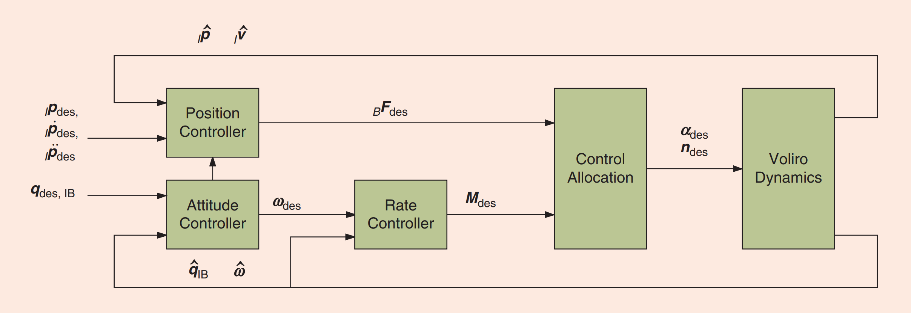
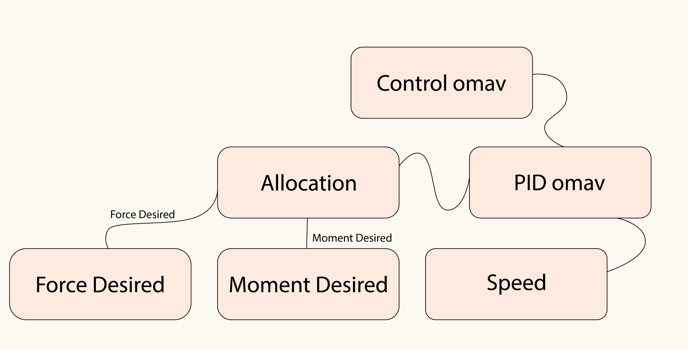
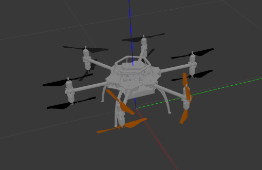

# Eklavya'22 Copter Control 

Designing & Implementing an Optimal Control System of an Overactuated Hexa-copter with Co-axial Tilt-Rotors for Efficient Omnidirectional Flight in Simulation(Gazebo) using ROS & Python. Learning about dynamics of a basic UAV and further implementing that knowledge in understanding the various dynamics of our system.

<!-- TABLE OF CONTENTS -->
## Table of Contents

- [Project](#Eklavya-Copter-Control)
  - [Table of Contents](#table-of-contents)
  - [About The Project](#about-the-project)
    - [Tech Stack](#tech-stack)
    - [File Structure](#file-structure)
  - [Getting Started](#getting-started)
    - [Prerequisites and installlation](#prerequisites-and-installlation)
    - [Installation](#installation)
    - [Execution](#execution)
  - [Algorithm Flowchart](#algorithm-flowchart)
  - [Results and Demo](#results-and-demo)
  - [Future Work](#future-work)
  - [Contributors](#contributors)
  - [Acknowledgements and Resources](#acknowledgements-and-resources)
  - [License](#license)
  - [Citation](#citation)
<!--ABOUT THE PROJECT -->
## About The Project
Drone aviation is an emerging industry. With possibilities for its applications in agriculture, healthcare, e-commerce as well as traffic control. We wanted to get first hand experience with how a drone is designed as well as how it flies to get a firm grasp on the principles needed to work with drones in the future.  
Our full project report can be found [here]()

## Project workflow
- To learn about different control systems and make gazebo simulation of a modelled hexacopter by ETH-Zürich
- Make the control system
- Implementation

### Tech Stack

- [ROS Noetic](http://wiki.ros.org/noetic)
- [Gazebo](http://gazebosim.org/)
- [Python 3](https://www.python.org/downloads/)


### File Structure
```
👨‍💻Eklavya-Copter-Control
 ┣ 📂Images                                 #contains gifs, videos and images of the results          
 ┣ 📂Resources and Research papers          #Contains all the research papers that we included for our case study
 ┣ 📂simulation
 ┃ ┣ 📂rotors_gazebo
 ┃ ┃ ┗ 📂launch                             # launch files
 ┃ ┃ ┃ ┗ 🗃️mav.launch                       # There are other launch files too but this is basic
 ┃ ┃ ┣ 📂models                             # files and meshes used to render the model
 ┃ ┃ ┣ 📂scripts                            # python programs used to run the drone   
 ┃ ┃ ┃ ┣🗃️control_omav.py                   # controller which initializes the controller node
 ┃ ┃ ┃ ┣🗃️pid_omav.py                       # contains the pid term calculations
 ┃ ┃ ┃ ┣🗃️force_desired.py                  # gets force the copter needs from inertial frame and then trasforms it to body frame
 ┃ ┃ ┃ ┣🗃️moment_desired.py                 # gets moment desired in body frame using some cool quaternions
 ┃ ┃ ┃ ┣🗃️moment_force_allocation.py        # recieves both force and moments and blend them together smoothly
 ┃ ┃ ┃ ┣🗃️speed.py                          # Co-axial rotors need this for speed distribution 
 ┃ ┃ ┃ ┗🗃️takeoff.py                        # Simple test file for rookies  
 ┃ ┃ ┣ 📂worlds                             # world files
 ┃ ┃ ┃ ┗ 🗃️basic.world
 ┃ ┃ ┣ 🗃️CMakeLists.txt
 ┃ ┃ ┗ 🗃️package.xml
 ┃ ┣ 📂dynamic_tutorials                    # Contains files for pid sliders
 ┃ ┣ 📂rotors_comm                          # Contains msg files for windspeed
 ┃ ┣ 📂rotos_description                    # All urdfs and meshes are found in here
 ┃ ┃ ┣ 📂meshes
 ┃ ┃ ┗ 📂urdf
 ┃ ┃   ┗ 🗃️omav.xacro
 ┃ ┗ 📂rotors_gazebo_plugins
 ┣📂Some Basic Concepts                     # All the learnings throughout this project are listed here
 ┗📂drone                                   # Fun to make custom msg file (To get an idea of how a custom message works)

 ```

<!-- GETTING STARTED -->
## Getting Started

### Prerequisites and installlation
* Tested on [Ubuntu 20.04](https://ubuntu.com/download/desktop)
* [ROS Noetic](http://wiki.ros.org/noetic/Installation)
* [Gazebo Sim](http://gazebosim.org/)
* Do visit these websites for the installation steps of the above mentioned software. It is recommended to install Gazebo along with ROS and not seperately

### Installation

[Installation Guide](./Installations.md "Installation")

### Execution
Open two terminal windows and run the following commands
- Terminal 1

```sh
source ~/catkin_ws/devel/setup.bash
roslaunch rotors_gazebo mav.launch mav_name:=omav
```
- Terminal 2
```sh
source ~/catkin_ws/devel/setup.bash
cd ~/Eklavya-Copter-Control/simulation/rotors_gazebo/scripts
chmod +x .                      
python3 control_omav.py
```


https://user-images.githubusercontent.com/97826285/194748183-21302200-b96e-4698-a9fe-57ef9b356e57.mp4


<!--Flowchart -->

## Algorithm Flowchart 
Basic Control system used

Overall controller flow

Simplified code structure 


<!-- RESULTS AND DEMO -->
## Results and Demo


Copter at start of the program:  



Copter when target co-ordinates are given in control_omav.py:  


https://user-images.githubusercontent.com/97826285/194613915-a2ed569a-9e6a-4278-b830-82055c5ecd51.mp4


For more results and demo please [click here](./Records%20and%20Reports/Records/Recordings)

For more pid values please [click here](./Records%20and%20Reports/Records/PId%20Values%20for%20tests)

<!-- FUTURE WORK -->
## Future Work
- [x] Create a control system for the drone using PID
- [x] Stabilise the Roll, Pitch and Yaw of the Copter 
- [x] Get the drone to fly at any arbitrary altitude
- [x] Have the drone fly to given co-ordinates and stabilise itself
- [ ] To make copter fly with an arbitary orientation at a given position
- [ ] Implement obstacle avoidance 

<!-- CONTRIBUTORS -->
## Contributors
* [Alqama Shaikh](https://github.com/aPR0T0)
* [Aryan Shah](https://github.com/ars-21)


<!-- ACKNOWLEDGEMENTS AND REFERENCES -->
## Acknowledgements and Resources
* [SRA VJTI](http://sra.vjti.info/) Eklavya 2022  
* [ETH-Zürich](https://github.com/ethz-asl/rotors_simulator) for the plugins as well as the model of the drone.
* [Tim Wescott](http://wescottdesign.com/articles/pid/pidWithoutAPhd.pdf) for the paper PID without PhD which was extremely illuminating for beginners in PID
* Our mentors [Jash Shah](https://github.com/Jash-Shah), [Sagar Chotalia](https://github.com/sagarchotalia) and [Ayush Kaura](https://github.com/Ayush-Kaura) for their guidance throughout the whole project
* Other [research papers](./Resources%20and%20Research%20papers) 
<!-- -->
## License
[MIT License](https://opensource.org/licenses/MIT)

## Citation
```sh
@Inbook{Furrer2016,
author="Furrer, Fadri
and Burri, Michael
and Achtelik, Markus
and Siegwart, Roland",
editor="Koubaa, Anis",
chapter="RotorS---A Modular Gazebo MAV Simulator Framework",
title="Robot Operating System (ROS): The Complete Reference (Volume 1)",
year="2016",
publisher="Springer International Publishing",
address="Cham",
pages="595--625",
isbn="978-3-319-26054-9",
doi="10.1007/978-3-319-26054-9_23",
url="http://dx.doi.org/10.1007/978-3-319-26054-9_23"
}
```
