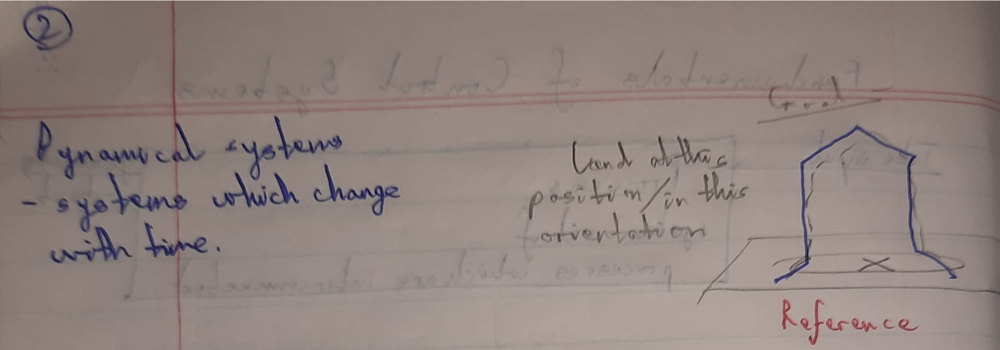
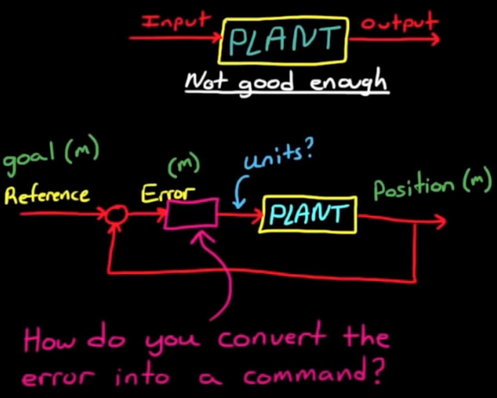
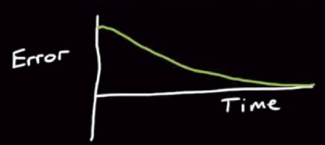

# Control Systems #1

1. Open Loop Control :

- performance of the system isn't good enough to meet your requirements 
- commands not given according to position of the robot
- open-loop commanding is perfectly fine for systems that don't change much or where accuracy isn't as important
- no way of compensating errors and making adjustments on its own

2. Closed Loop Control :

- sensing output of process and feeding it back so system can make adjustments accordingly
- Reference Value/Signal - which is the desired value or the ultimate goal
- we compare that to the measured value and what you're left with is the error or the Delta between where you are and where you want to be

3. Controller :
- takes the error signal and converts it into a command that is then sent into the plant(process)
- design this controller so that as time progresses the error or the difference between the current location and the goal is driven to zero
- zero error means that the measured position is exactly where you want it to be (system meets all of its requirements)

### References -

- [Control Systems Basics](https://www.youtube.com/watch?v=wVPOp-tptPQ)
- [PID Control - A brief introduction](https://www.youtube.com/watch?v=UR0hOmjaHp0&list=PLUMWjy5jgHK20UW0yM22HYEUTMJfla7Mb)