# Drone Simulation and Control #1

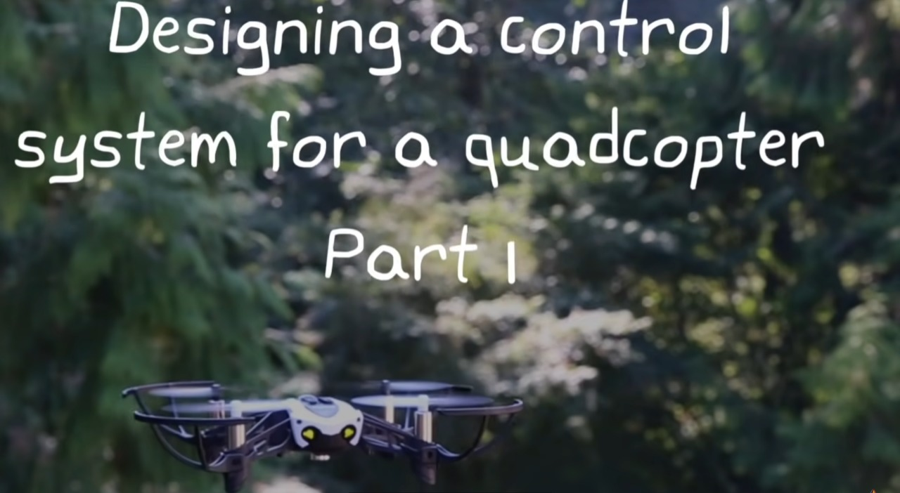

**Drones** have sophisticated control systems programmed into them that allow them to be stable and fly autonomously with very little human intervention.

**Propellers** are spun in precise ways to control a drone in 6 DOF(maybe different).

## Workflow of a Control Project :
- Requirements
- Understand the System
- Modelling
- Controller Design
- Testing

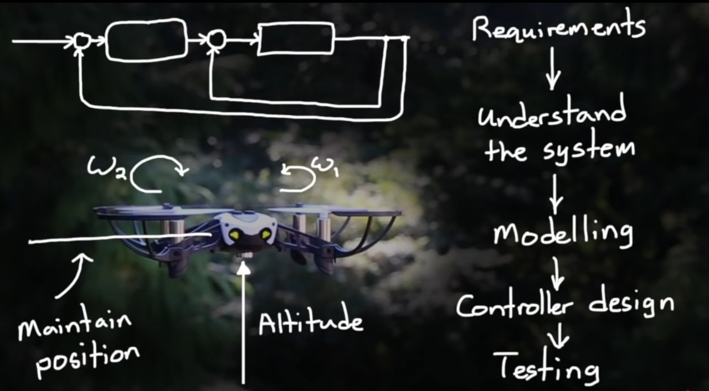

## **Rotorcraft** - Rotating Wing Aircraft which generates lift using rotating wing

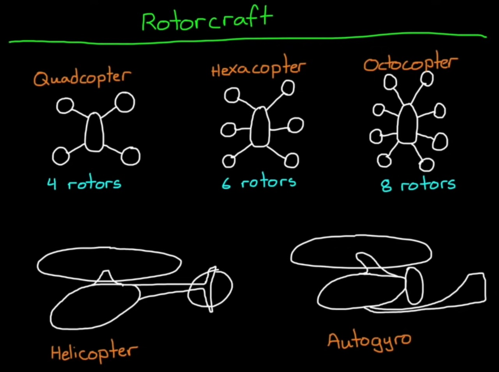

Even though all are rotary wing vehicles, they all have different dynamics. Hence requiring different control systems.

## Types of Configurations :

- Non-changeable : Existing hardware to be used
- Changeable : can change sensors/actuators, to re-configuration

## Sensors :

1. **Ultrasound Sensor :**
- measure vertical distances
- sends out a high-frequency sound pulse and measures how long it takes for that pulse to bounce off the floor and return back to the sensor
- from the measured time distance between the floor and the drone can be calculated
- **Upto 13 feet altitude** as after that the reflected sound is too soft for the sensor to pick up

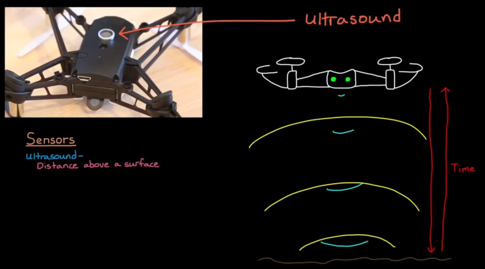

2. **Camera :**
- captures images at 60 fps
- image processing technique called optical flow used to determine how objects are moving between one frame and the next
- this apparent motion the mini drone can estimate horizontal motion and speed

3. **Pressure Sensor :**
- as the drone climbs in altitude the air pressure drops slightly
- this slight change in pressure is used to estimate the altitude

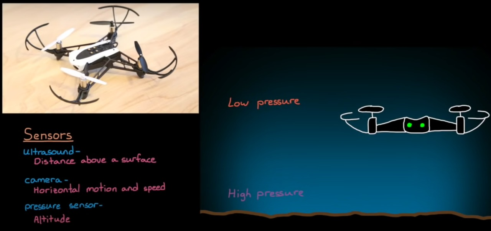

4. **IMU - Inertial Measurement Unit :**
- 3-axis accelerometer which measures linear acceleration
- 3-axis gyroscope that measures angular rate
- from IMU and acceleration due to gravity we can estimate the drone's attitude relative to gravity and how fast it's rotating

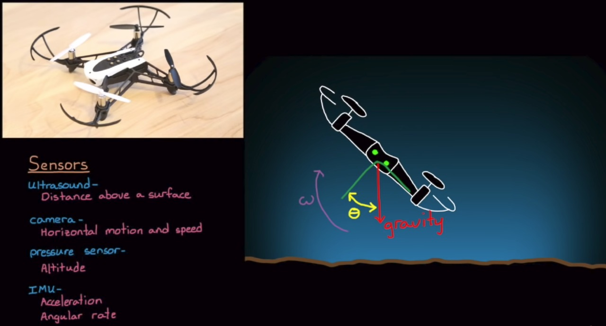

## Actuators :

- Colours of rotors are just there to indicate to the operator which way the drone is facing when they're flying it

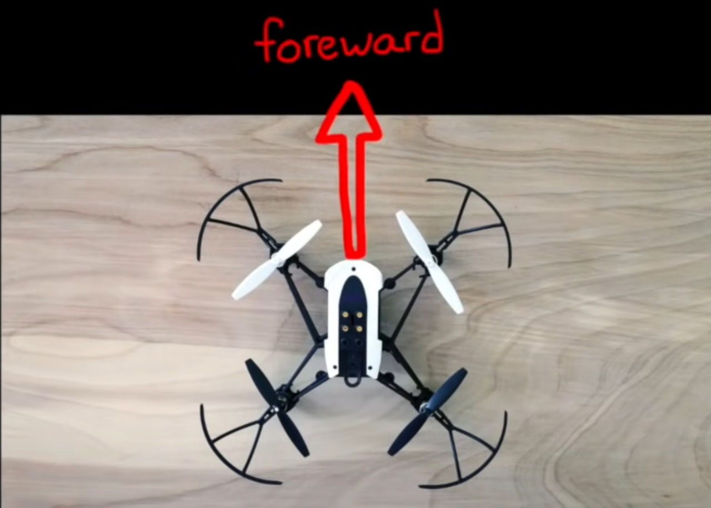

> Configuration & Spin Direction :

- X-Configuration
- Plus-Configuration
- Only difference will be which motors you send commands to when pitching and rolling

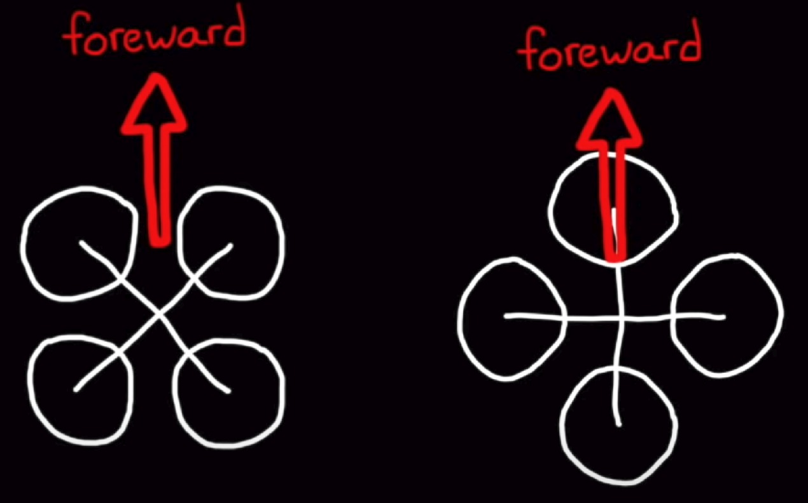

- The most ingenious part of a quad copters motor configuration is the spin direction
- Opposing motors spin in the same direction as each other but opposite direction as the other pair
- This is necessary to make sure that thrust, roll, pitch and yaw can be commanded independently of each other
- That means that we can command one motion without affecting the others
- In reality complex fluid dynamics around the drone means that all motion is coupled together in some way but our feedback control system corrects this error

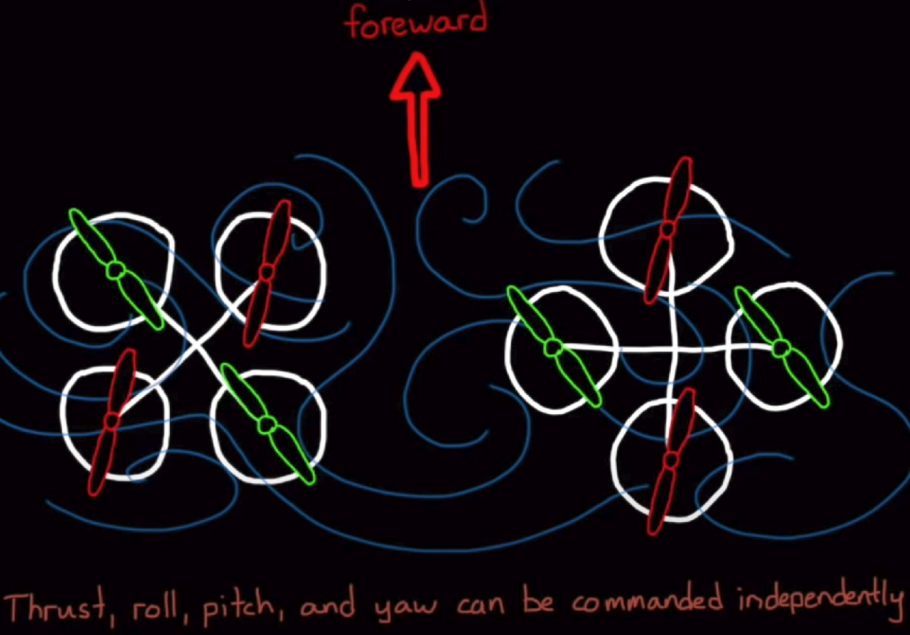

## Control Problem

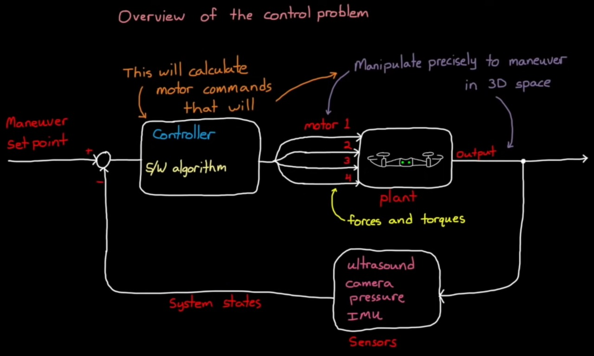

- Drone is the system
- 4 actuators that inject forces and torques into the system
- how to manipulate these 4 motors in a very precise way so that the drone can rotate and maneuver in 3-D space
- Sensors gives system states like angular position and rates altitude and horizontal velocity (the states that were estimating depend on the control architecture and goal)
- Maneuver Set Point and System State sent to a Controller

> Controller : 
    - is a Software Algorithm
    - which takes our Maneuver Set Point and estimated System State
    - and calculates those precise motor commands that will inject the necessary forces and torques

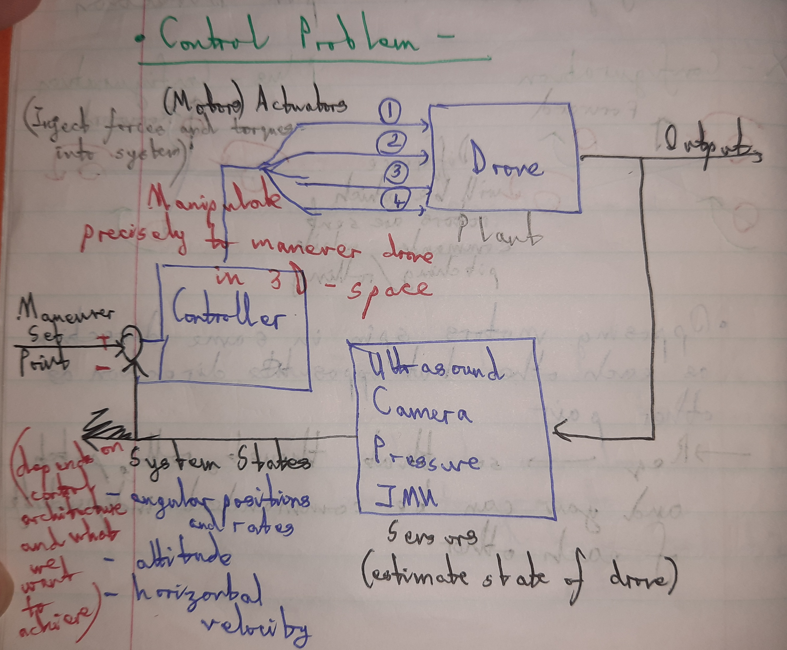

- But it is difficult to make algorithm

### Problems in Quadcopter -

- under actuated system
- 4 actuators
- But 6 DOF
    a. 3 Translational 
    b. 3 Rotational

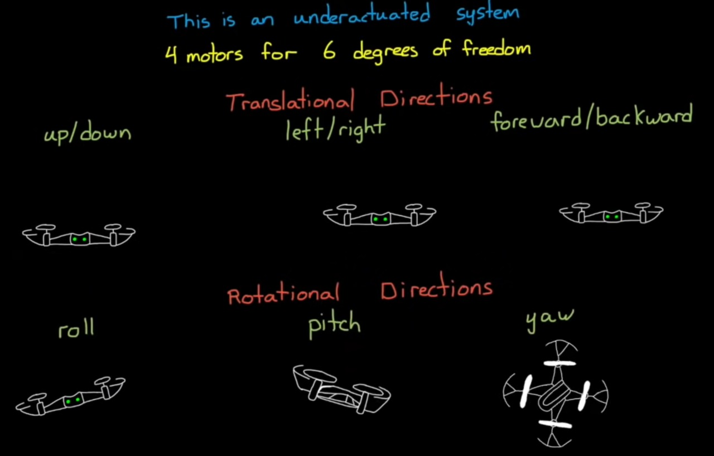

- Since we don't have an actuator for every motion
- Hence some directions are uncontrollable at any given time
- Eg - Can't go Left/Right/Forward/Backward without first rotating in that direction

> Solution -

- Control system that couples rotations and thrust to accomplish the overall goals

## How we generate thrust, roll, pitch and yaw with just four motors :

> how spin direction allows us to decouple thrust, roll, pitch and yaw from one another

1. Thrust :
- A motor produces thrust by spinning a propeller which pushes air down causing a reaction force that is up

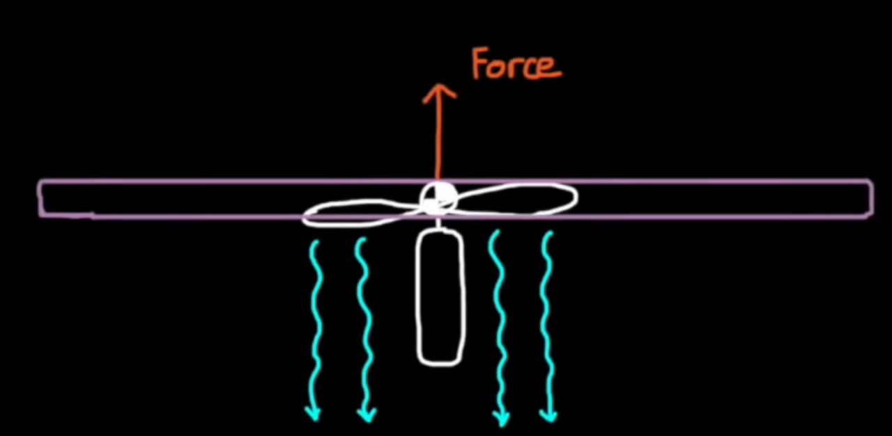

- If the motor is placed in a position that the force is applied through the center of gravity of an object then that object will move in pure translation with no rotation

- If the force of the thrust is exactly equal to and opposite the force of gravity then the object will hover in place

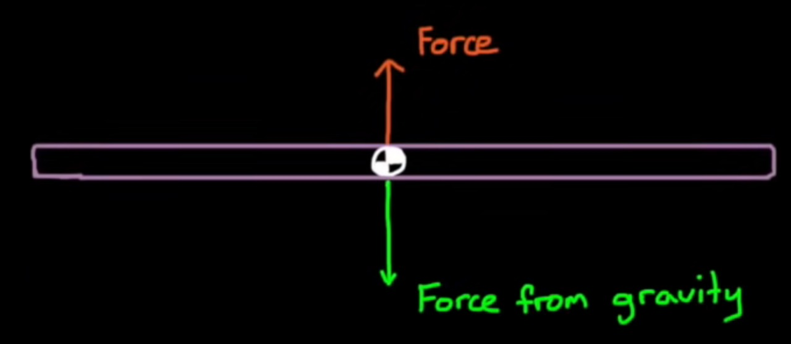

- A force at a distance from the center of gravity produces both a translational motion as well as a torque
- If our motor is attached to the bar as it rotates the torque will stay constant
- But the force is now no longer always in the opposite direction of gravity
- Hence our bar will begin to move off the side and fall out of the sky

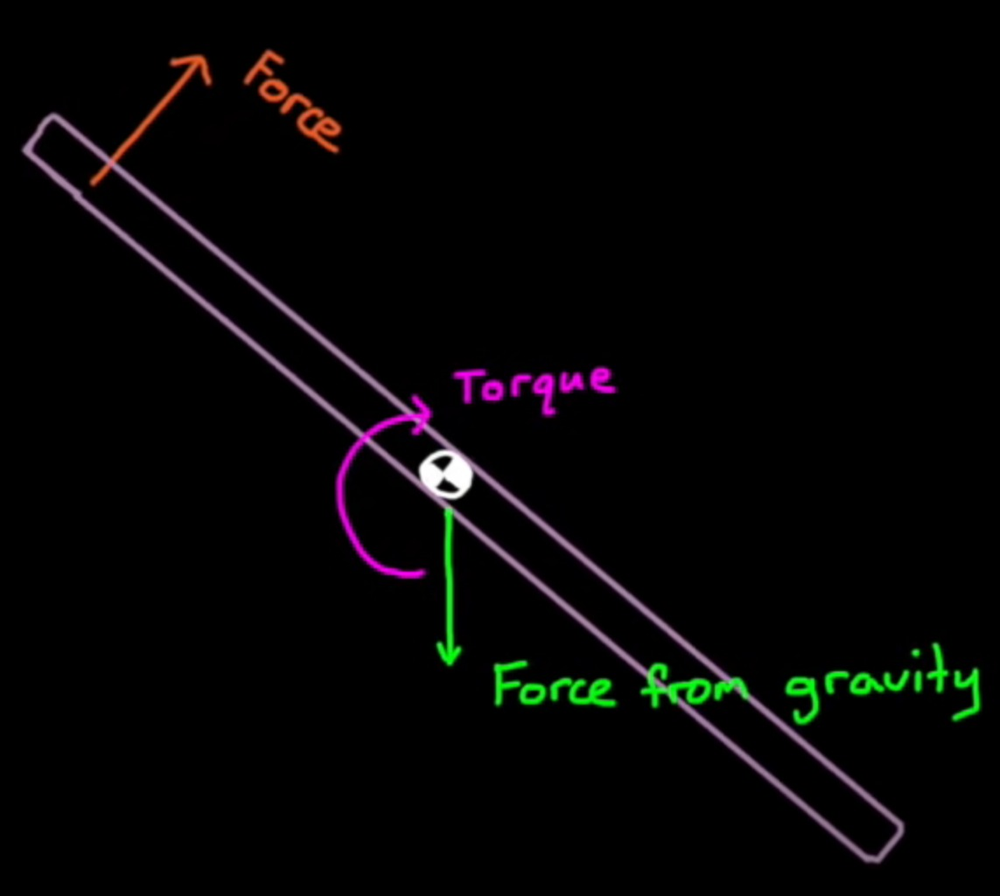

- Now if there's a counter force on the opposite side of the center of gravity and each force is half of the force of gravity then the object will again stay stationary because the torques and forces will cancel each other out

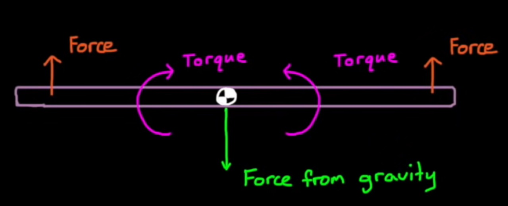

- But our actuators don't generate purely force when it generates thrust since it accomplishes thrust by rotating and torquing a propeller which has mass our actuators are also generating a reaction torque that is in the opposite direction
- If both of our motors are spinning in the same direction then the torque is doubled and our bar would start to rotate

- To counter this torque we could spend the two motors in opposite directions
and that would work just fine for two dimensions
- but we can't roll this bar

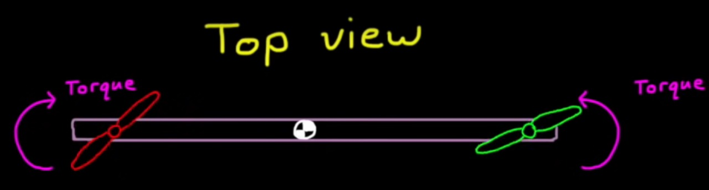

- Hence we add a second bar with two more motors to create our quadcopter
- With this configuration we can hover by accelerating each motor until they each produce a force one fourth that of gravity

> **Configuration** - opposing motors spinning in the same direction

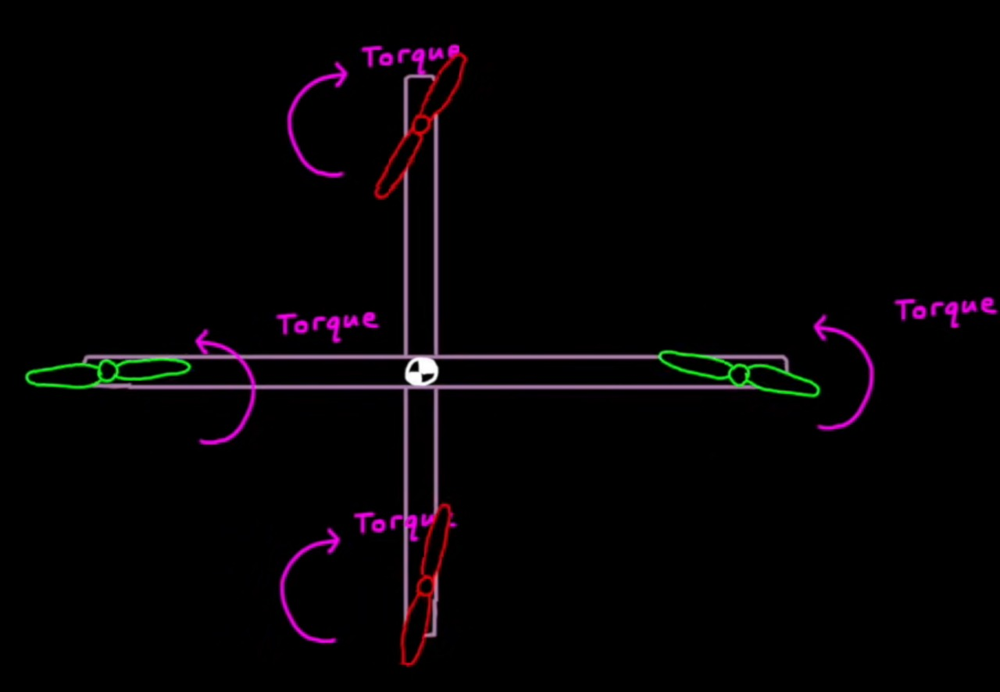

## Reason for opposing motors spinning in the same direction - Configuration :

1. How yaw (flat spinning motion) interacts with thrust, roll and pitch -

- slowing two motors down that are running in the same direction and speed the other two up
- hence thrust remains same due to which we're still hovering and counteracting gravity
- but Sumation of motor Torque is non-zero
- causing yaw-motion
- forces about Centre of Mass is Zero, hence no roll or pitch

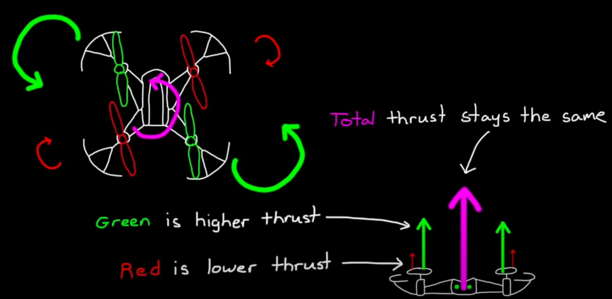

- If the rotating motor pairs are on the same side
- then slowing one pair down and increasing the other pair will cause an imbalance of forces about the center of gravity
- and the vehicle will either pitch or roll depending on which side the motor pairs are on
- However if we separate the two motors and place them on opposite sides of the drone then the forces will balance each other out

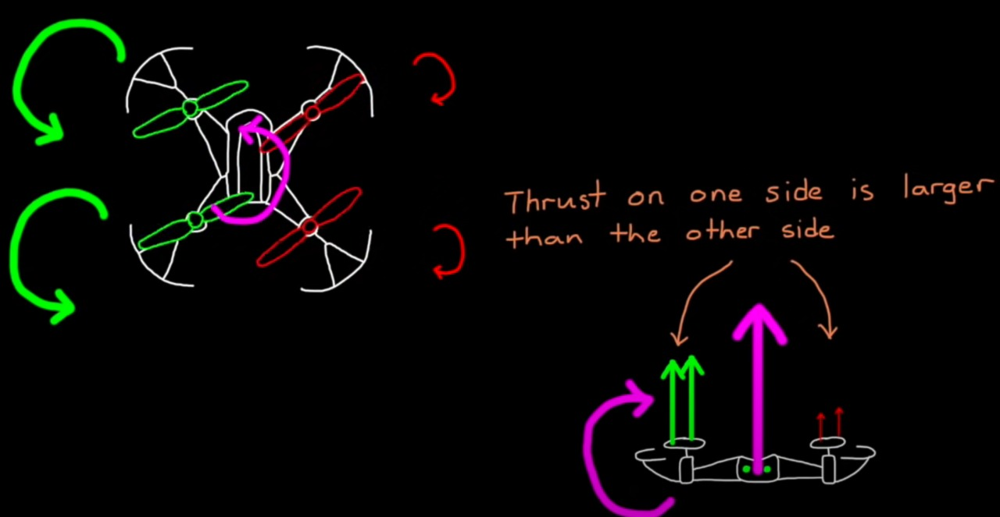

> Hence **motor configuration** and **spin directions** are so CRITICAL

2. Roll -

- decrease one of the left/right pairs and increase the other causing a rolling torque

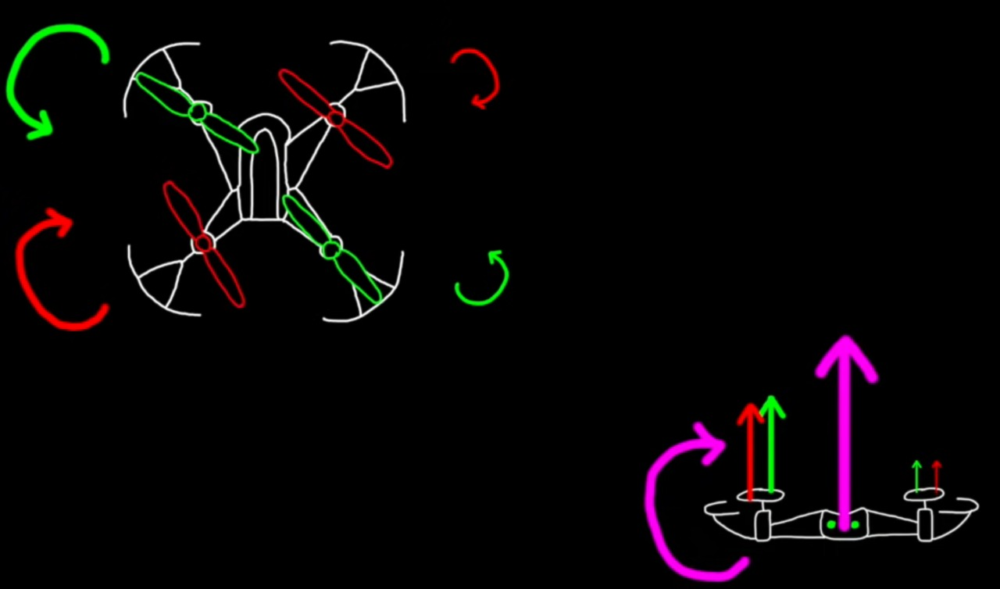

3. Pitch - 

- decrease one of the front/back pairs and increase the other causing a pitching torque

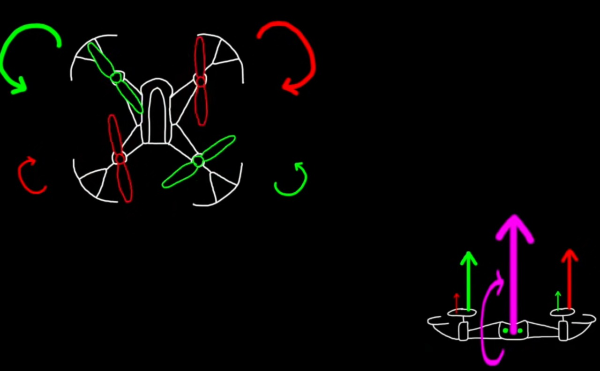

> Both of these motions would have no effect on yaw since we're moving counter rotating motors in the same direction and their yaw torque would continue to cancel out each other
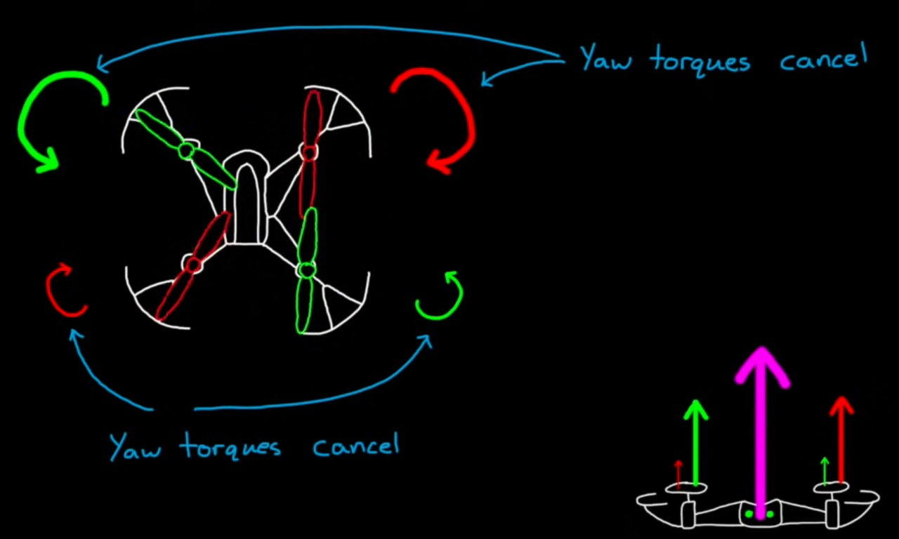

4. Thrust -

- tcontrolled by setting all 4 motors with the same speed.
- Increased/Decreased/Constant speed according to requirement

## Motor Mixing Algorithm :

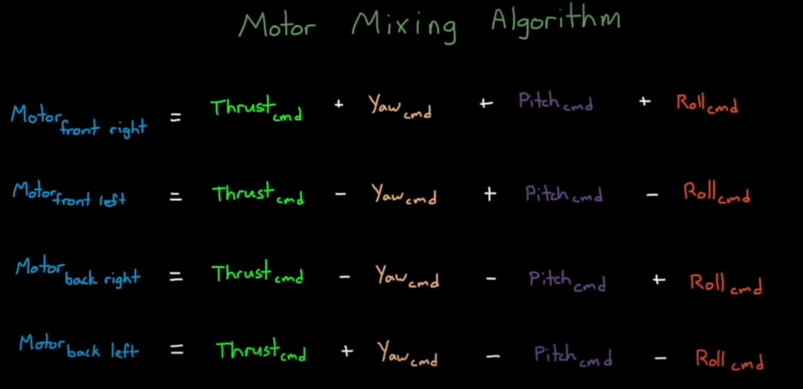

- Thrust - controlled by all 4 rotors at same speed
- Yaw - controlling opposite pairs spinning in same direction
- Pitch - Front/Back pairs controlled
- Roll - Left/Right pairs controlled

This is our simple motor mixing algorithm that can convert between the intuitive roll pitch yaw and thrust and the less intuitive motor and speeds.

## Forward/Backward/Left/Right Motion :

- Forward/Backward/Left/Right Motion our unactivated motions
- first tilt in direction of motion such that force (thrust) vector is partially in direction opposite to that of gravity and partially in direction of motion

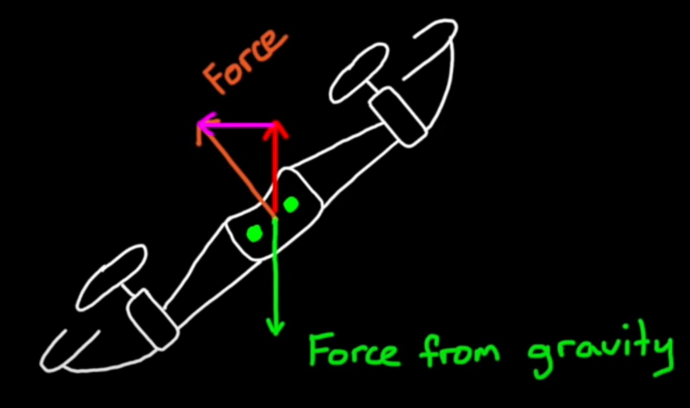

- Now if we wanted to maintain altitude while we do this maneuver then we would increase the thrust so that the vertical component is still cancelling out the downward pull of gravity

### References -

- [Drone Simulation and Control, Part 1: Setting Up the Control Problem](https://www.youtube.com/watch?v=hGcGPUqB67Q&list=PLn8PRpmsu08oOLBVYYIwwN_nvuyUqEjrj&index=1)