# Drone Simulation and Control #3

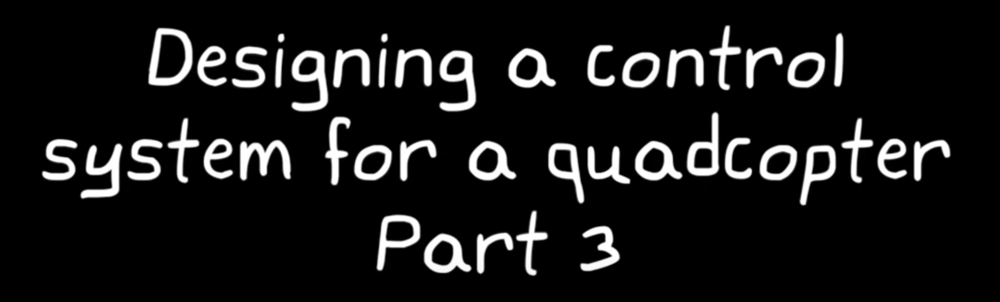

> **Steps Done -**
    - How quad-copters generate motion using their 4 propellers
    - A Control System Architecture which is capable of getting drone to hover

> **Steps Required to be Done -**
    - Code Control Logic (FLIGHT CODE) - in a way that we can put it on the mini drone
    - Tune and Tweak Flight Code - until the hover performance meets requirements - use MODEL-BASED DESIGN to achieve this goal which is to use a realistic model of the quad-copter in the environment to design our flight code and simulate the results
    - Fly Drone!!!

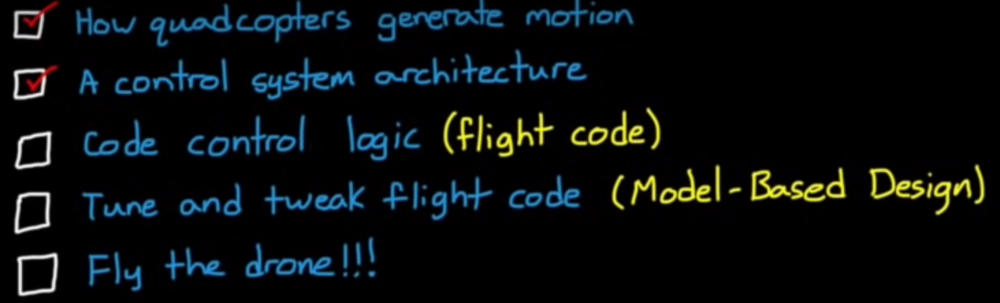

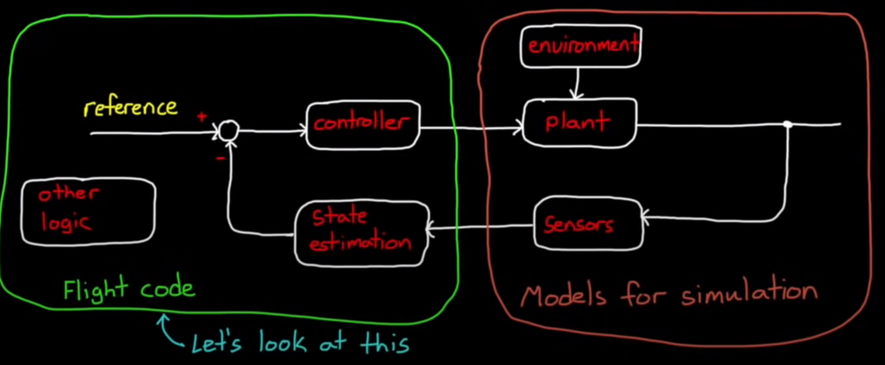

## Flight Control Software -

- it is just a small part of the overall flight code that will exist on the drone
- there's code to operate and interface the sensors and process their measurements
- there's code to manage the batteries, the Bluetooth interface and the LEDs
- there's code to manage the motor speeds and so on 

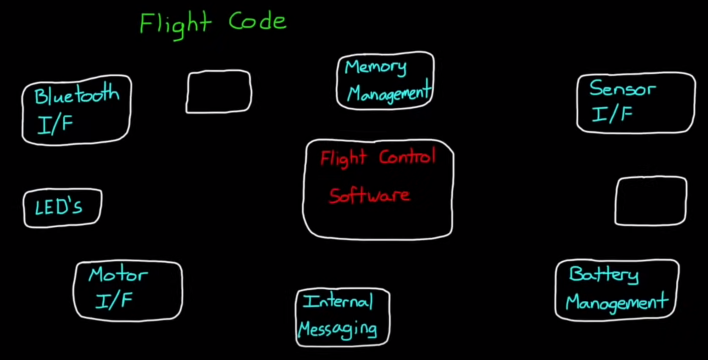

### 2 Ways to Implement the Flight Controller -

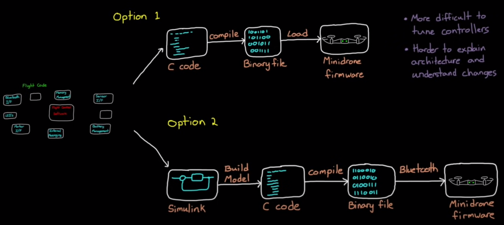

1. Option 1 - **Write C code by hand** -

- write the C code by hand and then compile the entire flight code with fewer changes to the flight controller and then finally load the compiled code to the mini drone

> Reasonable approach to creating flight code but it has a few **drawbacks** when developing feedback control software 
    - with this method we don't have an easy way to tune the controllers, except by tweaking them on the hardware
    - we could develop our own tuning tools and a model of the system, and then simulate how it would behave that way
    - but designing a modeling control systems in C code makes it harder to explain the architecture to other people and it's more difficult to understand how changes impact the whole system than it is with just graphical methods 
    
2. Option 2 - **Graphical Method** -

- describing the flight controller graphically using block diagrams
- we will develop the flight controller in Simulink
- then Auto code it into C code, where if we wanted to we can make changes manually 
- then compile that C code and load it onto the mini drone

> **Advantages -**
    - Simulink code is easier to understand 
    - additionally we can build a model of the drone and the environment and Simulink so that we can simulate the performance of our flight controller and use existing tools to tune the controller gains

> Now we won't need to worry about writing most of the flight code because we're going to use the Simulink Support Package for Parrot Mini-drones to program our custom flight control software 
    - this package loads new flight firmware on the vehicle in a way that keeps all of the normal operating functions of the drone in place but lets us replace the control portion of the firmware as long as we keep the same input and output signals intact 
    - then when we program the mini drone through Simulink 
    - any code we write will be placed in the correct spot and can interface with the rest of the mini drone firmware

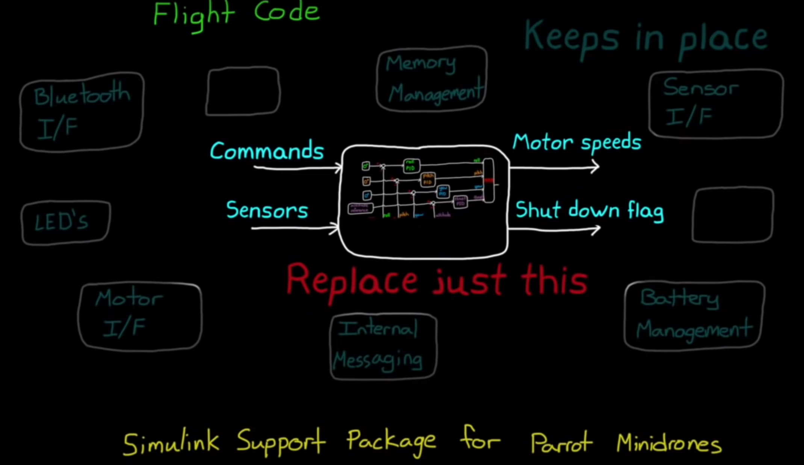

    - design a Simulink model that takes external commands and the measured sensor readings as inputs
    - and outputs the commanded motor speeds along with the safety flag that will shut the mini drone down when it's set
    - this safety flag is our protection in case our code causes the drone to become uncontrollable/perform dangerous/non-desireable maneuvers
    - then we can build the C code from that model and fly the actual drone with that software to test the drone

## Sub-systems of Control System -

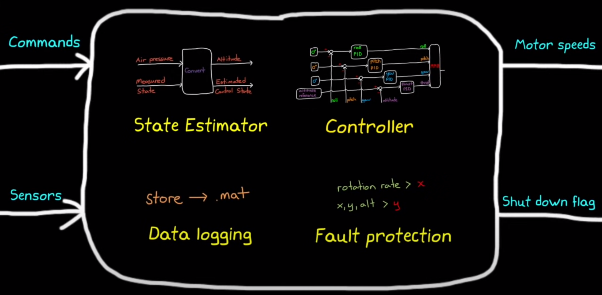

1. Controller -

- the flight control system with the developed architecture
- software algorithm

2. State Estimator -

- additional logic used to convert all of the measured states coming from the sensors into the control States needed by the controller
- Eg - air pressure sensor measures the air pressure reading 
        - this cannot be passed into our flight control system as we're not trying to control the drone to a particular pressure but we're trying to control an altitude 
        - hence,we require to convert from air pressure to altitude 

3. Fault Protection -

- logic that determines whether or not to set the shutdown flag 
- required as we'd run the risk of the drone flying away or causing harm to nearby observers 
- we could check for things like the rotation rate of the drone is above some threshold or the position or altitude is outside some boundary set
- relatively easy to develop code and can really save us from damaging the hardware or other people 

4. Data Logging -

- all of the firmware that exists on the mini drone records data that we have access to during and after the flight 
- since the mini drone doesn't know about the software that we've written 
- requirement to make sure that we have data logging set for the variables that were interested
- using Simulink can easily create logic
that will store data as a **.mat** file locally on the drone and then we can download it to MATLAB after the flight

> These are the 4 main subsystems that we need to develop in Simulink in order to have safe and functioning flight code

## Building Flight Code using Simulink -

> Note : we will not be using Simulink to make controllers, this is for understanding purposes

- Aerospace Blockset in MATLAB has a quadcopter project based on the parrot mini-drone, hence no need to write code from scratch, we're going to use this
- we understand how Simulink code matches the Control Architecture designed by us
- it also helps in state estimation data logging and fault protection
- following is a complete Simulink Model which also includes additional logic than our requirement

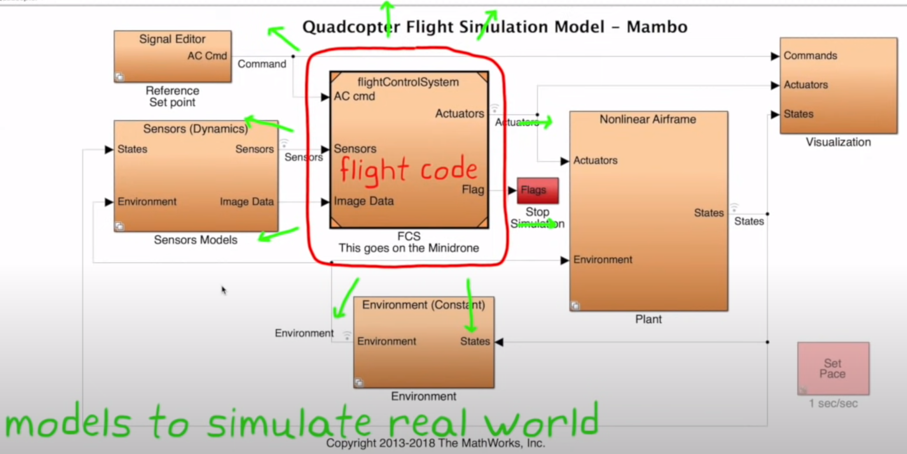

- the model has several subsystems like FCS, Airframe, Environment, and so on
- it is a classic feedback control system
- Signal Editor is generating the reference signals or the set points that we want the drone to follow
- flight control system block is where the error term is generated and the PID controllers live, this is the flight code block that gets auto coded and loaded onto the mini drone 
- the outputs from the FCS block are the motor commands that are sent to the rotors
- visualization block just plots the signals and runs the 3d visualizer and it's outside of our feedback loop
- environment block that models things like gravity vector and air pressure for the plant and the sensors
- the sensor model block which simulates the noise and dynamics of the force sensors that are on the mini drone

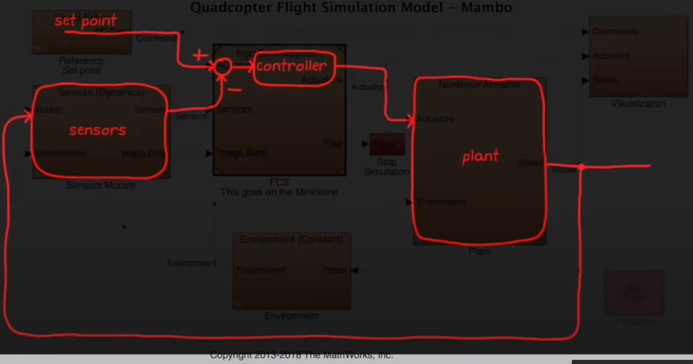

### FCS Block - 

- FCS block is the flight code and everything else is part of the model used for the simulation
- third input is the software as written makes use of the camera and image processing to help with precision landing 

> Following is Flight Control System Diagram

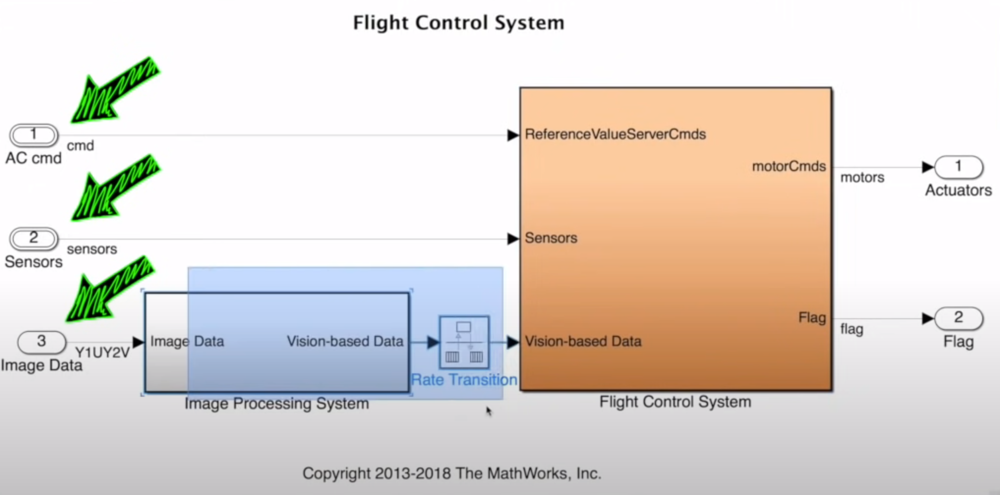

> Following is FCS Block

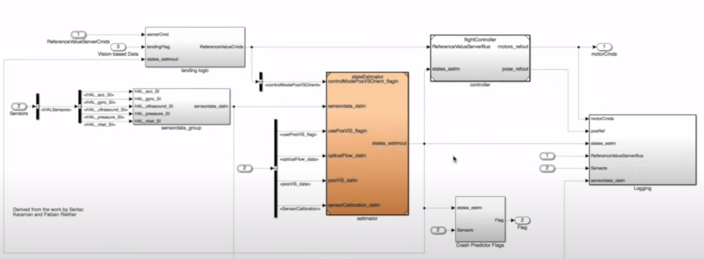

- the controller subsystem takes the reference signal and compares it to the estimated states to get the error signals
- this error is then fed into several PID controllers to ultimately generate the required motor commands

> Following is The Subsystem Block

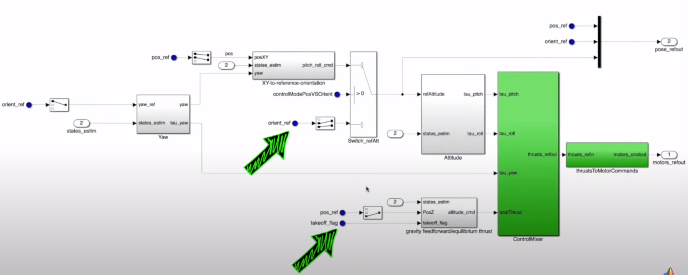

- additional logic allows us to command special takeoff behaviors as well as control the roll and pitch angles directly for landing

> Controller for our basic requirement (Hover Maneuver) -

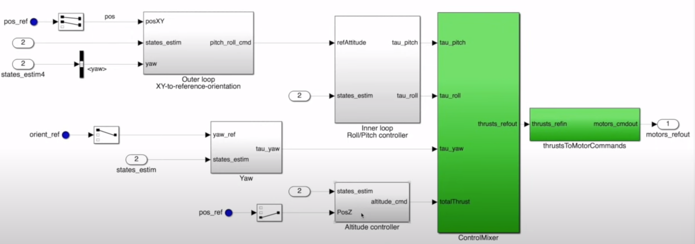

- XY position outer loop controller which is feeding into the roll and pitch inner loop controller
- independent of those two we have the yaw and altitude controllers
- 6 PID controllers that work together to control the position and orientation of the mini drone

> Altitude Controller -

 if we take a look at just
the altitude controller which is set up
as a proportional and derivative you'll
see that it might be implemented
slightly differently than you're used to
rather than a single altitude error term
feeding into both the P and D branches
the P gain is applied to the altitude
error derived from the ultrasound
whereas the D gain is applied to the
vertical rate estimate that comes from
the common filter in the state
estimation block this way we don't have
to take a derivative of a noisy altitude
signal we already have a derivative
estimate and one that's less noisy than
taking the derivative of the ultrasound
I'm gonna talk more about the benefits
and drawbacks of tuning when setting up
your PID controller in this way in a
future video in this series for now
we'll just accept that this is the way
it is and move on the output of these
PID controllers our force and torque
commands which all feed into the motor
mixing algorithm this produces the
required thrust per motor and then that
thrust command is converted into a motor
speed command through this block all in
all this subsystem is executing the
logic that we built in the last video
all right let's leave the controller for
now and move on to the state estimator
because there's some really cool stuff
going on in this block that we should
talk about there are two steps involved
in taking raw sensor measurements and
generating estimated states first we
process the measurements and then we
blend them together with filters to
estimate the control States let's look
at the details of the sensor processing
block first this looks like a daunting
task at first but the underlying concept
is pretty simple along the top here the
acceleration and gyro data are
calibrated by subtracting off the bias
that had been previously determined and
by removing this bias then zero
acceleration and zero angular rate
should result in a zero measurement the
next step is to rotate the measurements
from the sin
a reference frame to the body reference
frame and lastly we need to filter the
data through a low-pass filter to remove
the high frequency noise
similarly the ultrasound sensor has its
own bias removed and the optical flow
data just has kind of a pass/fail
criterion if the optical flow sensor has
a valid position estimate and we want to
use that estimate then this block sets
the validity flag to true there's always
more sensor processing that can be done
but we'll see shortly that our drone
hovers quite nice with just this simple
amount of bias removal coordinate
transformations and filtering now that
we have filtered and calibrated data we
can begin the task of combining
measurements to estimate the states we
need for the controllers the two orange
blocks are used to estimate altitude and
XY position if you look inside these
blocks you'll see that each of them use
a calman filter to blend together the
measurements and a prediction of how we
think the system is supposed to behave
in order to come up with an optimal
estimation there is already a MATLAB
Tech Talk series that covers common
filtering so I'm not gonna spend any
more time on them here but I recommend
watching that series if you're not
familiar with it and I've left a link in
the description of this video the other
non orange block estimates roll pitch
and yaw and it doesn't using a
complimentary filter instead of a common
filter a complimentary filter is a
simple way to blend measurements from
two sensors together and it works really
well for this system in the description
of this video I also linked a
complimentary video on complementary
controllers that I posted to my channel
if you're interested all right with the
state estimation and controller
subsystems described we can now move on
to the other important but less flashy
subsystems
there's the logging system that's saving
a bunch of signals like the motor
commands and position references to dot
mat files these are the values that we
can download and plot after the flight
we also have the crash predictor flag
subsystem the logic in this block is
just checking the sensed variables like
position and angular velocity for
outliers and when that happens it sets
the flag that shuts down the mini drone
and this is where you could add
additional fault protection logic if you
wanted to there's also the sensor data
group subsystem which is really just
pulling individual sensor values off of
the sensor bus so that we have access to
them elsewhere in the code and then
right above it there's the landing logic
block this block will overwrite the
external reference commands with landing
commands if the landing flag is set once
again I'm going to remove the switch and
the landing portion to simplify this
logic since we don't want to execute a
precision landing now I have to change
one other thing in here because the
reference block from the top level of
the model isn't part of the auto code
that runs on the drone so it won't get
loaded onto the drone and it won't
execute but that's ok because I can move
this logic into the flight code right
now and since I know I just want the
drone to hover I'm going to hard-code
the reference values in this block there
we go this will keep the drone at an X Y
position of 0 and 0 meters and an
altitude of minus 0.7 meters remember
the z-axis is down in the drone
reference frame so this is an altitude
of 0.7 meters up alright now this block
is no longer landing logic but instead
it's the block that's generating our
reference commands and we don't need
these inputs into the block anymore
since the reference commands are now
hard-coded values
and with that that completes the very
quick walkthrough of the entire flight
control software that is in the
quadcopter model and you should now sort
of understand how each of these
subsystems contribute to getting our
mini drone to hover safely whether it's
the sensor processing and filtering or
the various feedback controllers or even
just the logic that sets the stop flag
we needed all to have a successful
control system now I haven't yet spoken
about how to tune all of these PID
controllers but that's going to be a
future video in this series for now we
can rely on the fact that the default
gains delivered with the model are
already tuned pretty well alright enough
looking at Simulink models I think it's
time we see this default flight code in
action by flying it on the parrot
mini-drone
I already have the Simulink support
package for parrot mini-drone installed
so all I need to do is pair my drone to
my computer via bluetooth and then hit
the build model button at the top of the
Simulink model again the webinar linked
in the description describes how to set
all of this up if you're interested in
doing this at home
now while the software is building let
me revisit what's going on here behind
the scenes we have all of this flight
code in Simulink which at the top level
has the necessary interfaces for the
rest of the mini drone firmware we're
now in the process of auto coding C code
from the Simulink block diagrams and if
you have Simulink code or installed like
I do then you're gonna have access to
the C code and you can make changes if
you like now if you don't have simulant
coder then you just can't see the code
but it's still generated the C code is
then compiled on your computer and the
compiled binary code is sent to the mini
drone via bluetooth and placed in the
correct spot in the firmware once it's
ready to fly this GUI interface pops up
which allows us to start the code on the
drone and more importantly stop it I've
set up my computer and drone in an area
that's safe to fly but don't forget to
grab your safety goggles
alright now at this point we just sit
back hit the start button and watch our
feedback control system in action
[Music]
you
now in the next video I'm gonna deep
dive into the models like I did with the
flight code in this video so that way
you are gonna have a pretty good
understanding of how we're simulating
the real world and then how we're gonna
use those models to tune the
controller's ourselves now if you don't
want to miss the next Tech Talk video
don't forget to subscribe to this
channel also if you want to check out my
channel control system lectures I cover
more control theory topics there as well
thanks for watching and I'll see you
next time

### References -

- [Drone Simulation and Control, Part 3: How to Build the Flight Code](https://www.youtube.com/watch?v=3Gtb5Eq1Lvk&list=PLn8PRpmsu08oOLBVYYIwwN_nvuyUqEjrj&index=4)
