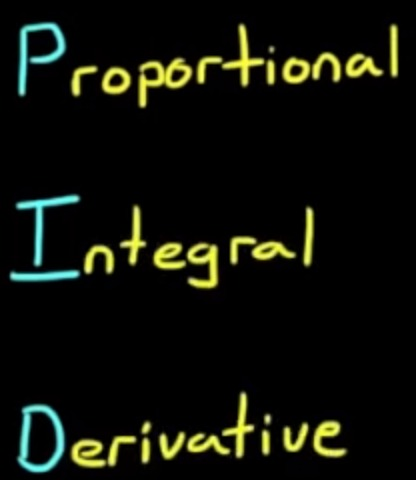
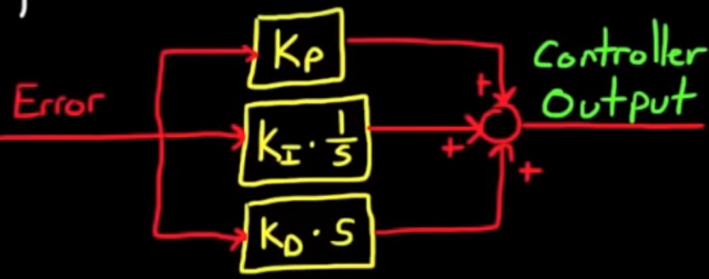
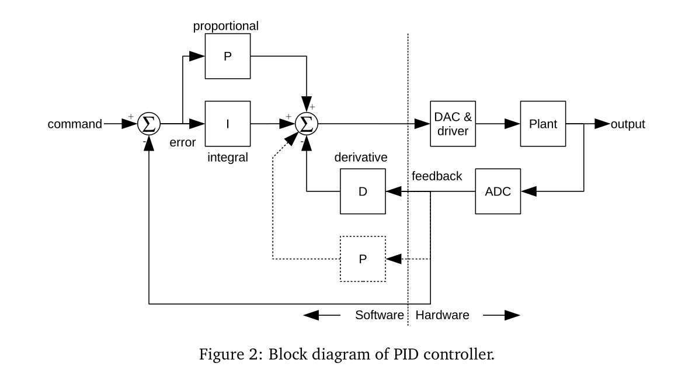
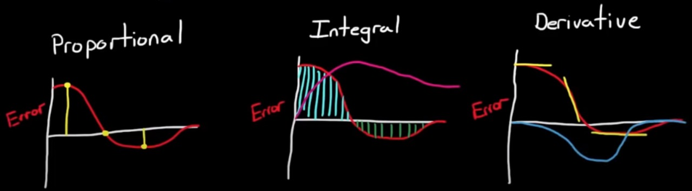

# PID CONTROL #1

- it is a type of control system
- simple, efficient and effective in a wide array of applications

> **PID**
    - Proportional
    - Integral
    - Derivative

- each of these terms describe how the error term is treated prior to being summed and sent into the plant(process)

## Eg - Line Following Bot
- The proportional term gives the maximum change and try to bring the bot on the line
- But if we only give Proportional term it could lead to oscillations
- Hence Derivative Term is used which will give a curve which has reducing amplitude
- But there is a problem with this as once the bot becomes parallel to the line then with very less displacement then the bot will not center itself to the line
- Hence we need the Integral Term which will bring the bot to the center of the line.

## Scenario
Consider a hexacopter that we are using here, suppose we have set the cartesian co-ordinates w.r.t the body frame of refernce.
Now, if we want to fly the hexacopter to (x,y,z) cordinates (here, we ar not bothering the control system, we are just understanding whats happeining) it may offshoot from the point by (dx,dy,dz) term in order to get back at the desired position we should add or subtract the error.

* **Proportional**: Take the error and multiply it by a constant Kp.

* **Integral**: Take the cumulative total error and multiply it by a constant Ki.

* **Derivative**: Take the rate of change in error and multiply it by a constant Kd.

> Block Diagram

- in the proportional path the error term is multiplied by a constant Kp
- in the integral path the error is multiplied by Ki and then integrated
- in the derivative path it's multiplied by Kd and then differentiated
- the three pads are then summed together to produce the controller output
- the three K terms are called gains and they can be adjusted or tuned to a particular plant with a defined set of requirements
- by changing these values you're adjusting how sensitive the system is to each of these different paths either the P I or D path

**Explanation of PID**

- in the proportional path the output is the error scaled by the gain Kp
- when the error is large the proportional path will produce a large output, when the error is zero the output in the path is zero and when it's negative the output is negative

- in the integral path as the error moves over time the integral will continually sum it up and multiply it by the constant Ki
- the integral path is the area under the curve
- the integral path is used to remove constant errors in a control system since no matter how small the constant error eventually the summation of that error will be significant enough to adjust the controller output 

- in the derivative path it's the rate of change of the error that contributes to the output signal when the change in error is moving relatively slowly then the derivative path is small and the faster the error changes the larger the derivative path becomes

- We can sum up each of these three paths and we've got the output of a PID controller 
- but we don't always need all three paths you can remove a path completely by setting its associated gain to zero, when you do this you generally refer to the controller with the letters of the path that are left
- for example you can have a proportional integral controller or P I if you set Kd to zero

> Why PID is used widely in the industry ?

- it is a simple controller
- easy to implement - a simple controller
- is easy to tune test and troubleshoot

### References -

- [PID Control - A brief introduction](https://www.youtube.com/watch?v=UR0hOmjaHp0&list=PLUMWjy5jgHK20UW0yM22HYEUTMJfla7Mb)