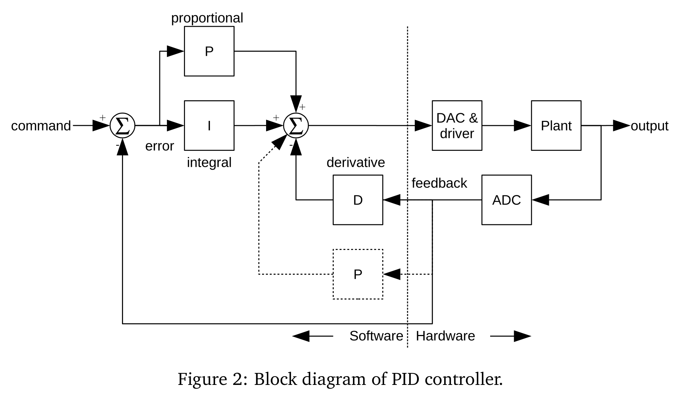
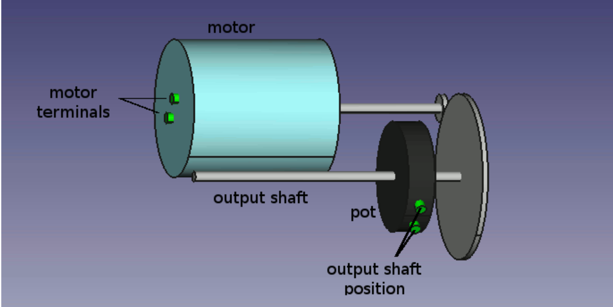
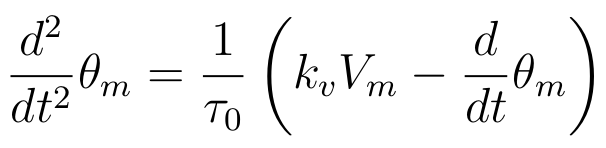
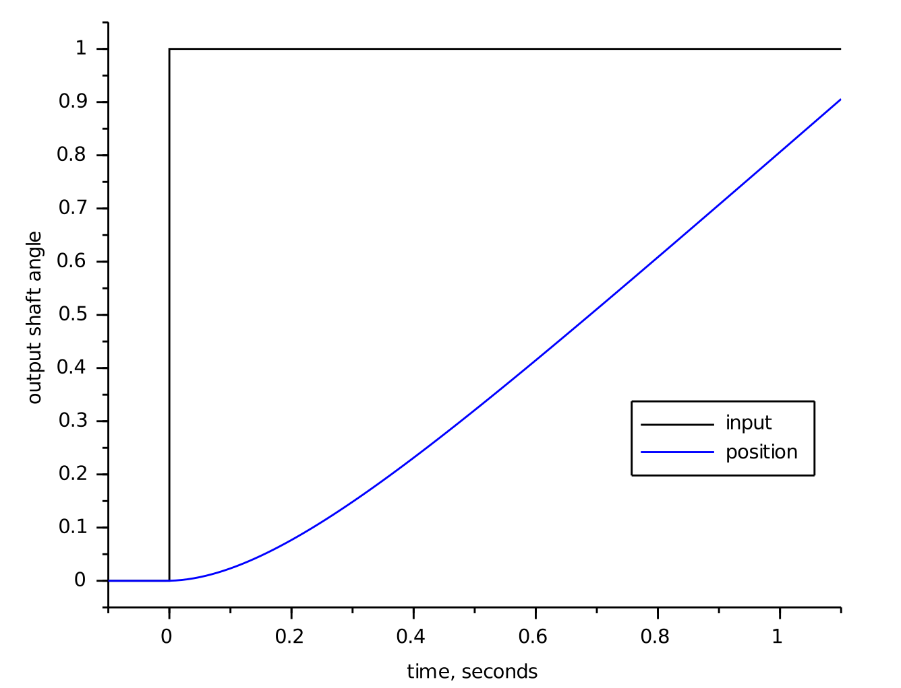
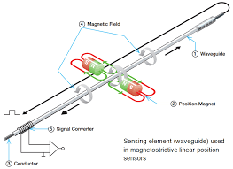
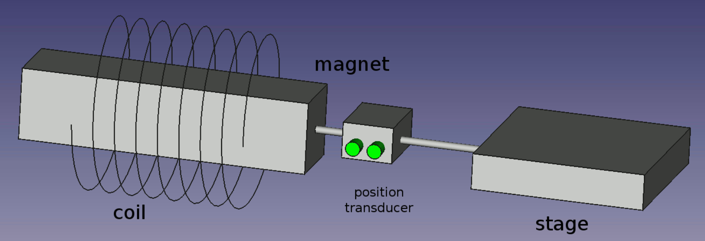
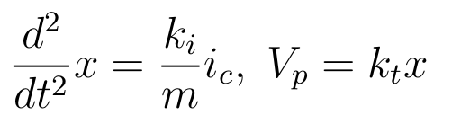
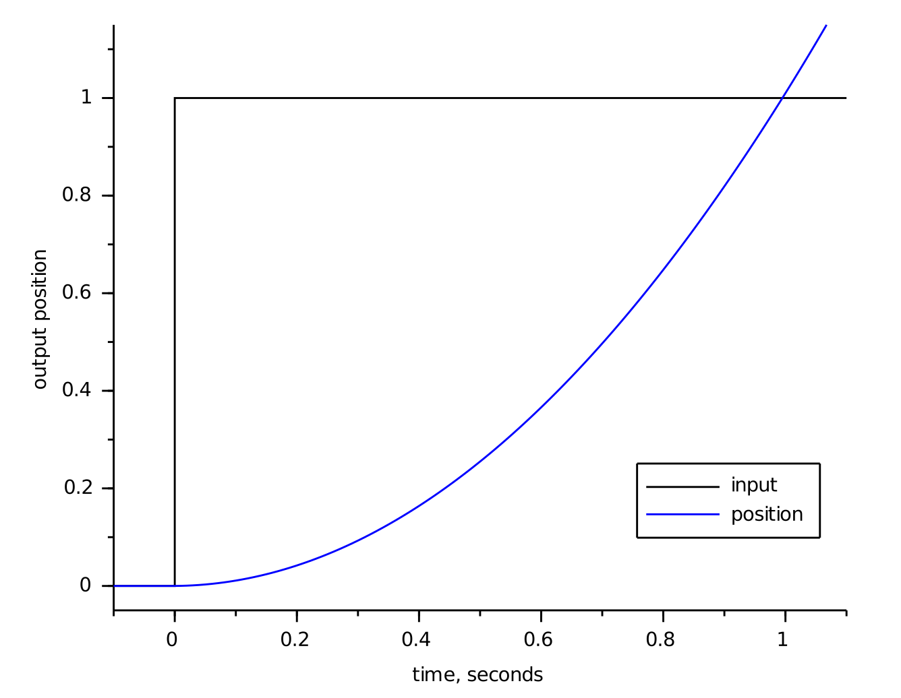
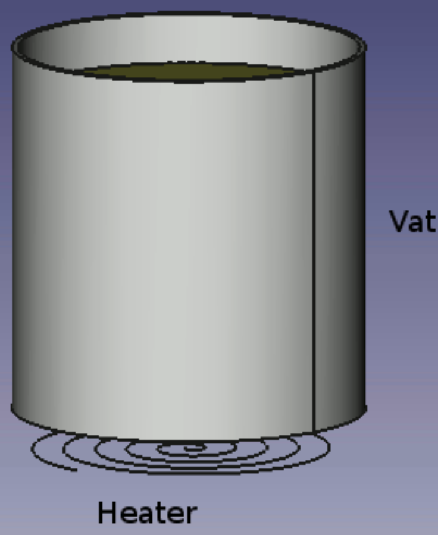
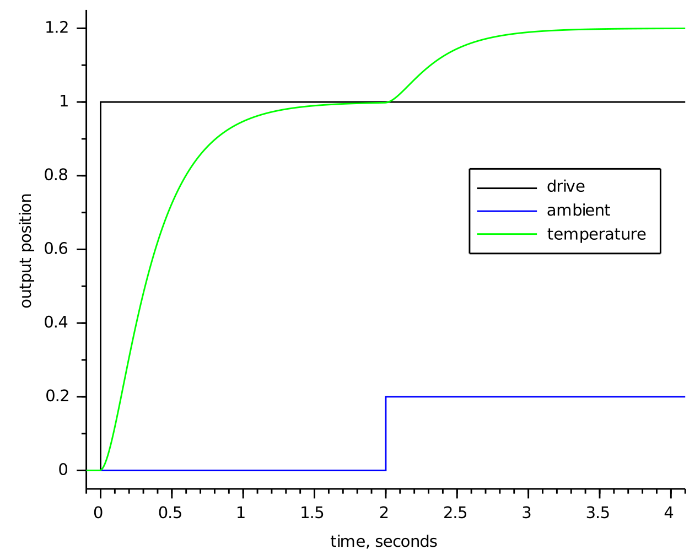

# PID CONTROL #3

- it can be used as  a purely mechanical device, as a pneumatic device, and as an electronic device
- a command is given to a controller, and the controller determines a drive signal to be applied to the plant
- in response to being driven, the plant responds with some behavior
- the response of the plant is measured and fed back into the controller, the feedback is used along with the reference signal to drive the plant

- A “plant” is simply a control system engineer’s name for the thing that we wish to control

> The plant feedback is subtracted from the command signal to generate an error. This error signal drives the proportional and integral elements. The derivative element is driven only from plant feedback. The resulting signals are added together and used to drive the plant.

## Motor & Gear

- plant is a motor driving a gear train, with the output position of the gear train being monitored by a potentiometer or some other position reading device
- example - driving a carriage on a printer, or a throttle mechanism in a cruise control system and other precise position controller
- in the absence of external influences, a DC motor driven by a voltage will go at a constant speed, proportional to the applied voltage
- usually the motor armature (device through which electric current is passed for generating torque (rotor)) has some resistance that limits its ability to accelerate, so the motor will have some delay between the input voltage changing and the speed changing
- the gear train takes the movement of the motor and multiplies it by a constant
- finally, the potentiometer measures the position of the output shaft

- The response of the motor position to the input voltage can be described by the equation

- where the time constant τ describes how quickly the motor settles out to a constant speed when its supply voltage changes, it has units of seconds
- The kv term is the motor gain, it tells how fast the motor will turn in response to a given voltage, it has units of degree/second/volt but usually shows up on motor data sheets in RPM/volt

- Now we look at the effect of the gear train and potentiometer
- Mathematically, the effect of the gear train is to multiply the motor angle by a constant, it is represented below by kg
- the potentiometer acts to multiply the gear angle by a constant, kp , which scales the output angle and changes it from an angle to a voltage, it has units of volts/degree

> Step Response - is the time behaviour of the outputs of a general system when its inputs change from zero to one in a very short time (at t=0)
    - The response of the motor starts out slowly due to the time constant, but once that is out of the way the motor position ramps at a constant velocity
    - eg - step from 0 to (1)^2 and τ = 0.2 seconds
    

## Precision Actuator

- A precise positioning system can be built using a freely moving mechanical stage, a speaker coil (a coil and magnet arrangement) and a non-contact position transducer (a device that converts variations in a physical quantity, such as pressure or brightness, into an electrical signal, or vice versa)

> Non-contact Position Transducer
    

- applications - stabilize an element of an optical system, areas of semiconductor processing, high-end printers
- software commands the current in the coil, which sets up a magnetic field which exerts a force on the magnet
- magnet is attached to the stage, which moves with an acceleration proportional to the coil current
- the stage position is monitored by a non-contact position transducer

- with this arrangement the force on the magnet is independent of the stage motion, bu this isolates the stage from external effects, but the resulting system is very "slippery", and can be a challenge to control
- In addition, the electrical requirements to build a good current-output amplifier and non-contact transducer interface can be challenging

- the force on the stage is proportional to the drive command and nothing else, so the acceleration of the system is exactly proportional to the drive

- where Vp is the transducer output
- ki is the coil force constant in newtons/amp (or pounds/amp)
- kt is the transducer gain in volts/meter (or volts/foot)
- m is the total mass of the stage, magnet and the moving portion of the position transducer in appropriate units

- The step response of this system by itself is a parabola
- this makes the control problem more challenging because of the sluggishness with which the stage starts moving, and its enthusiasm to keep moving once it gets going

## Temperature Control

- plant is a heater
- The vessel is heated by an electric heater, and the temperature of its contents is sensed by a temperature sensing device
- Thermal systems tend to have very complex responses, which can be difficult to characterize well

- a simplified, but accurate model is preferred

- where Vd is the input drive
- Th is the measured temperature and Ta is the ambient temperature
- τ1 and τ2 are time constants with units of seconds
- kh is the heater constant, has units of degrees C per volt

> there is step response of the system to both to a change in Vd and to a change in ambient temperature
    - The response tends to settle out to a constant temperature for a given drive but it can take a great deal of time doing it
    - it takes a disturbance input into account
    - disturbance is the ambient temperature, which the system will respond to the same as it responds to changes in the drive level
    - eg - τ1 = 0.1s and τ2 = 0.3s
    

# Controller Designing -

- we control these plants with various variations of proportional, integral, and derivative control
- we understand how to write controllers and how these controllers will affect the behavior of the system in closed loop
- The elements of a PID controller can take their input either from the measured plant output or from the error signal (which is the difference between the plant output and the system command)
- we would normally use some sort of fixed-point (refers to a method of representing fractional (non-integer) numbers by storing a fixed number of digits of their fractional part) arithmetic to limit your required processor speed
- If use floating point then we need to use double-precision floating point
- take this into consideration when you calculate the amount of processor loading your algorithm will introduce
    

## References

- [PID_Without_A_Phd](https://www.wescottdesign.com/articles/pid/pidWithoutAPhd.pdf)
- If this link doesn't work use [PID_Without_A_Phd](./References/pidWithoutAPhd.pdf)