# Rotors #1

- we are using aerial platform that combines the advantages of existing multirotor systems with the agility of vehicles having omniorientational (fly in any direction while maintaining an arbitrary orientation) controllability.
- a hexacopter with tiltable rotors, allowing the system to decouple control of position from control of orientation
- focus is on improving a multirotor’s agility and enabling aerial manipulation
- Extending the maneuverability of unmanned areal vehicles promises to yield a considerable increase in the areasbin which these systems can be used. Some such applications are the performance of more complicated inspection tasks and the generation of complex uninterrupted movements of an attached camera

> Challenges
    - incorporating the hardware that enables additional maneuverability while keeping the weight low
    - placing the propellers such that they can contribute to the system in any configuration and generate as little  counter-acting force as possible
    - achieving a safe design, such that a tool can be easily mounted and the drone operated close to a given surface

- As the rotor orientation can be fully controlled, thisbsystem allows the control of position and orientation to be decoupled
- it can be easily manipulated through a proportional-integral-derivative (PID) controller and a simple allocation scheme, which translates the control output into motor configurations
- Moreover, the ability of the system to independently orient the thrust generated from each rotor reduces the internal forces and, therefore, increases the efficiency in comparison to the fixed tilted-rotor platforms described previously

- Tilt-rotor position

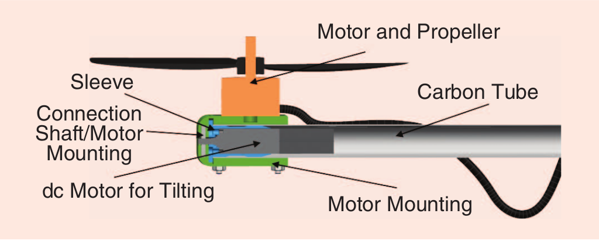

- Flight Control Structure

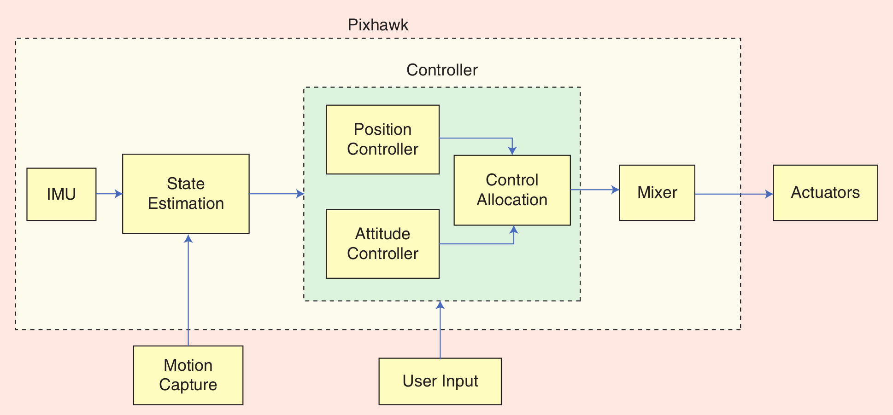

- the sensor data obtained by the IMU and magnetometer are fused together with the external pose information from a motion-capture system (or, in the case of outdoor flight, the position information from a global navigation satellite system) to provide an estimate of the system’s full pose
- This information enters the controller block together with the desired pose trajectory, which is generated by the user on an external computer
- The controller block contains both the position and attitude controller, as well as an allocation block that maps the desired forces and moments onto the 12 actuators. This is crucial to the decoupling of position and orientation
- After the desired control inputs are calculated, they are fed into the mixer block, which maps these values to the actuator pulse-width modulation signals

## Modeling

### Coordinate Frames

- Overall, eight coordinate frames were used. 
- The inertial frame **F**i is fixed on the ground, and its z axis points upward.
- In contrast, the z axis of the body frame **F**B points downward, ts origin is at the center of gravity

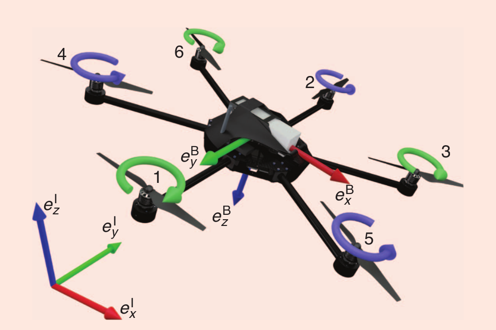

- Finally, there are the six coordinate frames of the rotor units **F**Ri, their origins are at the center of the rotor
blades, and their x-axes are aligned with the axes to the center of mass of the body, these coordinate frames rotate around their x-axes with respect to the body frame

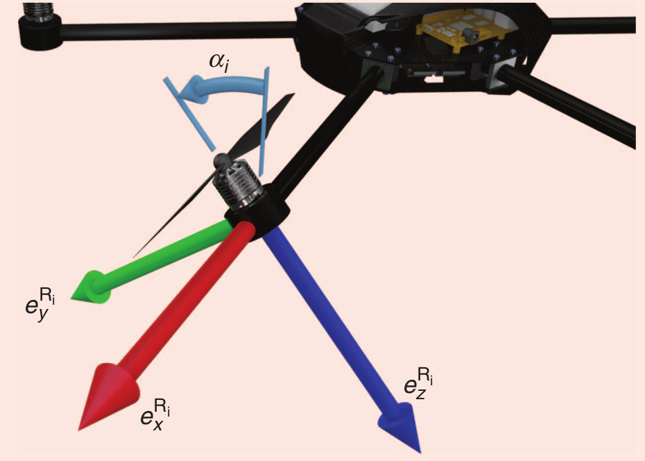

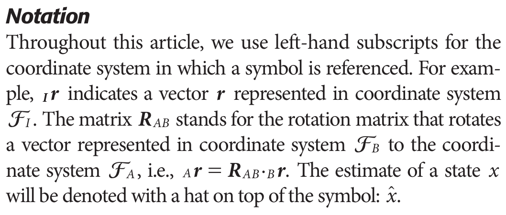

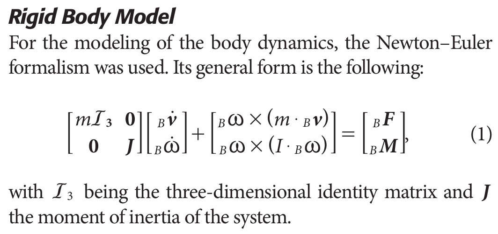

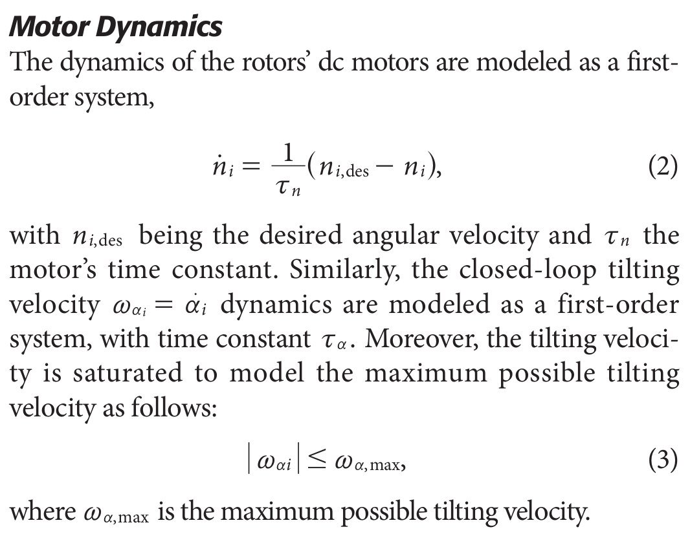

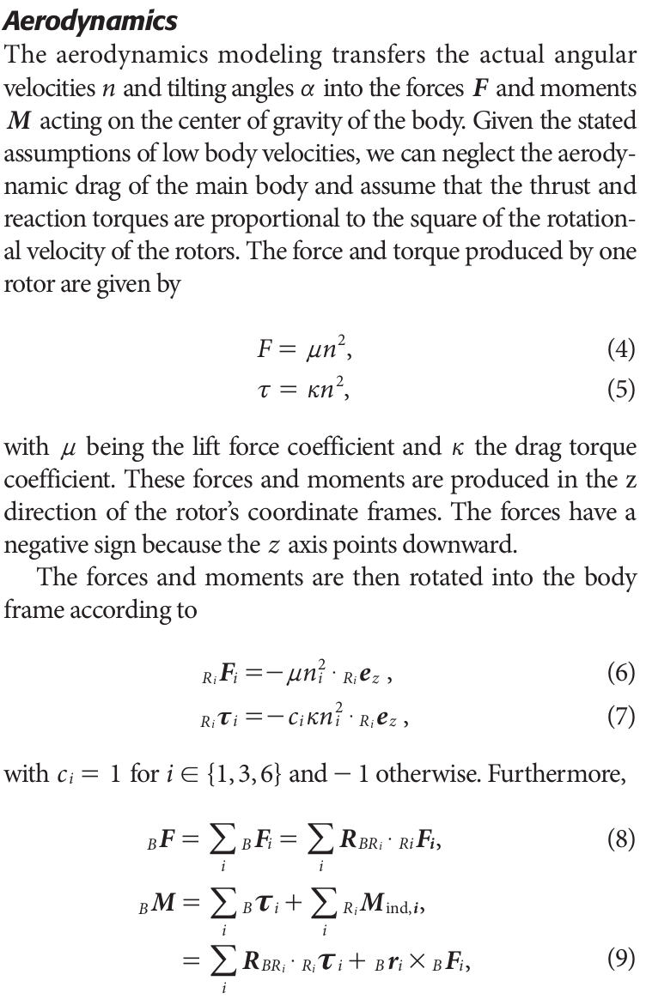

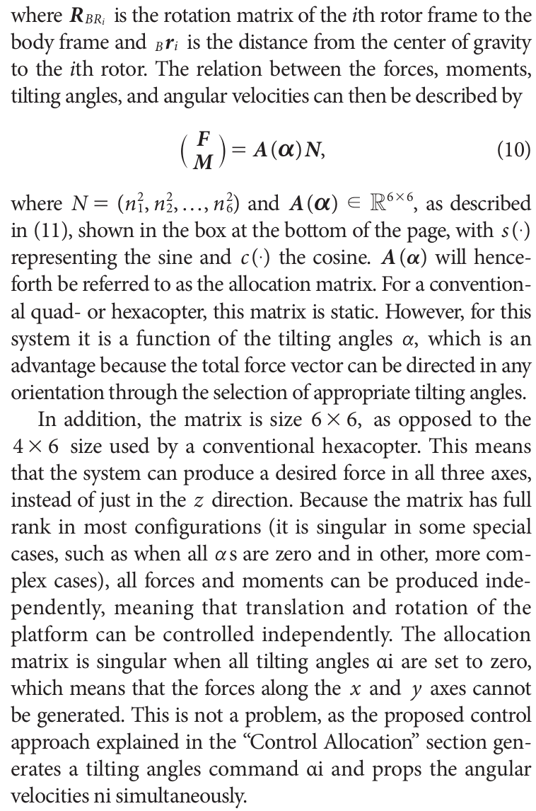

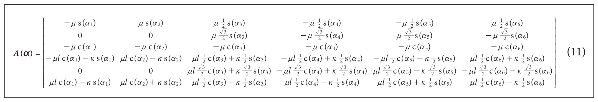

## Control

### Control Structure

- Given the omnidirectional nature of the platform, it is possible to decouple the position and attitude dynamics, as the actuation forces and torques are independent. Therefore, we consider two separate controllers for position and attitude reference tracking. A cascade control structure is employed to control the attitude

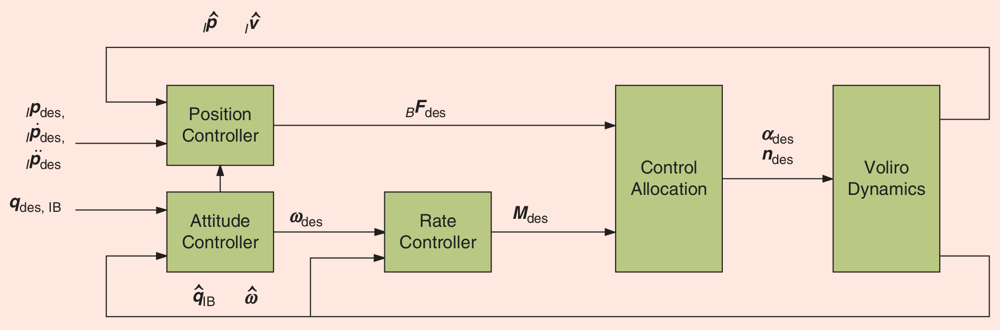

- The desired forces and torques are achieved by changing the angular velocity and the orientation of each propeller. Therefore, the control allocation problem becomes challenging; as for the 6 degrees-of-freedom (DoF) output, there are 12 control inputs.
- We here introduce the position and attitude controllers, followed by a novel solution to this control allocation problem

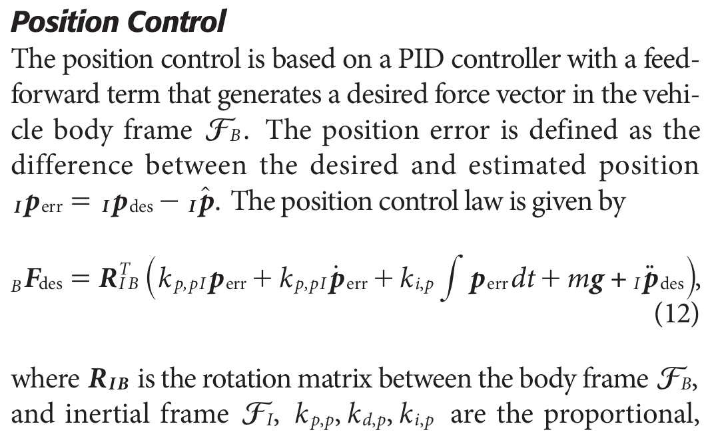

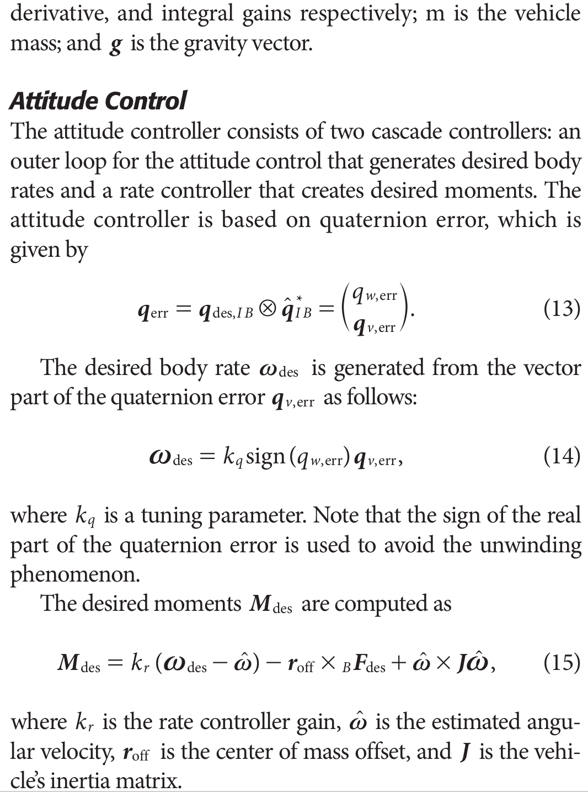

### Control Allocation

- The control allocation problem deals with finding rotor speeds n1, ...., n6 and rotor angular positions alpha to satisfy the relation between the forces, moments, tilting angles, and angular velocities
- Solving this equation is challenging for two reasons. First, any solution is not unique
because of the overactuated nature of the platform. Second, the rotor angular positions appear in a nonlinear fashion in the allocation matrix
- One approach to solve this problem would be to perform a nonlinear least-squares optimization. However, the computation time required and the available computation resources on board the platform inhibit such a solution
- Another ap­­proach is to use a nonlinear model- predictive attitude controller that generates near-optimal rotor-speed and tilting-angle commands. This method is appealing because it can easily account for tilting-angle dynamics, but it can be computationally expensive
- Note that this allocation needs to be solved at a high rate to allow the system to perform in an agile manner

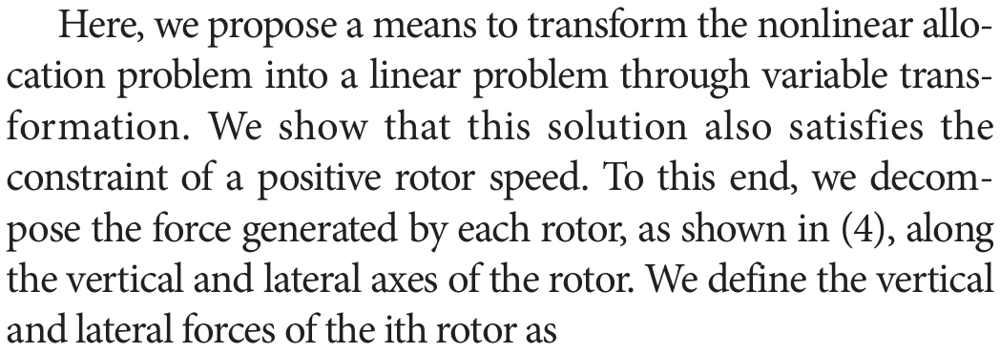

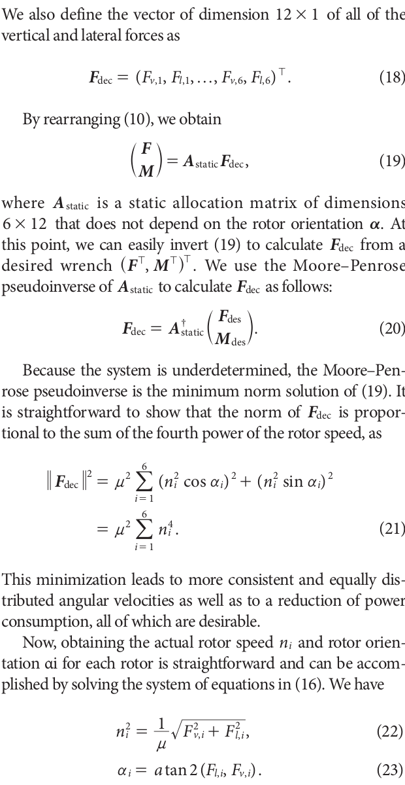

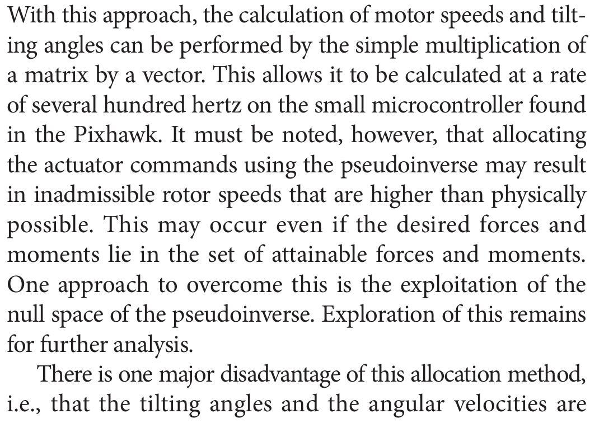

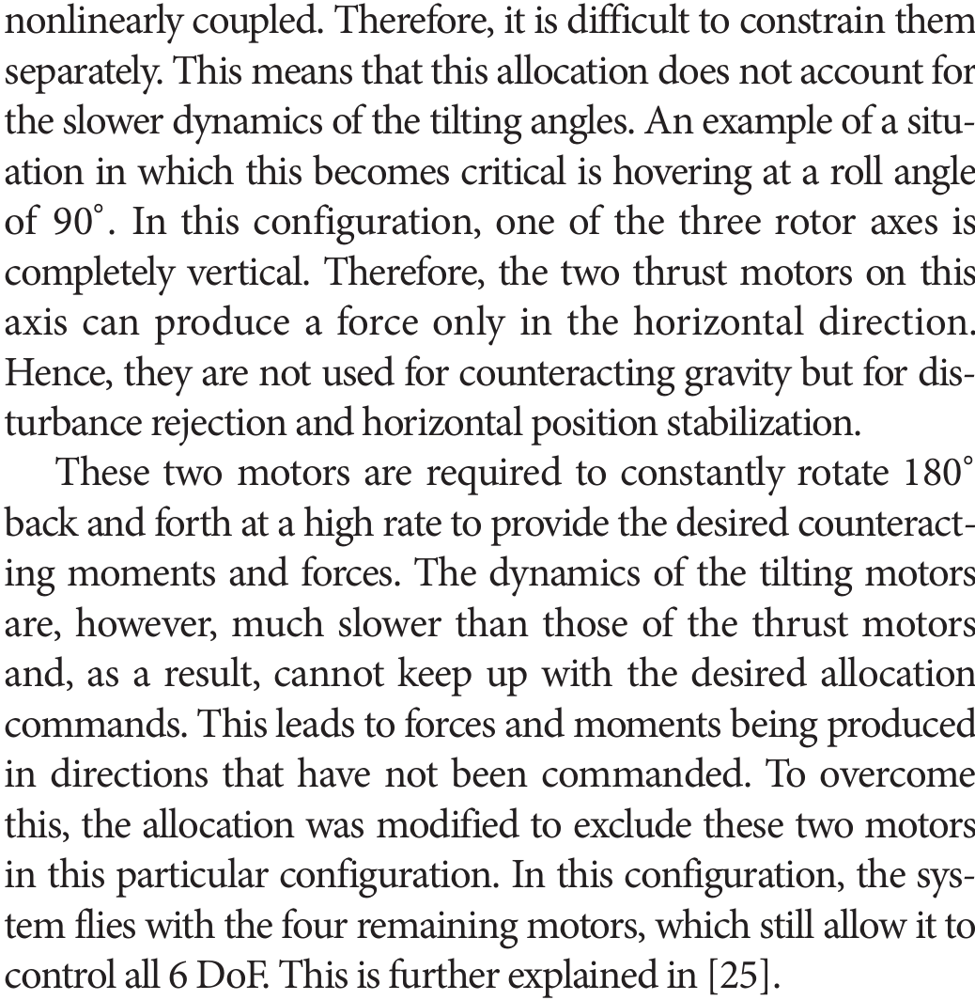

## References

- [The Voliro Omniorientational Hexacopter - An Agile and Maneuverable Tiltable-Rotor Aerial Vehicle](https://sci-hub.se/10.1109/mra.2018.2866758)
- If this link doesn't work use [The Voliro Omniorientational Hexacopter - An Agile and Maneuverable Tiltable-Rotor Aerial Vehicle](./References/kamel2018.pdf)

- [Voliro: An Omnidirectional Hexacopter With Tiltable Rotors](https://arxiv.org/pdf/1801.04581.pdf)
- If this link doesn't work use [Voliro: An Omnidirectional Hexacopter With Tiltable Rotors](./References/1801.04581.pdf)