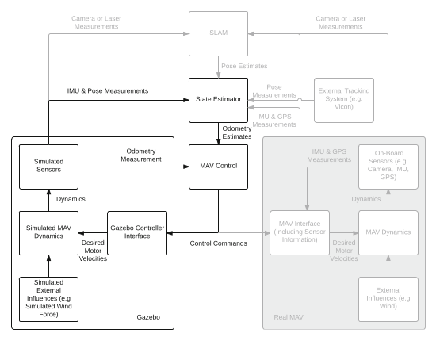
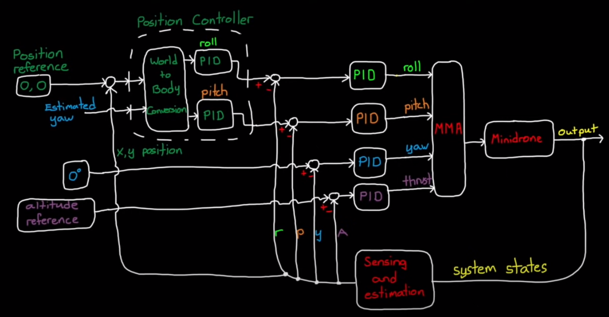
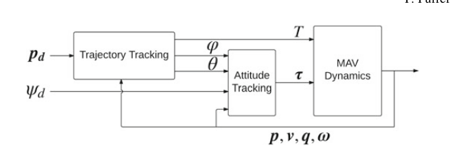

# MAV (Micro aerial vehicle)
We are using a model by the ETH-Zurich so there are file structure, MAV modelling, Control, State Estimation, IMU, sensor model, and many more that we need to understand before going ahead.

> ## Necessary building blocks of MAV

> ### Understanding the block diagram

The given model works in a loop, the highlighted part is a part of which we are more concerned about. Gazebo environment is set such that it contains near-real forces of the environment that will be experienced by the model. It involves:
* Gravitational pull
* Thrust force
* Drag force
* Unpredictability factors
* Wind
* Gyroscopic torques
* Moments 

These are some of the forces and moments which we will be couting on through this project

1. > ### Simulated External Influences

It gives basic property of the environment on which we are working on. 
e.g Simulated Wind force
Though it is nowhere near the real world factors but still it gives us enough understanding of how environment works

2. > ### Simulated MAV Dynamics

Here, there are all forces involved which we have control on. It gets input of desired motor velocities from the Gazebo Controller interface and imparts the given velocity to the rotors respectively. Now, it feeds the output of the dynamics to to the Simulated sensors too.

3. > ### Simulated Sensors

These calculate the readings (Because these are not the real sensors :😉) and then send them as IMU and pose measurements to the ==state estimator== now it gives the odometry estimates (Basically all the roll, pitch, yaw and thrust estimates) to the MAV control systems which we will be designing in this project.

4. >### MAV control

It basically takes the reading from the State estimator and processes in such a way that it predicts accurately the desired angular velocities for the 12 rotors we need. We will see the control system in detail while designing it in the basics of control systems.
For now please refer the block diagram below and checkout the link below for better understanding.

[Control Systems Basics](https://youtube.com/playlist?list=PLn8PRpmsu08oOLBVYYIwwN_nvuyUqEjrj "Playlist")

## State Estimation

It combines both IMU measurements which come at a higher rate and with lower delay, and methods of estimation of 6 DoF (Degrees of Freedom) which are of lower drift or no drift due to complex computation needed. Once, they are combined we get almost drift free estimate of the state, at high rate and with low delay. To combine these two it uses **EKF formulation** EKF is Extended Karman Filter 

## IMU sensor model

IMU provides basic readings for the angular velocity and acceleration of the MAV through its MPU and gyroscope. 

[Reference for IMU](https://drive.google.com/file/d/1psTlkN6moLHDshecLDnJdyQ80qUk-Von/view?usp=sharing "pdf")