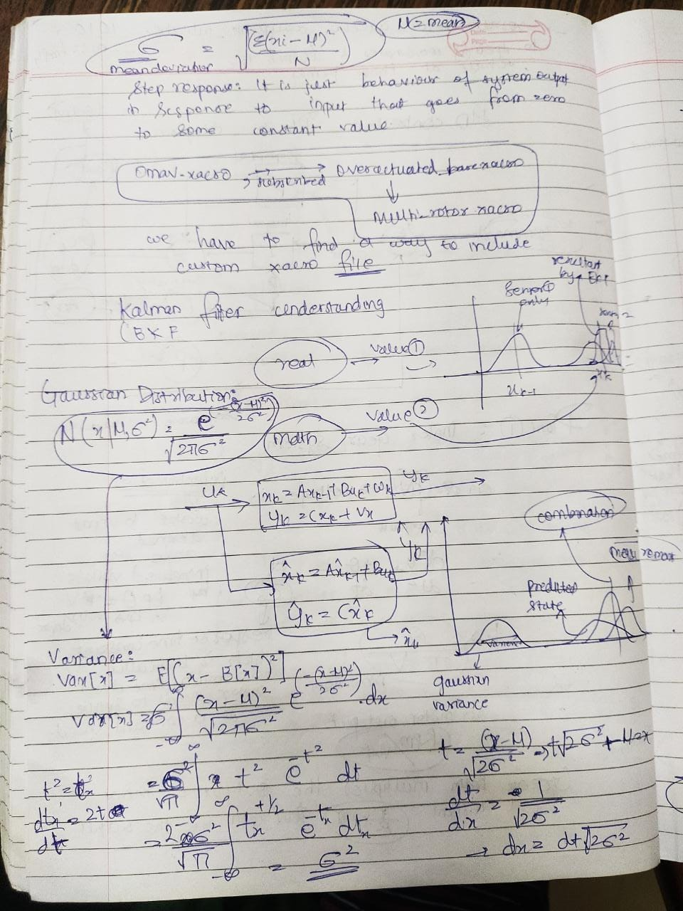
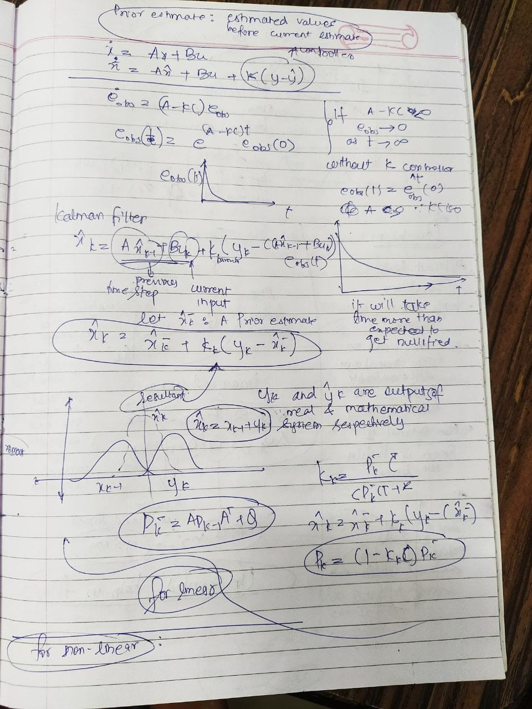
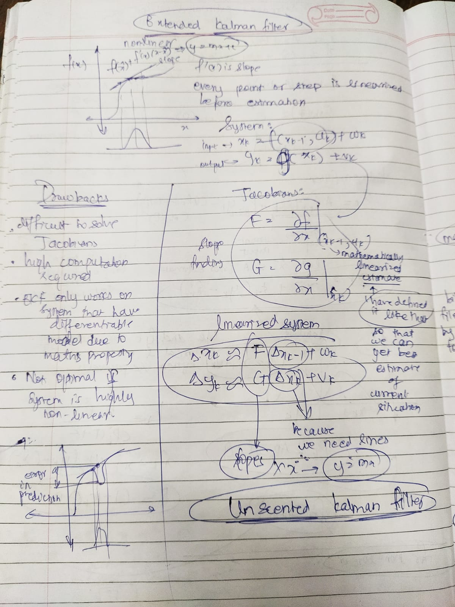

# Kalman Filters
The __Kalman filters__ are often referred as the **sensor fusion** algorithm, which helps achieve great accuracy even when there is a lot of noise involved in the sensor readings of some sensors.
It uses basic statistical methods to make such interpretation. 
>### Key Components of a Kalman filter
* Gaussian distribution
* Previous sensor data readings
* Current and previous estimates for the states
* Superposition of the current estimate with the sensor readings

### Kalman filter Major Limitation:
Basically they can only be used for the linear systems which never the case in terms if real life situations.

Due to this, We prefer using __**Extended Kalman filter**__ . 

>### How is it better?
* It works on the non-linear systems. (`Note: The non-linear systems should be continous and differentiable`)
* It makes the best estimate by using slope of the graph
* It makes use of gaussian distribution
* It uses Jacobian equations
* Linearized system

# Notes for better understanding

