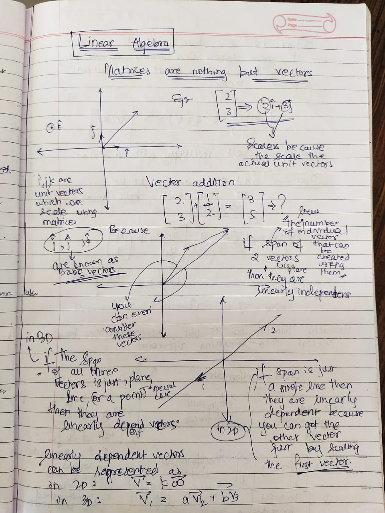
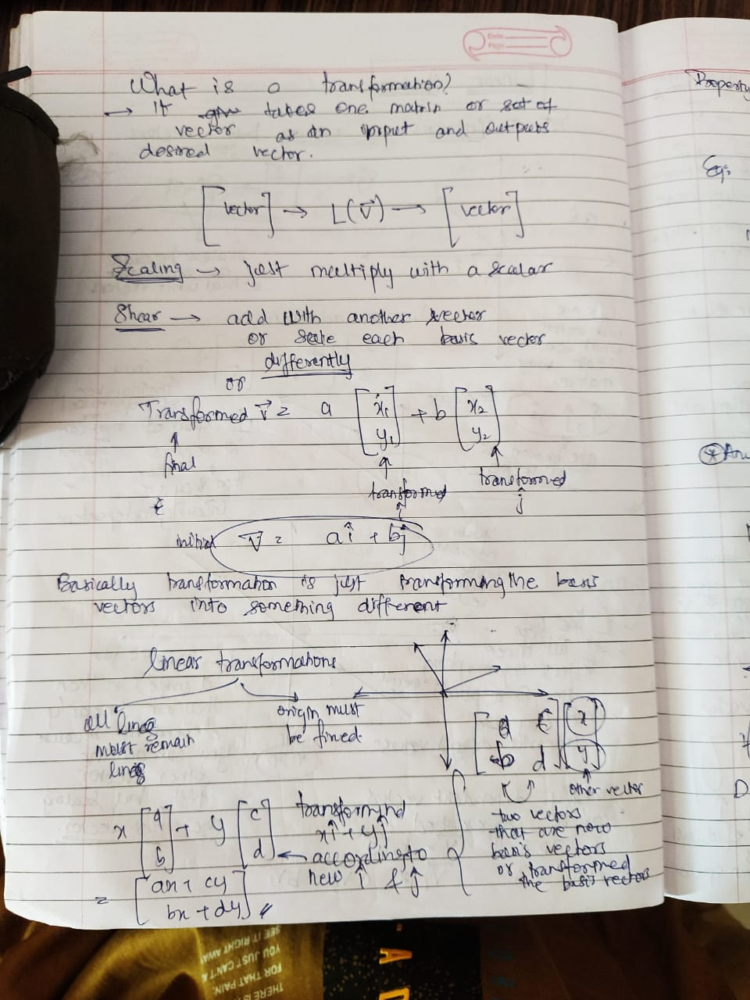
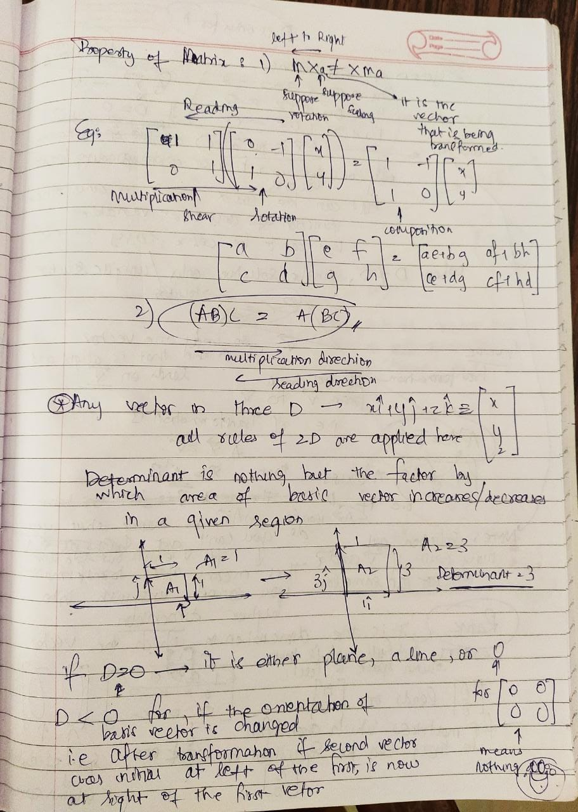
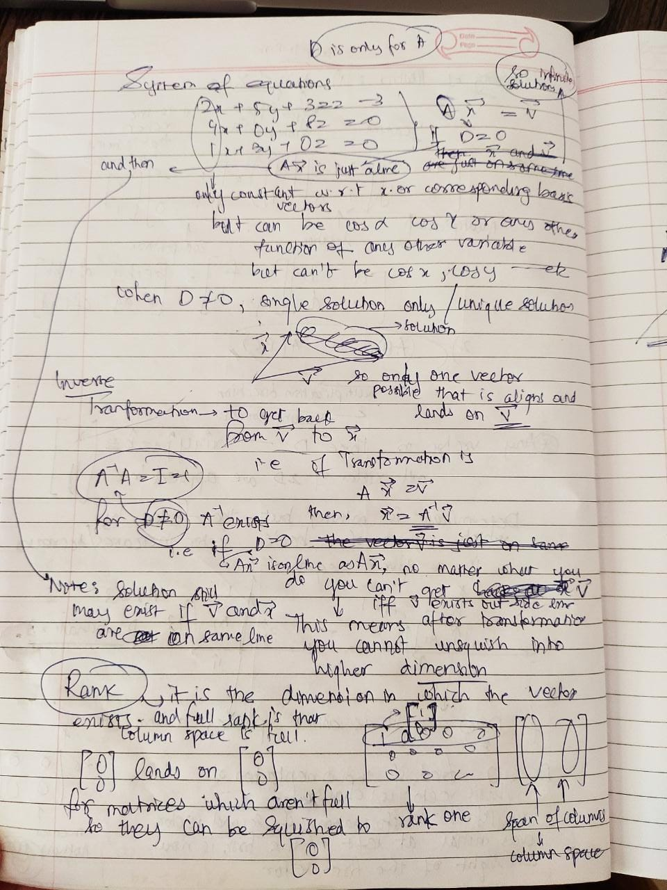
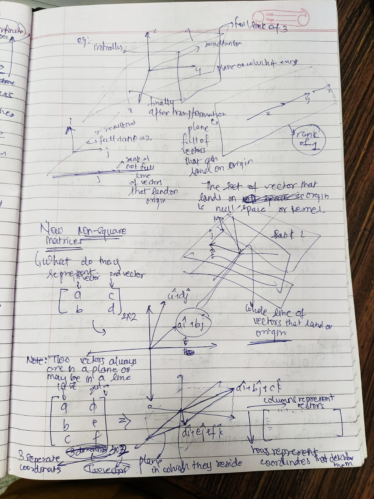

# Linear Algebra
It is one of the most used and by far the most applied branch of mathematics in the dynamics and the robotic(mechanics) industry.

### Hand Written :

1.

2.

3.

4.

5.

`Course referred: Essence of Linear Algebra`
[Course](https://youtube.com/playlist?list=PLZHQObOWTQDPD3MizzM2xVFitgF8hE_ab "Link")