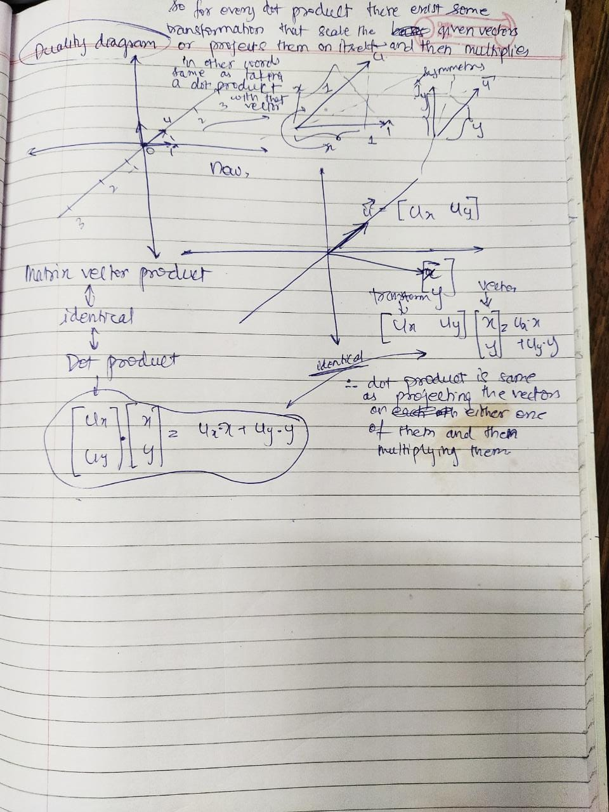

# Linear Algebra
It is one of the most used and by far the most applied branch of mathematics in the dynamics and the robotic(mechanics) industry.
>There are certain important concepts that we need to know before solving any problem

* What are basis vectors
* What is a span of vector
* What is the rank of the matrix
* Are matrices just matrices
* How do we represent vectors in terms of matrices
* What does column represents
* What does row represents
* What are the properties of matrices
* What do you mean by an inverse
* What are Transformations
* What is Linear Transformation
* What is duality
* What is a dot product
### Hand Written :

1.

2.

3.

4.

5.

6.

7.
How symmetry plays an important role in deciding the projections?
So, if we draw a symmetry line between x unit vector and the given vectors unit vector then we can have the projection of x's unit vector on the given vector as its own x-coordinate. This process is similar for the y-component

8.

9.

`Course referred :` [ Essence of Linear Algebra](https://youtube.com/playlist?list=PLZHQObOWTQDPD3MizzM2xVFitgF8hE_ab "Link")