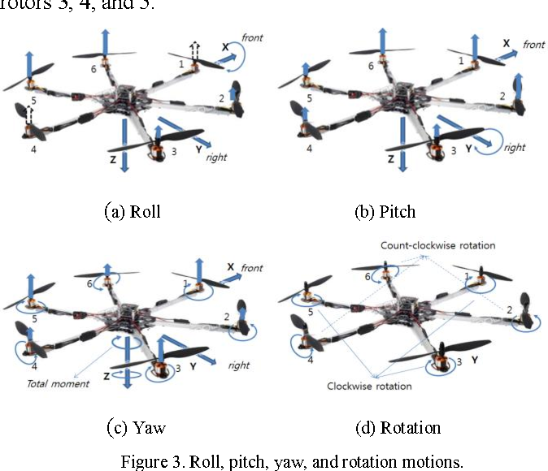

# rgb(255,255,0) Motor Mixing 
It is nothing but the logic used to make the body go in the way we want it to.
So, there are basically main 3 conditions that we need to satisfy: 

---

---

* **Roll**: To rotate about X-axis
* **Pitch**: To rotate about Y-axis
* **Yaw**: To rotate about Z-axis

