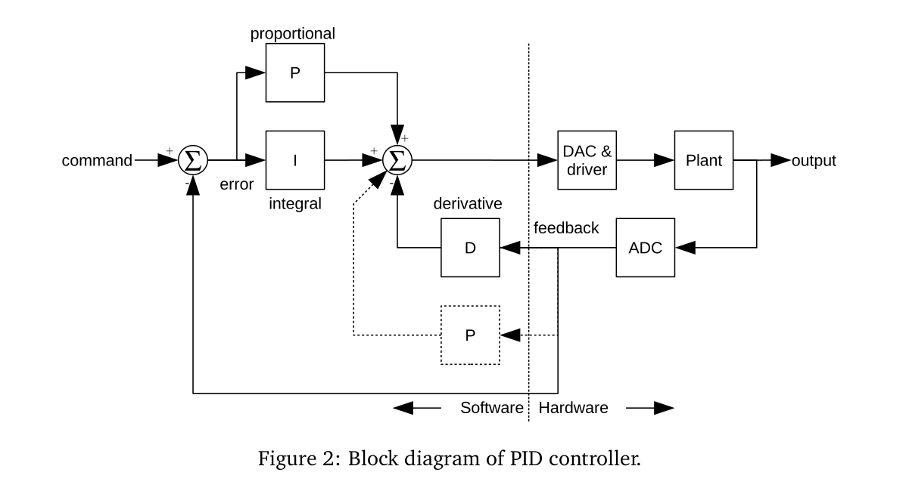
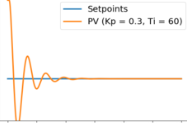

# P.I.D
What is a P.I.D?
P.I.D stands for __Proportional, Integral and derivative__ of a certain parameters of the system. Each of these parameters performs a different task and has a different effect on the functioning of a system.
In a typical PID controller these parameters are driven by a combination of the system command and the feedback signal from the thing that is being controlled (usually referred to as the "Plant"). Their outputs are added together to form the system output.
Please go through the following video for better understanding:
[P.I.D Controller](https://youtu.be/UR0hOmjaHp0 "Video")

## Scenario
Consider a hexacopter that we are using here, suppose we have set the cartesian co-ordinates w.r.t the body frame of refernce.
Now, if we want to fly the hexacopter to (x,y,z) cordinates (here, we ar not bothering the control system, we are just understanding whats happeining) it may offshoot from the point by (dx,dy,dz) term in order to get back at the desired position we should add or subtract the error.
> **Block diagram of PID**

## Types of error terms
* **Proportional**: Take the error and multiply it by a constant Kp.

* **Integral**: Take the cumulative total error and multiply it by a constant Ki.

* **Derivative**: Take the rate of change in error and multiply it by a constant Kd.

## Example of Plants
**Motor & Gear**

The plant is a motor driving a gear train, with the output position of the gear train being monitored by a __potentiometer__ or some other position reading device. You might see this kind of mechanism driving a carriage on a printer, or a throttle mechanism in a cruise control system or almost any other moderately precise position controller. The motor is driven by a voltage which is commanded by software and applied to its terminals. The motor output is geared down to drive the actual mechanism. The position of this final drive is measured by the potentiometer (__“pot”__ in the figure) which outputs a voltage proportional to the motor position. 
A DC motor driven by a voltage will go at a constant speed, proportional to the applied voltage. Usually the motor __armature__ has some resistance that __limits its ability to accelerate__, so the motor will have some delay between the input voltage changing and the speed changing. __The gear train takes the movement of the motor and multiplies it by a constant__. Finally, the potentiometer measures the position of the output shaft.
> Mathematical logic behind the motor output __here T0 is response time taken for the motor to settle at a constant speed__ 
>

* Mathematically, the effect of the gear train is to multiply the motor angle by a constant; it is represented below by kg. Similarly, the potentiometer acts to multiply the gear angle by a constant, kp , which scales the output angle and changes it from an angle to a voltage (thus kp has units of volts/degree).
A system’s __**step response**__ is just the behavior of the system output in response to an input that goes from zero to some constant value at time t = 0. We’re dealing with fairly generic examples here so I’ll normalize the step input as a fraction of full scale, with the step going from 0 to 12xx. Using a time constant value τ0 = 0.2 seconds. This figure shows the step input and the motor response. The response of the motor starts out slowly due to the time constant, but once that is out of the way the motor position ramps at a constant velocity.

* **Note: Step response of different systems vary differently according to their specifiic properties**
---
* Example:
    1. Precision Actuator

        

        

        

    2. Temperature Control

        

        

        

### Notes for better understanding:

