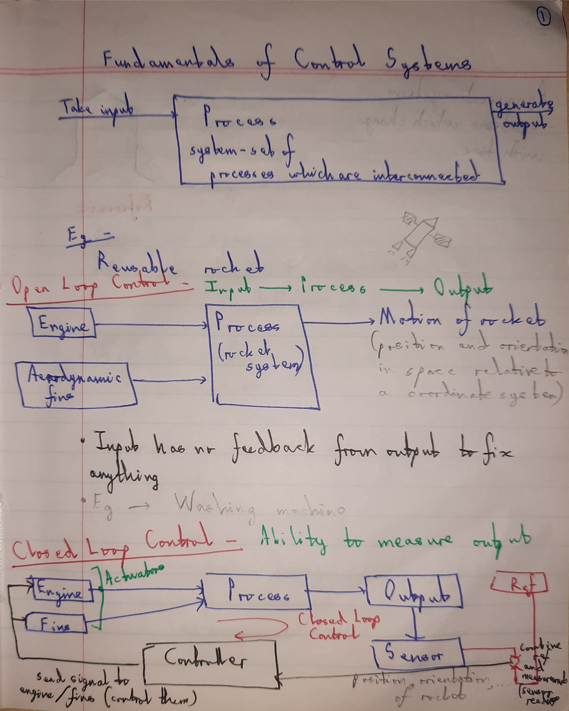
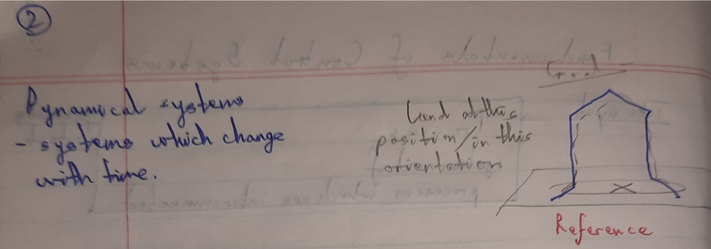
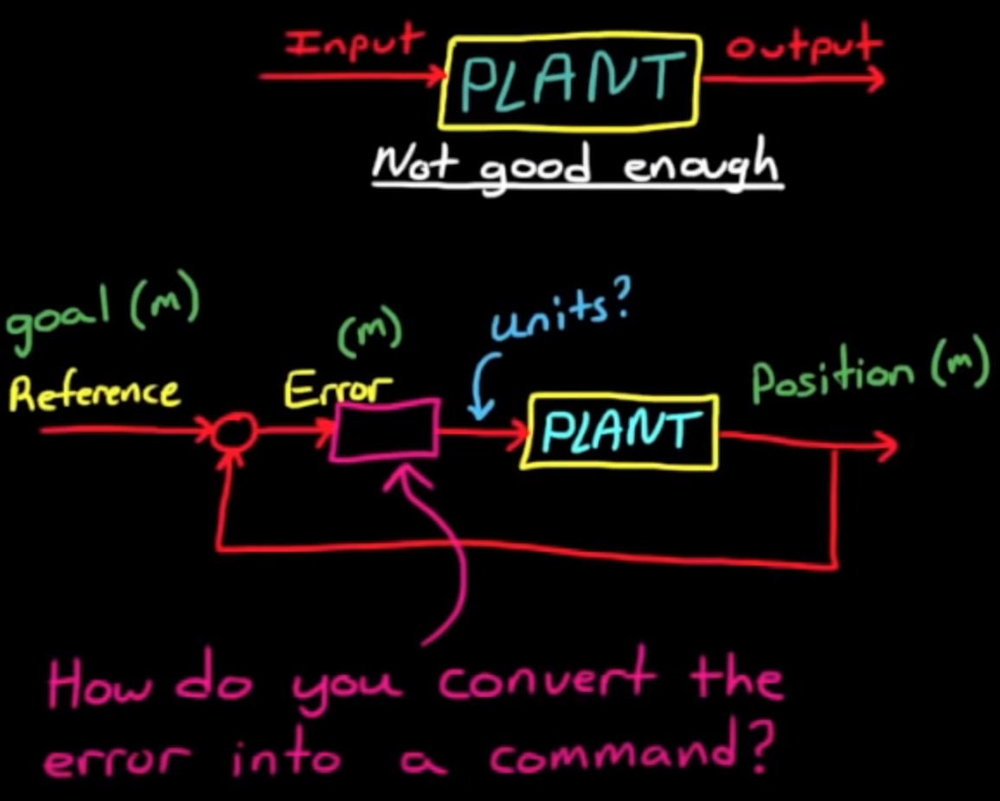
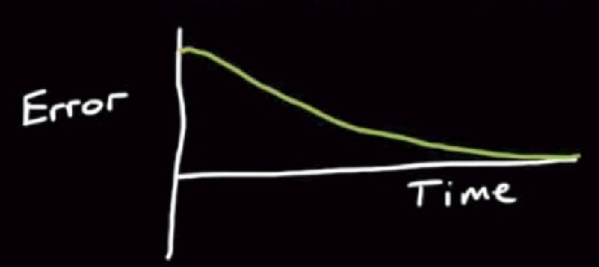

# Control Systems #1

1. Open Loop Control :

- performance of the system isn't good enough to meet your requirements 
- commands not given according to position of the robot
- open-loop commanding is perfectly fine for systems that don't change much or where accuracy isn't as important
- no way of compensating errors and making adjustments on its own

2. Closed Loop Control :

- sensing output of process and feeding it back so system can make adjustments accordingly
- Reference Value/Signal - which is the desired value or the ultimate goal
- we compare that to the measured value and what you're left with is the error or the Delta between where you are and where you want to be

3. Controller :
- takes the error signal and converts it into a command that is then sent into the plant(process)
- design this controller so that as time progresses the error or the difference between the current location and the goal is driven to zero
- zero error means that the measured position is exactly where you want it to be (system meets all of its requirements)

## Overview
Everything around us working to make our lives easier is nothing but systems.
How they interact with the environment and what should be their behavior is decided by the control over the systems which we have. By combining real life parameters, system variables, and control of the user we can make a control system.

## Types of systems
- ### Non-linear :
    These are real form of systems which represent actual data of interaction with surrounding. These are high fidely, highly accurate form of systems and involves all non-linear factors, or one can say some real life unpredictable factors in the system.
    For Examaple: Consider a drone, here if we take in account the bending stress, strain, strength of the materials, environment correction, etc. while designing the control system then this will be known as a non-linear system. Here the accuracy of design is higher but the computational power required also increases drastically.
                
- ### Linear : 
    These are very ideal form of systems which don't really represent the real world scenario. But these systems are often used along side with the non-linear system to make a program faster and doesn't involve extra computation which is usually required for the non-linear type of systems.
    For Example: Again consider a drone, but we are not taking in account all the factors that we took previously. So, now the varaibles are less so is the accuracy, but it can be improved by just verification by the non-linear model whenever required.

## Control system for copter
We are using **PID controller** for our hexacopter. 

### References -

- [Control Systems Basics](https://www.youtube.com/watch?v=wVPOp-tptPQ)
- [PID Control - A brief introduction](https://www.youtube.com/watch?v=UR0hOmjaHp0&list=PLUMWjy5jgHK20UW0yM22HYEUTMJfla7Mb)