# PID CONTROL #3

- it can be used as  a purely mechanical device, as a pneumatic device, and as an electronic device
- a command is given to a controller, and the controller determines a drive signal to be applied to the plant
- in response to being driven, the plant responds with some behavior
- the response of the plant is measured and fed back into the controller, the feedback is used along with the reference signal to drive the plant

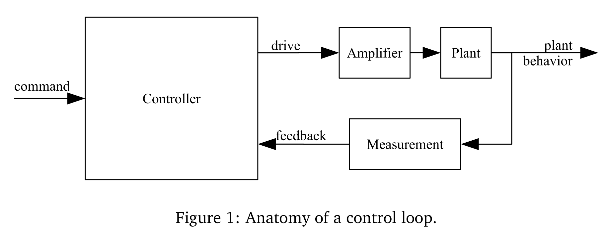

- A “plant” is simply a control system engineer’s name for the thing that we wish to control

> The plant feedback is subtracted from the command signal to generate an error. This error signal drives the proportional and integral elements. The derivative element is driven only from plant feedback. The resulting signals are added together and used to drive the plant.

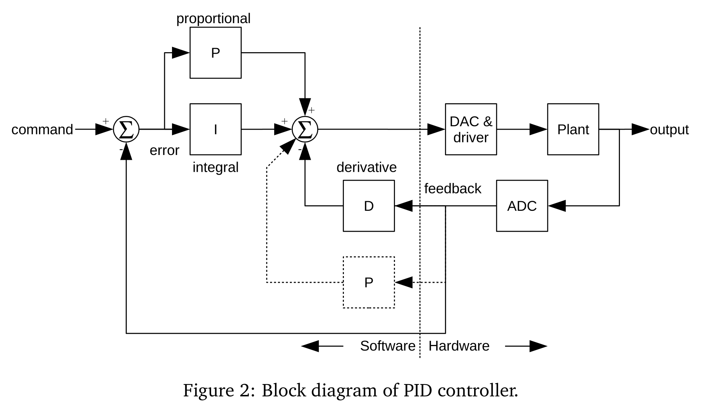


# Controller Designing -

- we control these plants with various variations of proportional, integral, and derivative control
- we understand how to write controllers and how these controllers will affect the behavior of the system in closed loop
- The elements of a PID controller can take their input either from the measured plant output or from the error signal (which is the difference between the plant output and the system command)
- we would normally use some sort of fixed-point (refers to a method of representing fractional (non-integer) numbers by storing a fixed number of digits of their fractional part) arithmetic to limit your required processor speed
- If use floating point then we need to use double-precision floating point
- take this into consideration when you calculate the amount of processor loading your algorithm will introduce

- The function UpdatePID takes the error and the actual plant output as inputs, it modifies the PID states (in pid), and it returns a drive value to be applied to the plant

```
typedef double real_t; // this almost certainly needs to be double
real_t UpdatePID(SPid * pid, real_t error, real_t position)
{
.
.
}
```

- The reason we pass the error to the PID update routine instead passing the command is that sometimes you want to play tricks with the error. Leaving the error calculation out in the main code makes the application of the PID more universal

```
.
position = ReadPlantADC();
drive = UpdatePID(&plantPID, plantCommand - position, position);
DrivePlantDAC(drive);
.
```


## Proportional -

- A proportional controller is just the error signal multiplied by a constant and fed out to the drive

```
real_t pTerm;
.
pTerm = pid->propGain * error;
.
return pTerm;
```
> Drawbacks -
    - a proportional controller alone can be useful for some plants, but might help a bit or not be useful at all
    - plants with too much delay can’t be stabilized with proportional control or be brought to desired target
    - it cannot compensate for external effects
    - some motors may need to be driven faster than is possible with proportional control alone in certain applications

- proportional control deals with the present behavior of the plant


## Integral -

- Integral control is used to add long-term precision to a control loop
- It is almost always used in conjunction with proportional control

- The integrator state (integratState) is the sum of all the preceding inputs. The parameters integratMin and integratMax are the minimum and maximum allowable integrator state values

```
real_t iTerm;
.
// calculate the integral state with appropriate limiting
pid->integratState += error;
// Limit the integrator
if (pid->integratState > pid->integratMax)
{
pid->integratState = pid->integratMax;
}
else if (pid->integratState < pid->integratMin)
{
pid->integratState = pid->integratMin;
}
// calculate the integral term
iTerm = pid->integratGain * pid->integratState;
.
```
- Integral control by itself usually decreases stability, or destroys it altogether
- the integrator state "remembers" all that has gone on before, which is what allows the controller to cancel out any long term errors in the output
- This same memory also contributes to instability - the controller is always responding too late, after the plant has gotten up speed
- to stabilize system we also need a little bit of their present value, which you get from a proportional term
- integral control deals with the past behavior of the plant


## Proportional-Integral Control

- proportional control by itself has limited utility
- integral control by itself can vastly improve the steady-state behavior of a system, it often destroys stability

> Important Points
    - since you are adding up the error over time, the sampling time that you are running becomes important
    - we need to pay attention to the range of our integrator to avoid windup
    - Integral windup(reset windup) refers to the situation in a PID feedback controller where a large change in setpoint occurs (say a positive change) and the integral term accumulates a significant error during the rise (windup), thus overshooting and continuing to increase as this accumulated error is unwound (offset by errors in the other direction)
    - The specific problem is the excess overshooting

- The rate that the integrator state changes is equal to the average error times the integrator gain times the sampling rate
- since integrator smoothen in long term, uneven sampling rates will work which needs to average out to a constant value
- sampling rate should vary by no more than ±20% over any ten sample interval
- average sample staying within bounds, missing a few samples will be tolerated

> Saturation 
    - if the controller needs to push the plant hard your controller output will spend significant amounts of time outside the bounds of what your drive can actually accept
    - this condition is known as saturation
    - all the time spent in saturation can cause the integrator state to grow (wind up) to very large values
    - the plant drives beyond the target while the integrator unwinds and the process reverses
    - this situation can get so bad that the system never settles out, but just slowly oscillates around the target position
    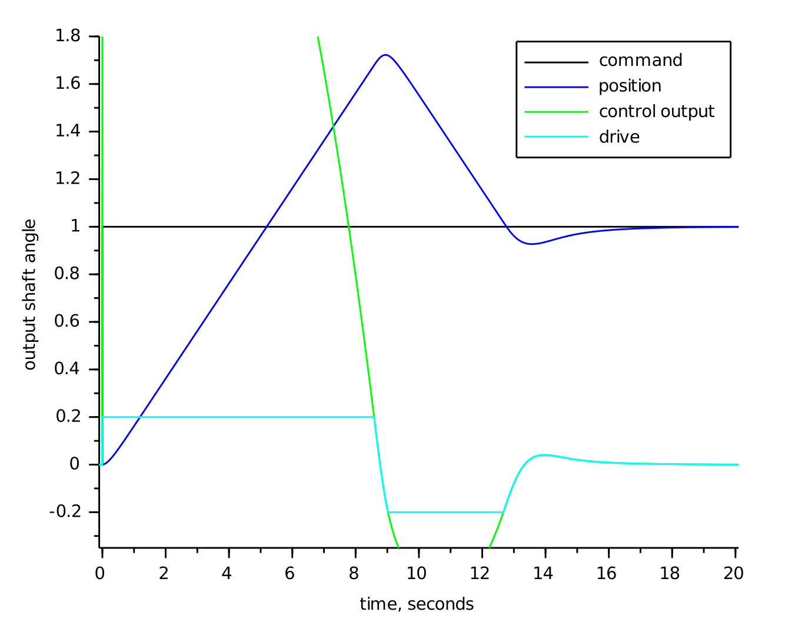

> Solution of Integral Windup
    - limit the magnitude of the integrator state
    - we must scale integratMin and integratMax whenever you change the integrator gain
    - usually you can just set the integrator minimum and maximum so the integrator output matches the drive minimum and maximum
    - If you know your disturbances will be small and you want quicker settling you can limit the integrator further
    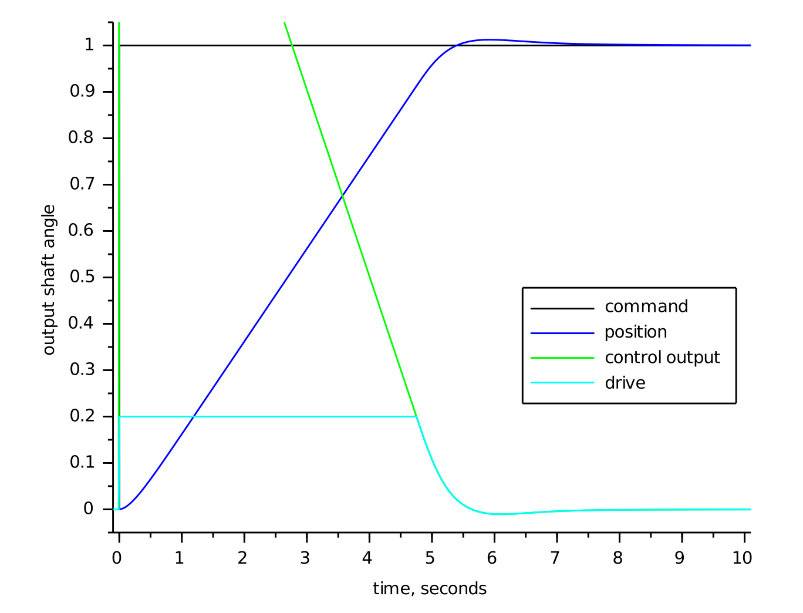

- if you cannot stabilize a plant with proportional control you cannot stabilize it with PI control


## Derivative 

- predicts plant behaviour which can be used to stabilize the plant, which is performed by a differentiator

> Controller
    - here we use the actual plant position rather than the error because this makes for smother transitions when the command value changes
    - the derivative term itself is just the last value of the position minus the current value of the position
    - This gives a rough estimate of the velocity (delta position / sample time), which predicts where the position will be at the next instant

    ```
    real_t dTerm;
    .
    dTerm = input - pid->derState;
    pid->derState = input;
    .
    ```

> Problems - sampling irregularities, noise, and high frequency oscillations
    - for a differential element, the output is proportional to the position change divided by the sample time. If the position is changing at a constant rate but your sample time varies from sample to sample then you will get noise on your differential term. Since the differential gain is usually high, this noise will be amplified a great deal
    - Noise can be a big problem when you use differential control, to the extent that it often bars you from using differential control without making modifications to your system’s electrical or mechanical arrangement to deal with it at the source
    - noise is usually spread pretty evenly across the frequency spectrum. Control commands and plant outputs, however, usually have most of their content at lower frequencies. Proportional control passes noise through unmolested. Integral control averages its input signal, which tends to kill noise. Differential control enhances high frequency signals, so it enhances noise

> Sampling Problem
    - When you use differential control you need to pay close attention to even sampling. At worst you want the sampling interval to be consistent to within 1% of the total at all times
    - If you can’t set the hardware up to enforce the sampling interval then design your software to sample with very high priority
    - in software we just just make sure that the actual ADC(Analog to Digital Converter) conversion happens at the right time
    - If necessary put all of your sampling in an ISR(An interrupt service routine is a software routine that hardware invokes in response to an interrupt. ISR examines an interrupt and determines how to handle it executes the handling, and then returns a logical interrupt value) or very high-priority task, then execute the control code in a more relaxed manner
    - You can low-pass filter your differential output to reduce the noise, but if done incorrectly this can severely affect its usefulness
    - finally, depending on applications one can decide control strategy (noise characteristics of input, requirement of high-performance of derivative controller,...)


## The Complete Controller

```
typedef struct
{
    real_t derState;
    // Last position input
    real_t integratState; // Integrator state
    real_t integratMax, // Maximum and minimum
    integratMin; // allowable integrator state
    real_t integratGain, // integral gain
    propGain,
    // proportional gain
    derGain;
    // derivative gain
} SPid;
real_t UpdatePID(SPid * pid, real_t error, real_t position)
{
    real_t pTerm, dTerm, iTerm;
    pTerm = pid->propGain * error; // calculate the proportional term
    // calculate the integral state with appropriate limiting
    pid->integratState += error;
    // Limit the integrator state if necessary
    if (pid->integratState > pid->integratMax)
    {
        pid->integratState = pid->integratMax;
    }
    else if (pid->integratState < pid->integratMin)
    {
        pid->integratState = pid->integratMin;
    }
    // calculate the integral term
    iTerm = pid->integratGain * pid->integratState;
    // calculate the derivative
    dTerm = pid->derGain * (pid->derState - position);
    pid->derState = position;
    return pTerm + dTerm + iTerm;
}
```


# Examples - 

## 1. Motor & Gear

- plant is a motor driving a gear train, with the output position of the gear train being monitored by a potentiometer or some other position reading device
- example - driving a carriage on a printer, or a throttle mechanism in a cruise control system and other precise position controller
- in the absence of external influences, a DC motor driven by a voltage will go at a constant speed, proportional to the applied voltage
- usually the motor armature (device through which electric current is passed for generating torque (rotor)) has some resistance that limits its ability to accelerate, so the motor will have some delay between the input voltage changing and the speed changing
- the gear train takes the movement of the motor and multiplies it by a constant
- finally, the potentiometer measures the position of the output shaft

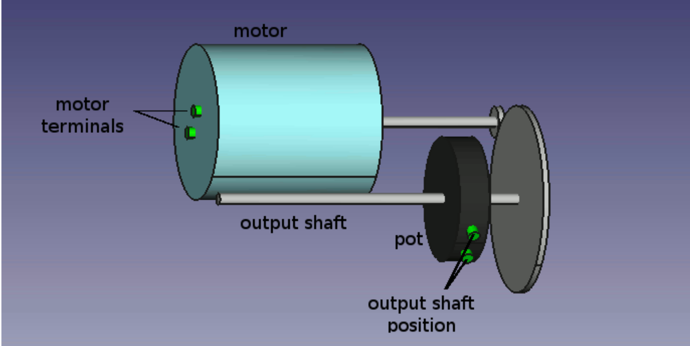

- The response of the motor position to the input voltage can be described by the equation

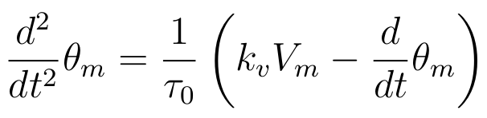

- where the time constant τ describes how quickly the motor settles out to a constant speed when its supply voltage changes, it has units of seconds
- The kv term is the motor gain, it tells how fast the motor will turn in response to a given voltage, it has units of degree/second/volt but usually shows up on motor data sheets in RPM/volt

- Now we look at the effect of the gear train and potentiometer
- Mathematically, the effect of the gear train is to multiply the motor angle by a constant, it is represented below by kg
- the potentiometer acts to multiply the gear angle by a constant, kp , which scales the output angle and changes it from an angle to a voltage, it has units of volts/degree

> Step Response - is the time behaviour of the outputs of a general system when its inputs change from zero to one in a very short time (at t=0)
    - The response of the motor starts out slowly due to the time constant, but once that is out of the way the motor position ramps at a constant velocity
    - eg - step from 0 to (1)^2 and τ = 0.2 seconds
    


### Proportional 

- for small gains the motor goes to the correct target, but it does so quite slowly
- increasing the gain speeds up the responses to a point
- beyond that point, the motors starts to overshoot the target and is highly unstable and oscillates continuously around the target
- the reason of the overshoot is because of the delay in the motor response, the motor position doesn’t start ramping up immediately. This delay, plus high feedback gain causes the overshoot

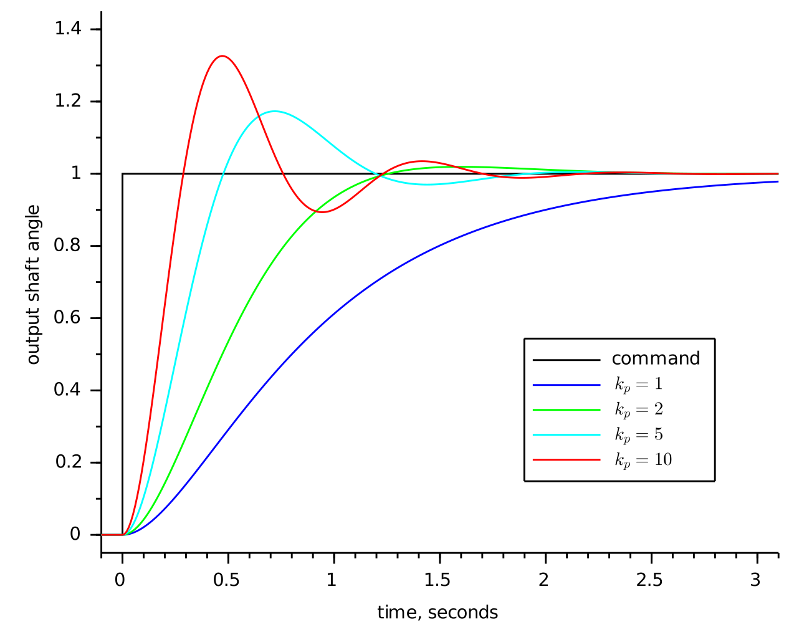


### Integral

- The system with pure integral control (propGain = 0) and a variety of integrator gains (integratGain or ki) doesn’t settle, no matter how low we set the integral gain
- it will oscillate with bigger and bigger swings until something hits a limit

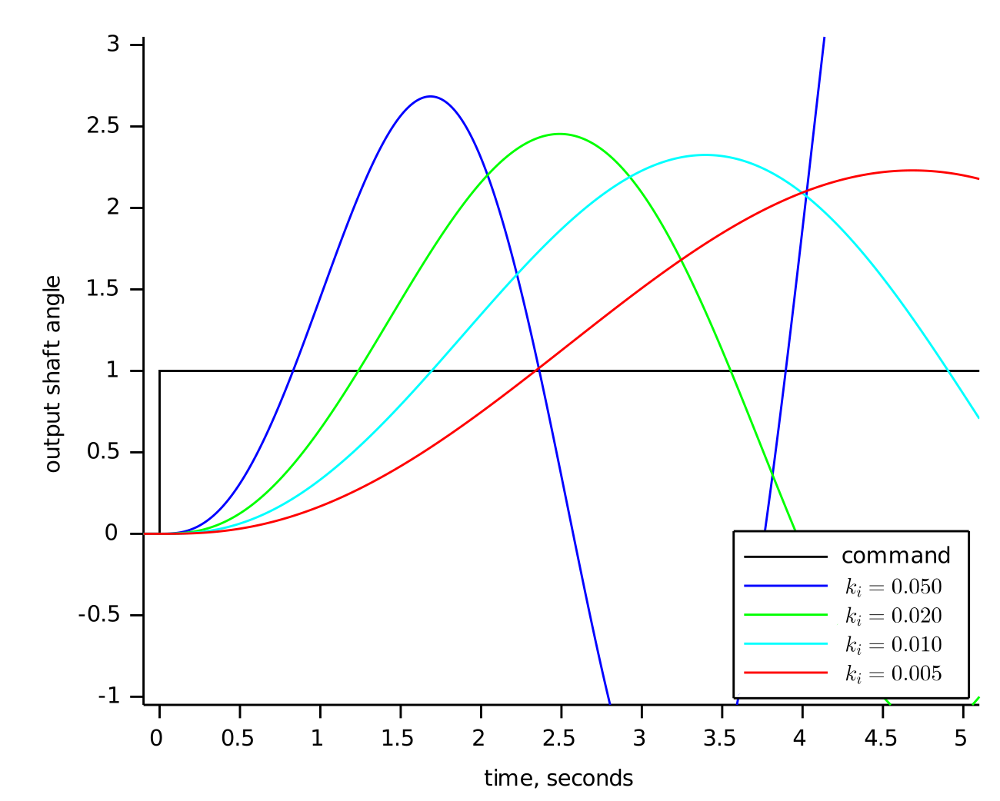


### Proportional-Integral Control

- The position takes longer to settle out than the system with pure proportional control, but unlike the motor with pure integral control it does settle out, and the system will not settle to the wrong spot

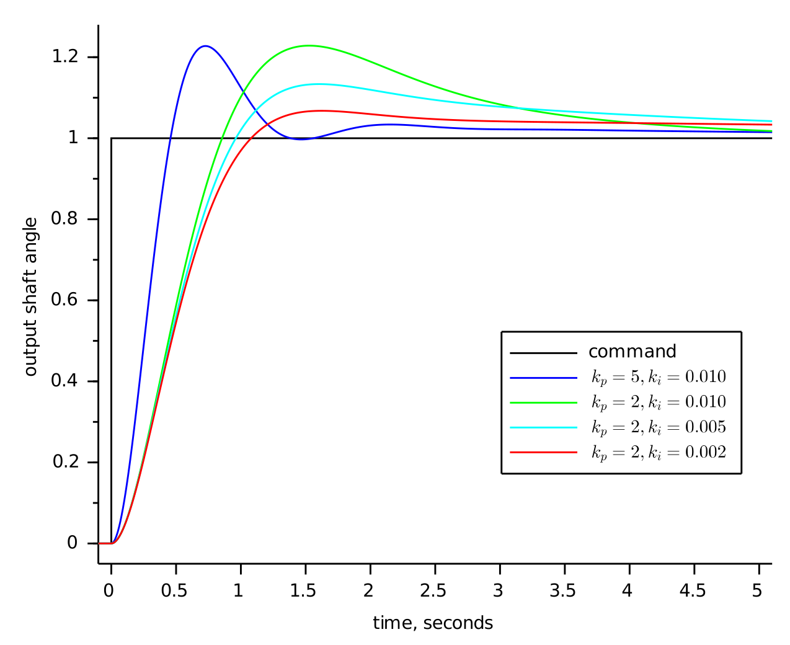


## 2. Precision Actuator

- A precise positioning system can be built using a freely moving mechanical stage, a speaker coil (a coil and magnet arrangement) and a non-contact position transducer (a device that converts variations in a physical quantity, such as pressure or brightness, into an electrical signal, or vice versa)

> Non-contact Position Transducer
    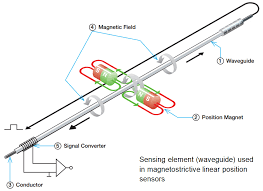

- applications - stabilize an element of an optical system, areas of semiconductor processing, high-end printers
- software commands the current in the coil, which sets up a magnetic field which exerts a force on the magnet
- magnet is attached to the stage, which moves with an acceleration proportional to the coil current
- the stage position is monitored by a non-contact position transducer


- with this arrangement the force on the magnet is independent of the stage motion, bu this isolates the stage from external effects, but the resulting system is very "slippery", and can be a challenge to control
- In addition, the electrical requirements to build a good current-output amplifier and non-contact transducer interface can be challenging

- the force on the stage is proportional to the drive command and nothing else, so the acceleration of the system is exactly proportional to the drive

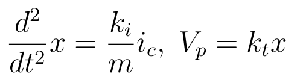

- where Vp is the transducer output
- ki is the coil force constant in newtons/amp (or pounds/amp)
- kt is the transducer gain in volts/meter (or volts/foot)
- m is the total mass of the stage, magnet and the moving portion of the position transducer in appropriate units

- The step response of this system by itself is a parabola
- this makes the control problem more challenging because of the sluggishness with which the stage starts moving, and its enthusiasm to keep moving once it gets going

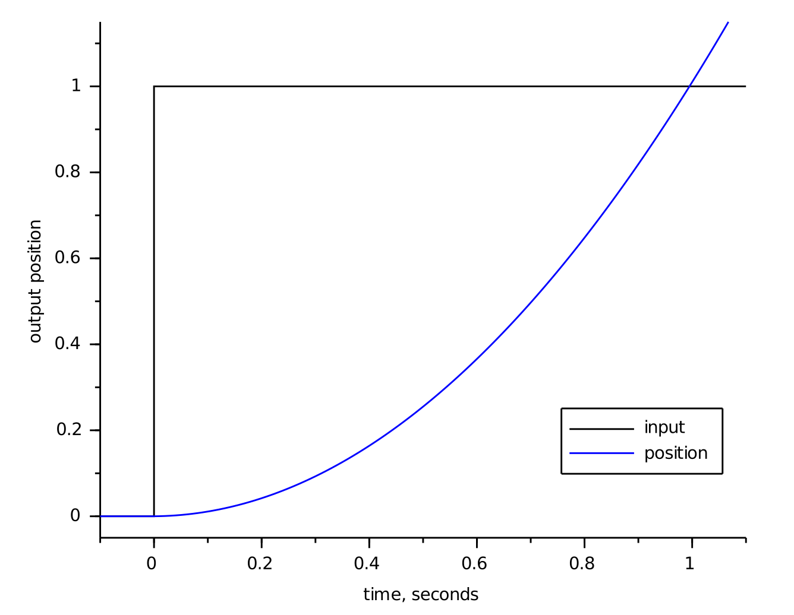


### Proportional 

- only proportional control has so much delay in the plant that no matter how low the gain is the system will oscillate
- As the gain is increased the frequency of the output will increase, but the system just won’t settle
- we cannot rely only on proportional control for this plant

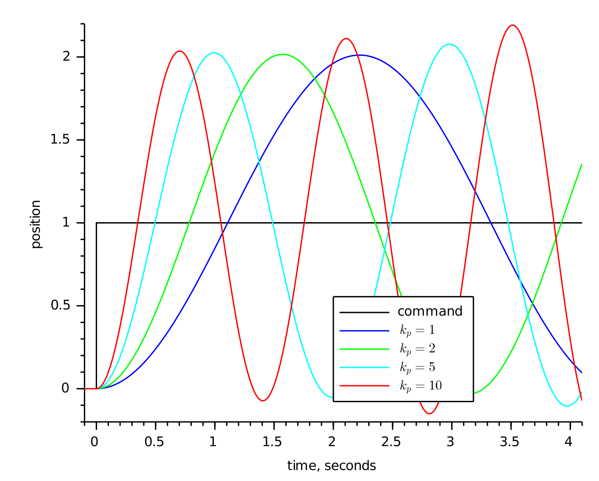


### Integral

- the precision actuator system can’t even be stabilized with a proportional controller
- there is simply no integral gain that could be chosen that would make the system stable


### Proportional-Integral Control

- precision actuator cannot be stabilized with PI control


### Derivative 

- With differential control can stabilize the precision actuator system


## Proportional-Derivative Control

- graph shows the response of the precision actuator system with proportional and derivative (PD) control for various values of proportional gain and derivative gain (derGain, kd), this system settles in less than 1/2 or a second, compared to multiple seconds for the other systems

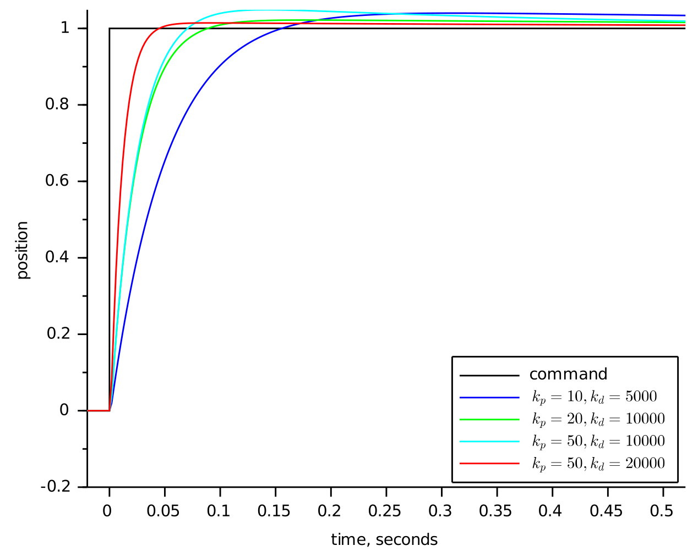


## 3. Temperature Control

- plant is a heater
- The vessel is heated by an electric heater, and the temperature of its contents is sensed by a temperature sensing device
- Thermal systems tend to have very complex responses, which can be difficult to characterize well

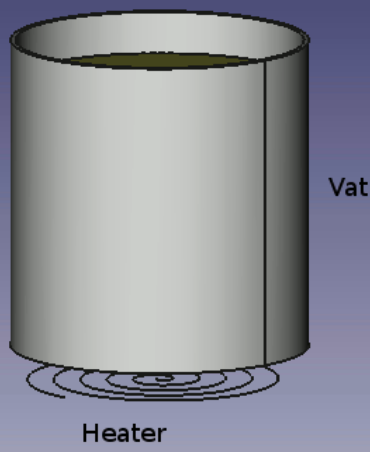

- a simplified, but accurate model is preferred

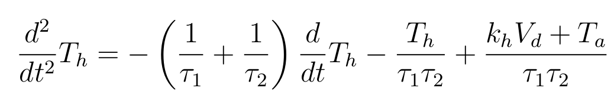

- where Vd is the input drive
- Th is the measured temperature and Ta is the ambient temperature
- τ1 and τ2 are time constants with units of seconds
- kh is the heater constant, has units of degrees C per volt

> there is step response of the system to both to a change in Vd and to a change in ambient temperature
    - The response tends to settle out to a constant temperature for a given drive but it can take a great deal of time doing it
    - it takes a disturbance input into account
    - disturbance is the ambient temperature, which the system will respond to the same as it responds to changes in the drive level
    - eg - τ1 = 0.1s and τ2 = 0.3s
    


### Proportional 

- Even without the disturbance the proportional control doesn’t get the temperature to the desired setting
- with the disturbance the loop is susceptible to external effects
- Increasing the gain helps with both the settling to target and with the disturbance rejection, but the output is still below target
- and we also see a strong overshoot that continues to travel back and forth for some time before settling out (known as "ringing")

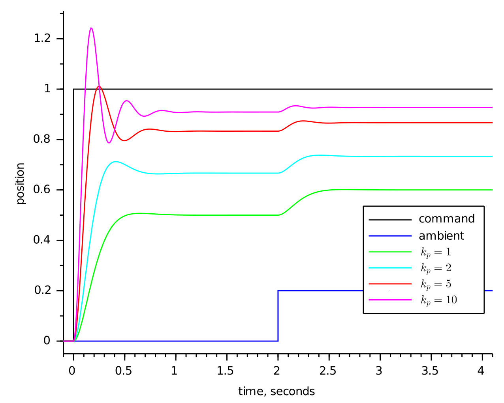


### Integral

- This system takes a lot longer to settle out than the same plant with proportional control
- but when it does settle out it settles out to the target value - even the undesired response from the disturbance goes to zero eventually
- but application required fast-settling which is drawback

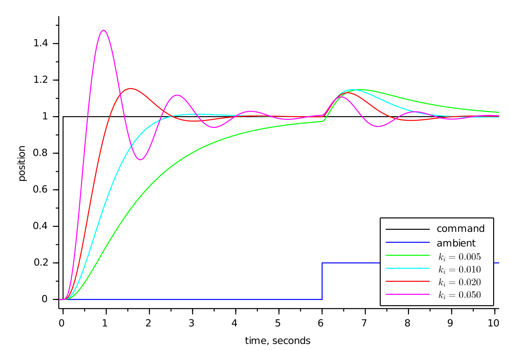


### Proportional-Integral Control

- PI control settles out 2 to 3 times faster than pure-integral control

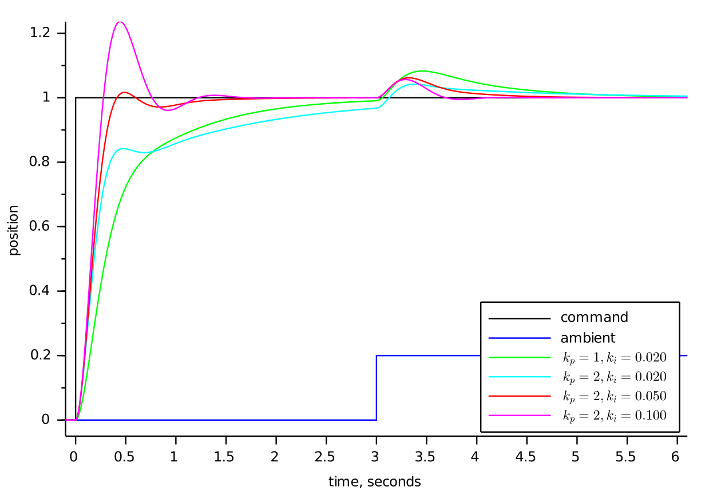


### PID Control


## References

- [PID_Without_A_Phd](https://www.wescottdesign.com/articles/pid/pidWithoutAPhd.pdf)
- If this link doesn't work use [PID_Without_A_Phd](./References/pidWithoutAPhd.pdf)