# Rotors #2

- Necessary building blocks to get an MAV airborne
- The structure of the simulator is designed to match the real MAVs as close as possible

- All components, found on real MAVs, are simulated by Gazebo plugins and by the Gazebo physics engine
- To facilitate the development of different control strategies, a simple interface is provided
- a geometric controller , which gives access on various levels of commands, such as angular rates, attitude, or position control
- The last building block is the state estimation, used to obtain information about the state of the MAV at a high rate

## Modeling - 

- The forces and moments that are acting on an MAV can be split up into the forces and moments acting on each rotor, and the gravitational force acting on the Center of Gravity (CoG) of an MAV. All these forces combined together describe the full dynamics of an MAV

### For A Single Rotor

- Forces and moments acting on the center of a single rotor

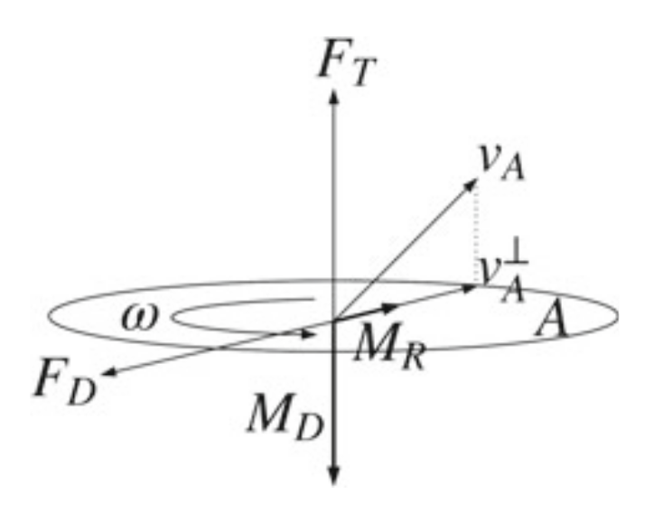

- we will analyze the thrust force **F**T, the drag force **F**D, the rolling moment **M**R, and the moment originating from the drag of a rotor blade, **M**D

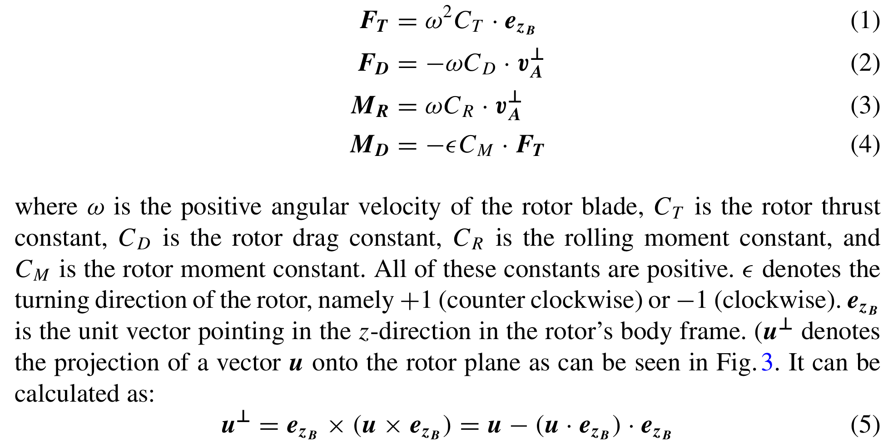

### For Full MAV

- quad-rotor helicopter with numbered rotors and the forces acting on it
- Now, we can write down the equations of motion from Newton’s law, and Euler’s equation

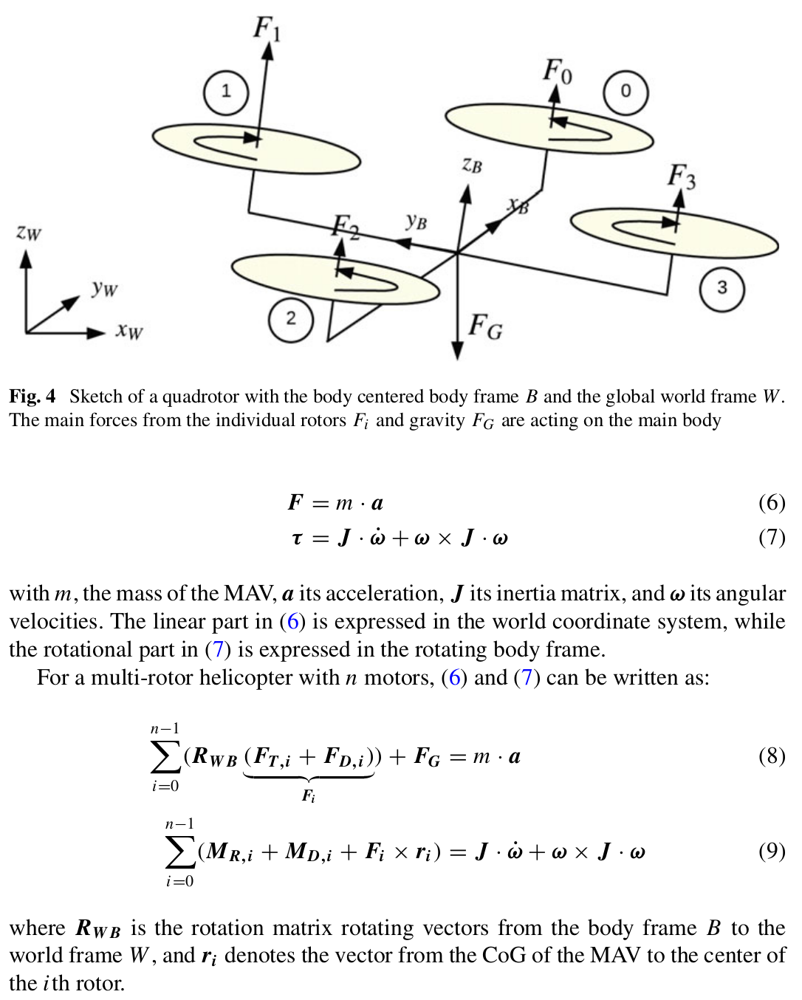

### Control

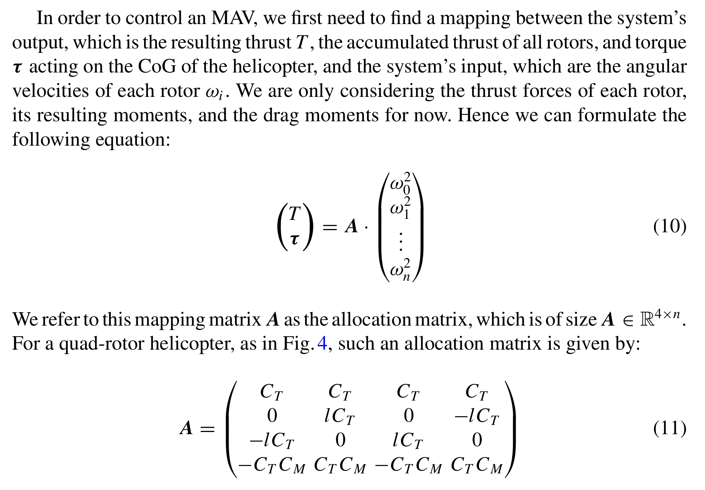

- By looking at a multi-rotor helicopter with all rotor axes pointing in the same direction, we can only generate a thrust T pointing in the direction of the rotor blade’s normal vector, we assume here, that this coincides with **z**B. Hence, only the thrust T , and the moments around all three body axes **x**B, **y**B and **z**B  can be controlled directly. To be able to navigate in 3D space, the vehicle has to be tilted towards a setpoint. Therefore we want to control the overall thrust of the vehicle, the direction of z B (by controlling the roll- and pitch angle), and the yaw rate **ω**z . This is usually referred to as the attitude controller. Because the dynamics of the attitude are usually much faster than the translational dynamics, often a cascaded control approach is chosen
- The attitude control loop usually runs onboard a micro controller at high rate, while the position loop, which calculates the desired attitude and thrust, runs at a lower rate

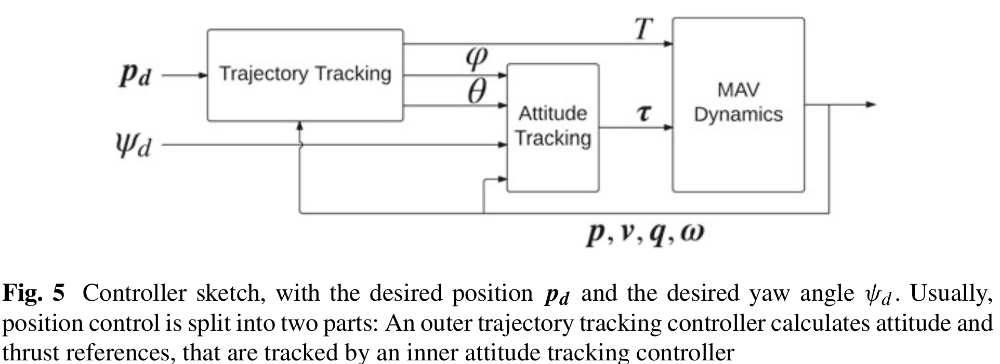

### State Estimation

- One of the key elements for enabling stable and robust MAV flights is accurate knowledge of the state of the MAV
- we fuse IMU measurements with a generic 6 DoF pose measurement in order to obtain estimates of the states that are commonly needed for a position controller for an MAV
- 6 DoF pose measurement obtained from visual-odometry or visual SLAM systems, laser rangefinder-based techniques or marker-based localization or external tracking system with highly accurate measurements at high rate
- Measurements from IMUs, typically used onboard MAVs, are available at high rate and with low delay, but are corrupted by noise and a time-varying bias
- As a result, solely time-discrete integration (dead-reckoning) of these sensors makes a steadily accurate estimation of the absolute pose of the vehicle nearly impossible
- In contrast, the methods for estimation of the 6 DoF pose usually exhibit no drift or only very low drift, but their measurements usually arrive at a much lower rate, and with high delay, due to their computational complexity
- Combining both types of measurements yields a (almost) drift-free estimate of the state, at high rate and with low delay

#### 1. IMU Sensor Model

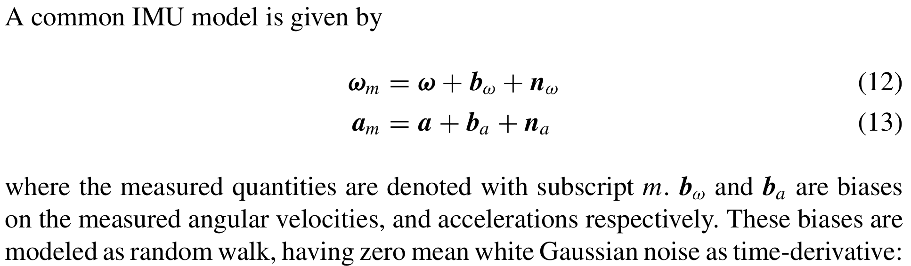

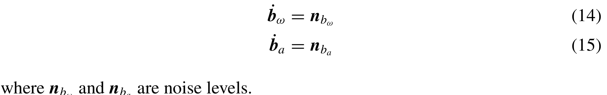

#### 2. State Representation

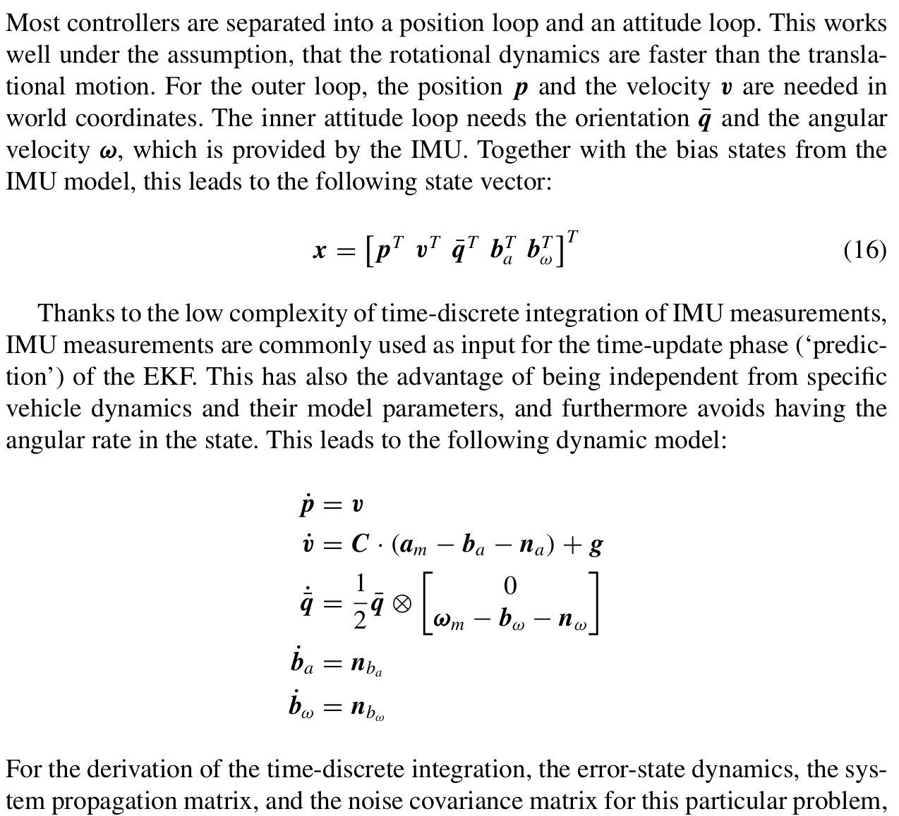

#### 3. Measurement Model

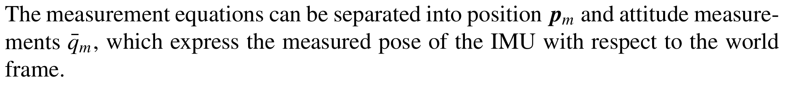

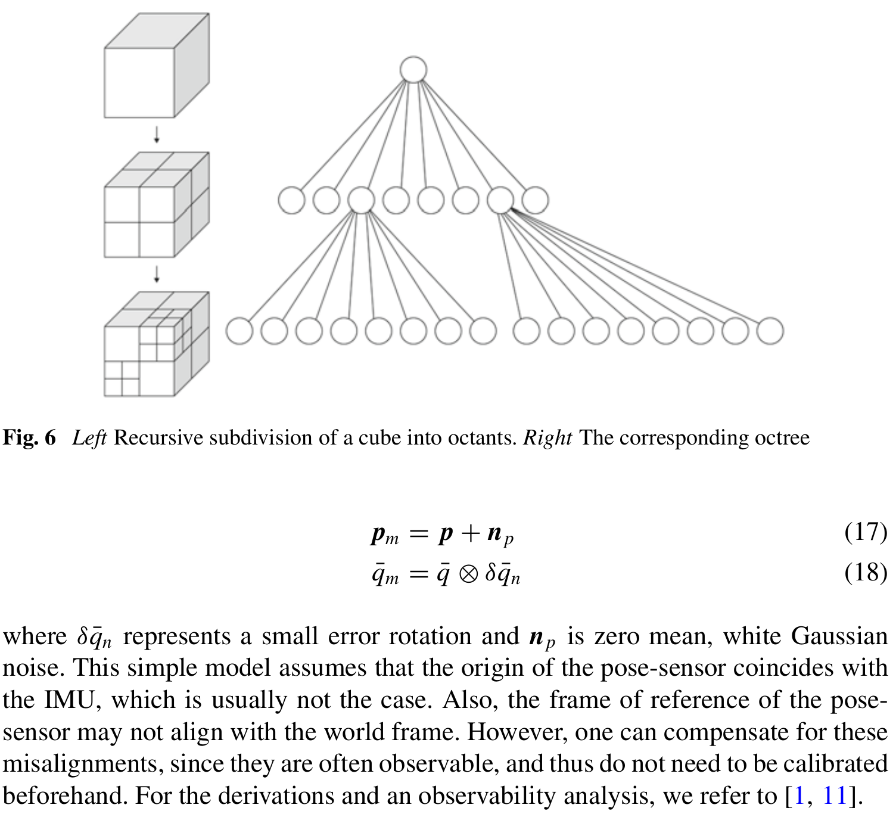

### Structure of the packages contained in the RotorS simulator

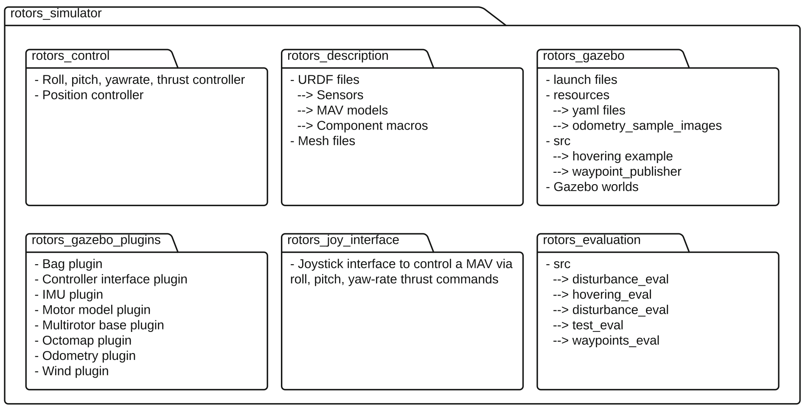

1. Select your model
2. Attach sensors to the MAV
3. Add a controller to your MAV
4. Use a state estimator

### Firefly Simulation

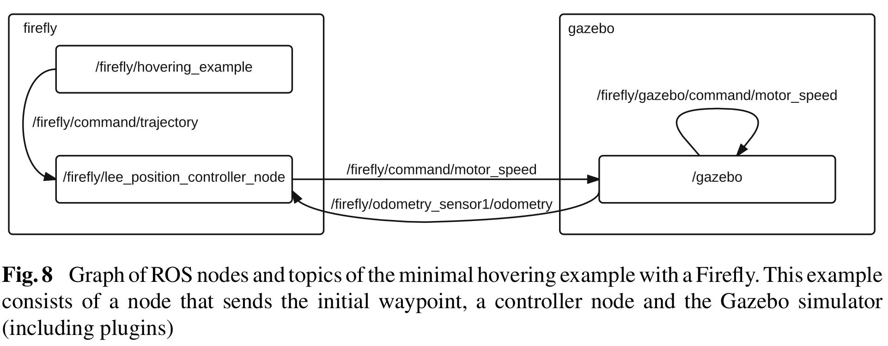

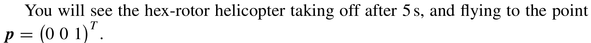

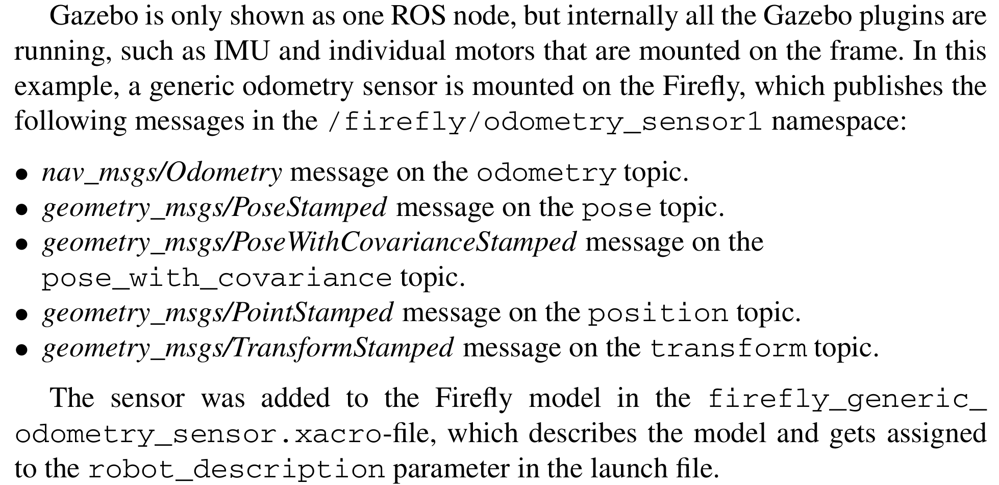

- All the states needed by the position controller are contained in the Odometry message. Namely, these (states) are the position, orientation, and linear and angular velocity of the MAV. Hence, the position controller running alongside the simulation can directly subscribe to the Odometry message. The controller publishes Actuators messages, which are read by the Gazebo controller interface and forwarded to the individual motor model plugins
- Commands for the controller are read from MultiDOFJointTrajectory messages, which get published by the hovering_example node. These messages contain references of poses, and its derivatives. In addition this node un-pauses the Gazebo physics

### Use the MSF package to get the full state from a pose sensor and the IMU

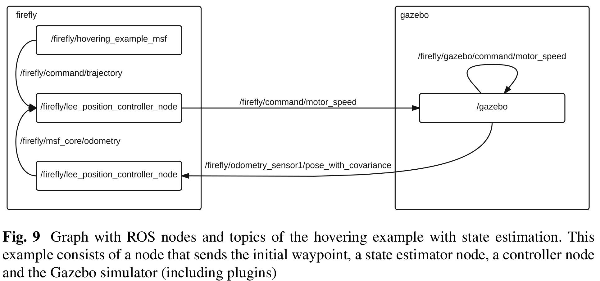

- This time, the MAV is not as stable as in the previous example, and has a small offset at the beginning. The wobbling comes from the simulated noise on the pose sensor and the offset from the IMU biases. After a while the offset will disappear, because the EKF estimates the biases correctly
- First, the Gazebo odometry plugin only publishes the pose of the MAV and not the full odometry message as before. On real systems, this could be an external tracking system. Second, an additional node is started, the MSF pose_sensor. The controller node now subscribes to the odometry topic from the MSF instead of the odometry from Gazebo
- The MSF package consists of a core that performs the state propagation based on IMU measurements. For the state update many predefined sensor combinations are available

## References

- [RotorS — A Modular Gazebo MAV Simulator Framework](https://sci-hub.se/10.1007/978-3-319-26054-9_23)
- If this link doesn't work use [RotorS — A Modular Gazebo MAV Simulator Framework](./References/furrer2016.pdf)
