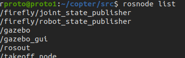
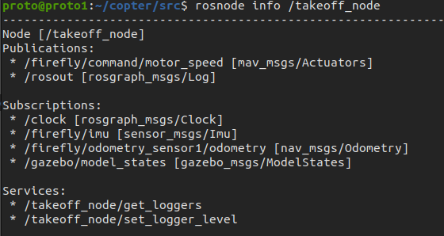
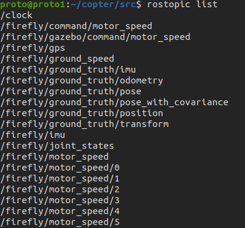
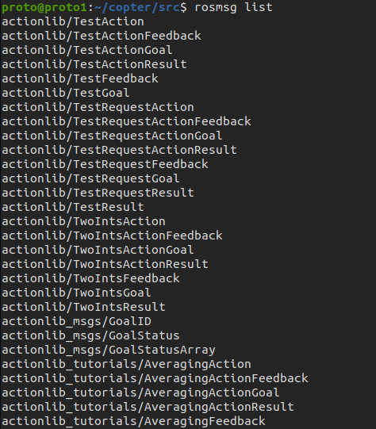
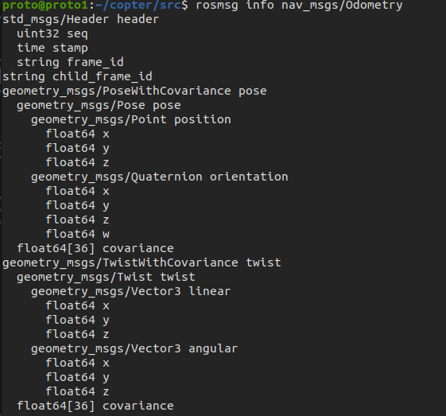

# Errors Faced
In this section we are trying to cover nearly all the errors we have faced, what mistakes was there from our side and how did we tackle them.
 
## Launching the simulation
There are number of changes required to be made in the .launch files which are providied here [pdfs]((ResourcesandResearchpapers)/Rotors_Sim.pdf)

* Step 1 : `roslaunch rotors_gazebo mav_hovering_example.launch mav_name:=firefly`
* Step 2 : Open new terminal 
* Step 3 : Type in `chmod +x control.py`

 `Note: That you should have the file structure same as mentioned in the README.md`

## Concept of rosmsg, rostopic, and rosnode

Consider a scenario when you are talking to your friend on your phone.
Here, you and your friend are the `nodes`. 
* rosnodes : So, these are basically the users or programs that publish or subscribe to any information
> ### How to know everything about your nodes?

First initializing the node

  

`rosnode list` : This commands gives you the list of all the active nodes
Once you know what are your nodes, and then you need to know what topics are they connected to and you should be able to **extract** its relevant data.

  

Now, here we see that we need to know about the various parameters to know about the current state of the drone.

  

The network or line you are using for the communication is the `topic`, or you may even consider your conversations topic
* rostopic : So, It is just the channel through which you have to transfer the data.
Now that we know what topic is the node connected to, so we need more info about the same.

>Note: If you want to know all the topics available or currently associated to your model then just type-in `rostopic list`

Now, we needed to know what type of data is actually being published o subscribed through the given topic
So we use `rostopic info` for the same.

>Now, from the above image it is clear that it is communicating the message as `nav_msgs/Odometry`.

* `rosmsg list` : rosmsg list gives you all the information about the specific messages that are being published or subscribed to.
In our, example we needed to correctly distinguish the message data type and then if required, need to convert the data and then use it for our controller.

But still, it is not clear what is the __data types__ that we are gonna extract from it. So we use `rosmsg info`.

Now, One of the major problems faced by us was to identify what readings to take and from which sensors.
So, we took the following reading along with their sensors

* `Position` from `/firefly/odometry_sensor1/odometry` which is basically the odometry sensor mounted on the drone

* `Roll, Pitch and Yaw` from `/firefly/imu` which is again the sensor mounted on the firefly.

Again the problem wasn't just solved by just taking the data. Now, we needed to sync the data from these sensors. For this we used `message_filters`.

Now, we need to run the control algorithm and tune it for better control and error correction. For this we use `PID` controller.